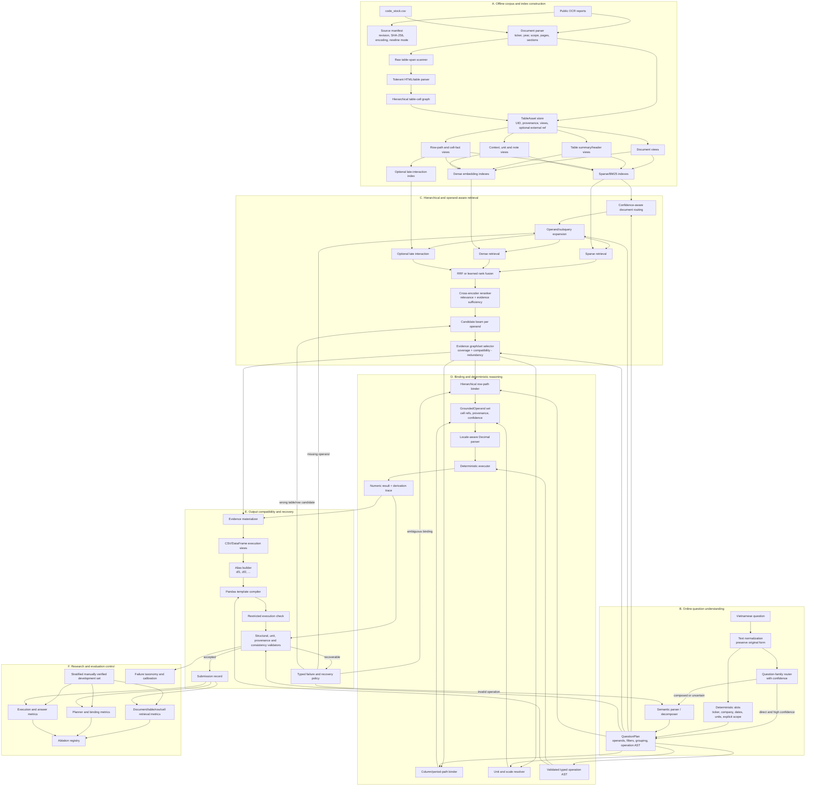

# Architecture

## 1. Architecture decision

The target system is an **adaptive hierarchical neuro-symbolic RAG pipeline**.

It is adaptive because ViFinQA mixes simple lookups with multi-hop analytical questions. It is hierarchical because evidence belongs to reports, sections, tables, row paths, column paths, units, and cells. It is neuro-symbolic because learned models retrieve and disambiguate meaning, while deterministic code owns identity, arithmetic, unit conversion, execution, and validation.

The central rule is:

> **Models select and bind meaning. Deterministic code preserves provenance and executes finance operations.**

A generic flat-vector RAG system is kept only as a baseline.

## 2. Verified data contract

### 2.1 Public release

The public corpus contains:

- `1,012` questions;
- OCR financial reports;
- ticker/company metadata;
- question records with only `id` and `question`.

The following fields are not present in the public question file:

```text
answer
relevant_docs
relevant_tables
evidence
pandas_query
difficulty
```

Therefore:

- the public file does not support supervised retrieval evaluation by itself;
- external table-reference semantics cannot be proved corpus-wide from public questions;
- official or manually verified labels are required for retrieval, binding, and answer evaluation;
- any question-family labels derived below are observational, not organizer-provided gold labels.

### 2.2 Exact question-family audit

The public file is ordered into six visibly distinct template blocks. Boundaries were determined by inspecting the complete sequence and locating abrupt changes in question form.

| IDs | Count | Observed family | Main evidence requirement |
|---:|---:|---|---|
| `1–361` | `361` | Direct lookup | usually one company, one scope, one period, one metric |
| `362–577` | `216` | Conditional analytical / scenario | several metrics, entities or years; filtering, ranking, median, scenarios |
| `578–655` | `78` | Temporal difference / growth | same entity/metric across two periods |
| `656–732` | `77` | Ratio / derived metric | numerator and denominator, sometimes from different rows or tables |
| `733–812` | `80` | Cross-entity comparison | comparable operands from two or more companies |
| `813–1012` | `200` | Multi-period / multi-entity aggregation | sum, average, maximum, minimum, count, threshold selection |

The counts sum to `1,012`.

These blocks determine the architecture:

- direct lookup questions need a fast, low-risk route;
- ratio and temporal questions need explicit operand binding;
- cross-company and aggregation questions need evidence-set retrieval;
- conditional analytical questions need decomposition, filtering, ranking, and sometimes hypothetical execution.

A single monolithic prompt is not an acceptable design.

## 3. Identity findings

A table-related record must separate three identities.

### 3.1 External table reference

An organizer or upstream-normalization identifier:

```text
VJC_financial_statements_2018_separate|350
VJC_financial_statements_2018_separate|table_350
```

Its format must be preserved exactly when required by the evaluator.

### 3.2 Internal table UID

A stable identity controlled by this system:

```text
sha256(document identity + raw span + normalized cell fingerprint)
```

All indexes and internal joins use this UID.

### 3.3 Source span

Physical provenance in the source report:

```json
{
  "byte_start": 235,
  "byte_end": 1890,
  "char_start": 205,
  "char_end": 1563,
  "page_no": 2,
  "local_ordinal": 1
}
```

The hypothesis that suffix `350` is the raw opening-`<table>` offset is refuted for the exact VJC 2018 separate report: its first table starts at decoded-character offset `205` and UTF-8 byte offset `235`.

Companion ViFinQA code consumes `table_N.csv` assets and `document|table_N` references. This strongly supports treating `N` as an external normalized-asset ID. The public raw release does not expose the upstream algorithm that originally assigned `N`.

Architecture consequences:

- never train a model to regress or classify `N`;
- never use raw offsets as a substitute for external IDs without a verified mapping;
- keep `external_table_ref` nullable;
- use `internal_table_uid` as the system identity;
- emit the stored external reference only after candidate selection.

## 4. End-to-end graph



## 5. Why the architecture branches

### 5.1 Fast path: direct lookup

Question IDs `1–361` mostly request one value.

Example shape:

```text
metric + company + scope + one period + requested unit
```

Execution path:

```text
rules/router
→ one QuestionOperand
→ metadata document routing
→ table/row retrieval
→ one cell binding
→ unit conversion
→ result
```

A full multi-agent planner is unnecessary unless confidence is low.

### 5.2 Analytical path: conditional and scenario questions

Question IDs `362–577` contain operations such as:

- filter companies above/below a median;
- find a year satisfying a condition;
- rank companies by one metric and return another metric;
- calculate margins, turnover, ROE, CFO ratios, or coverage;
- apply hypothetical changes such as revenue or cost shocks;
- aggregate only the entities that pass a condition.

These require a typed plan:

```json
{
  "universe": ["HPG", "HSG", "MSR", "NKG"],
  "periods": [2022, 2023, 2024],
  "operands": [
    {"id": "inventory", "metric": "ending_inventory"},
    {"id": "cogs", "metric": "cost_of_goods_sold"},
    {"id": "gross_profit", "metric": "gross_profit"},
    {"id": "revenue", "metric": "net_revenue"}
  ],
  "derived": [
    {
      "id": "days_inventory",
      "op": "divide",
      "args": [
        {"op": "multiply", "args": [365, {"op": "average", "args": ["inventory_begin", "inventory_end"]}]},
        "cogs"
      ]
    },
    {
      "id": "gross_margin",
      "op": "divide",
      "args": ["gross_profit", "revenue"]
    }
  ],
  "filter": "days_inventory_2022 > median(group)",
  "select": "argmax(days_inventory_2022 - days_inventory_2024)",
  "return": "gross_margin_2024"
}
```

The plan is explicit before retrieval and execution.

### 5.3 Temporal path

Question IDs `578–655` usually bind the same metric at two dates.

Supported operations:

```text
signed_difference
absolute_difference
percentage_change
percentage_decrease
CAGR
beginning-to-ending change
```

The planner creates two operands and records direction explicitly. “A lớn hơn B bao nhiêu” is not interchangeable with absolute difference.

### 5.4 Ratio path

Question IDs `656–732` require named or implicit formulas:

```text
numerator / denominator
(numerator - denominator)
margin
coverage
turnover
leverage
loan-to-deposit ratio
net financial income
```

Formula resolution is schema-driven. The LLM can propose an operation, but the operation must map to an approved typed template.

### 5.5 Cross-entity path

Question IDs `733–812` require at least two document/evidence branches.

```text
entity A operand
entity B operand
→ normalize units and periods
→ compare or subtract
```

Document routing cannot assume one ticker or one report.

### 5.6 Aggregation path

Question IDs `813–1012` use:

```text
sum
mean
median
max/min and argmax/argmin
count
threshold count
multi-year reduction
multi-company reduction
average of ratios
ratio of aggregated values
```

The planner must distinguish operations that appear linguistically similar:

```text
average(ratio_i)
```

is not equal to:

```text
sum(numerator_i) / sum(denominator_i)
```

## 6. Offline corpus layer

### 6.1 Immutable source manifest

Read bytes before decoding:

```python
raw_bytes = path.read_bytes()
source_sha256 = sha256(raw_bytes)
```

Record:

```json
{
  "dataset_revision": "...",
  "source_sha256": "...",
  "encoding": "utf-8",
  "strict_decode_ok": true,
  "newline_mode": "LF",
  "byte_length": 190245,
  "character_length": 174901
}
```

Do not use `errors="replace"` as the canonical representation because replacement characters can invalidate provenance.

### 6.2 Table extraction

The extraction pipeline has two responsibilities:

1. preserve raw source spans;
2. construct a tolerant semantic representation.

```text
raw bytes
→ lightweight span scanner
→ raw HTML span
→ tolerant HTML parser
→ hierarchy reconstruction
→ normalized retrieval views
```

Regex scanning can identify candidate spans, but table semantics are produced by a parser that handles malformed OCR, `rowspan`, `colspan`, repeated headers, and continuation tables.

### 6.3 Hierarchical table-cell graph

The canonical table representation is not a flat DataFrame.

```json
{
  "cell_id": "cell-r7-c3",
  "raw_text": "1.234.567",
  "normalized_text": "1234567",
  "row_path": [
    "Doanh thu hoạt động tài chính",
    "Lãi tiền gửi"
  ],
  "column_path": [
    "Năm nay",
    "2018"
  ],
  "unit_scope": "million_vnd",
  "note_reference": "25",
  "page_no": 42,
  "source_span": {
    "byte_start": 100200,
    "byte_end": 100209
  }
}
```

The flat CSV/DataFrame is derived later for execution and submission compatibility.

### 6.4 Retrieval views

One physical table generates several views:

```text
document metadata card
section/caption summary
table headers
hierarchical row paths
row chunks
cell facts
unit lines
surrounding page context
semantic financial aliases
```

No single view is assumed to dominate every question family.

## 7. Question understanding

### 7.1 Deterministic fields

Use rules and ticker metadata for stable patterns:

- ticker and company aliases;
- dates, years, periods, and report boundaries;
- explicit scope such as `công ty mẹ` or `hợp nhất`;
- requested units;
- explicit comparison and aggregation words.

### 7.2 Question-family router

The router predicts:

```text
direct_lookup
conditional_analytical
temporal_change
ratio_or_derived
cross_entity_comparison
multi_entity_or_period_aggregation
```

It also returns confidence. Low-confidence direct predictions are escalated to the semantic planner.

### 7.3 QuestionPlan

```json
{
  "question_id": 733,
  "family": "cross_entity_comparison",
  "entities": [
    {"ticker": "SSB", "scope": "separate"},
    {"ticker": "VPB", "scope": "separate"}
  ],
  "periods": [2020],
  "operands": [
    {
      "id": "x0",
      "entity": "SSB",
      "metric": "average_monthly_income_per_employee",
      "period": 2020
    },
    {
      "id": "x1",
      "entity": "VPB",
      "metric": "average_monthly_income_per_employee",
      "period": 2020
    }
  ],
  "operation_ast": {
    "op": "subtract",
    "args": ["x0", "x1"]
  },
  "target_unit": "million_vnd"
}
```

QuestionPlan is the contract between language understanding and retrieval.

## 8. Retrieval architecture

### 8.1 Confidence-aware document routing

Hard-filter only fields with high confidence.

```text
high-confidence ticker → hard filter
uncertain company alias → candidate expansion
explicit company-mother scope → prefer separate
missing scope → retain separate and consolidated
exact report year unavailable → inspect adjacent/comparative report years
```

The router must consider that a report for year `Y` can contain beginning balances or comparative columns from `Y-1`.

### 8.2 Operand-level retrieval

Retrieve evidence for each operand independently, then construct a compatible evidence set.

Example:

```text
Question asks average of four companies' ratios.

For each company:
    retrieve numerator evidence
    retrieve denominator evidence
    bind same scope and period
    compute ratio
Then:
    average the four computed ratios
```

This is more reliable than one global query containing every company and metric.

### 8.3 Sparse retrieval

BM25 remains mandatory as a strong baseline because financial row labels often contain exact domain phrases and OCR-specific variants.

Sparse indexes are built over:

- table summaries;
- row paths;
- row chunks;
- context and note descriptions;
- alias-expanded text.

### 8.4 Dense retrieval

Candidates include multilingual models such as:

```text
BAAI/bge-m3
Qwen3-Embedding-0.6B
larger Qwen3 embeddings when hardware and ablations justify them
```

Dense retrieval addresses paraphrases, abbreviations, and semantic variants not captured by lexical search.

### 8.5 Late interaction

A multilingual ColBERT-style retriever is optional. Token-level matching can help when only a few metric or qualifier tokens identify the correct row. It is added after BM25+dense baselines, not before.

### 8.6 Rank fusion

Use Reciprocal Rank Fusion as the default score-independent fusion baseline:

```text
BM25 rank
+ dense rank
+ optional late-interaction rank
+ multi-view ranks
→ RRF
```

A learned fusion model is considered only after sufficient labeled retrieval data exists.

### 8.7 Cross-encoder reranking

Candidate rerankers include:

```text
BAAI/bge-reranker-v2-m3
Qwen3-Reranker-0.6B
Qwen3-Reranker-4B when hardware and gains justify it
```

The reranker input is structured and bounded:

```text
question or operand subquery
document metadata
table title and section
hierarchical headers
candidate row paths
unit information
local context
```

It predicts:

- relevance;
- scope/period consistency;
- evidence sufficiency for the operand.

### 8.8 Evidence graph

The final retrieval result is a set, not merely a ranked list.

Node types:

```text
document
table
row
cell
operand
```

Edge types:

```text
same company
same report scope
same period
same financial concept
note reference
comparative-year relation
numerator-denominator compatibility
same-table or join compatibility
```

The selector optimizes:

```text
relevance
+ operand coverage
+ structural compatibility
+ scope and unit consistency
- redundancy
- contradiction
```

## 9. Binding

### 9.1 Row-path binding

Match hierarchical paths, not isolated cell strings.

Signals:

- normalized exact match;
- finance alias match;
- fuzzy OCR match;
- dense semantic similarity;
- section and note consistency;
- qualifiers such as industry, counterparty, project, currency, maturity, or related-party status.

### 9.2 Column/period binding

Resolve:

```text
năm nay
năm trước
đầu năm
cuối năm
01/01/YYYY
31/12/YYYY
comparative column
fiscal year ending on a non-calendar date
```

The binder records the chosen period semantics explicitly.

### 9.3 Unit binding

Unit resolution is scoped by:

- table-level unit lines;
- section/page context;
- row-specific percentages or per-share units;
- question target unit.

A conversion is represented as metadata, not hidden in prompt prose.

### 9.4 GroundedOperand

```json
{
  "operand_id": "x0",
  "table_uid": "sha256:...",
  "external_table_ref": null,
  "row_path": ["Thu nhập tài chính", "Lãi tiền gửi"],
  "column_path": ["Năm nay", "2018"],
  "cell_ref": "cell-r7-c3",
  "raw_value": "1.234.567",
  "parsed_value": "1234567",
  "source_unit": "thousand_vnd",
  "target_unit": "million_vnd",
  "binding_confidence": 0.94,
  "provenance": {
    "document_id": "...",
    "page_no": 42,
    "source_span": "..."
  }
}
```

## 10. Typed numerical reasoning

### 10.1 Approved operation AST

The planner emits operations from a closed, typed registry:

```text
lookup
add
subtract
absolute_difference
multiply
divide
percentage_change
CAGR
mean
median
sum
min
max
argmin
argmax
count
filter
all / any
scenario_adjustment
```

Each operation defines:

- input types;
- output type;
- unit behavior;
- zero/negative handling;
- rounding policy;
- executable implementation.

### 10.2 Decimal execution

Use `Decimal` for finance arithmetic.

The numeric parser handles:

```text
Vietnamese thousand separators
Vietnamese decimal commas
parenthesized negatives
percent signs
currency/unit suffixes
blank and dash cells
OCR ambiguity warnings
```

A parsed number carries confidence and warnings; ambiguous values are not silently coerced.

### 10.3 Pandas as an output compiler

The system first executes the typed AST directly. It then compiles an equivalent Pandas query when required by the competition contract.

```text
QuestionPlan + GroundedOperands
→ deterministic result
→ evidence CSV materialization
→ df1/df2 alias assignment
→ Pandas template compiler
→ restricted execution equivalence check
```

This avoids free-form code generation as the primary reasoning mechanism.

## 11. `df1`, evidence, and output

`df1` is a local runtime alias:

```json
{
  "variable": "df1",
  "csv_path": "data/generated/question_733_table_1.csv"
}
```

Assignment is deterministic:

```python
for index, table in enumerate(selected_tables, start=1):
    variable = f"df{index}"
```

Identity layers remain distinct:

```text
external_table_ref → organizer/upstream compatibility
internal_table_uid → system identity
source_span        → raw provenance
df1                → local execution alias
```

## 12. Validation and recovery

A validator cannot know semantic truth without gold labels. It can detect structural and logical failures.

### 12.1 Structural validator

Checks:

- referenced document/table/cell exists;
- evidence CSV exists;
- aliases are unique;
- every code variable is declared;
- source provenance is complete.

### 12.2 Type and unit validator

Checks:

- numeric inputs parsed successfully;
- operation types are compatible;
- periods and scopes are aligned;
- unit conversions are explicit;
- denominator is nonzero.

### 12.3 Evidence sufficiency validator

Checks:

- every planned operand is grounded;
- filters and grouping keys have evidence;
- aggregate sets are complete;
- no selected evidence contradicts entity, scope, or period constraints.

### 12.4 Execution validator

Checks:

- deterministic execution succeeds;
- Pandas execution succeeds;
- both results match within tolerance;
- result is finite and scalar;
- final rounding follows the output contract.

### 12.5 Recovery

Typed failures route backward:

```text
missing operand        → retrieve that operand again
low evidence coverage  → expand document/table candidates
ambiguous row          → rerank row paths with qualifiers/context
scope conflict         → retain alternate report scope
invalid operation      → re-plan AST
code mismatch          → regenerate Pandas from unchanged AST
```

Repeated unresolved ambiguity leads to abstention or manual review in development mode.

## 13. Evaluation

### 13.1 Corpus integrity

```text
report discovery rate
strict decode failures
page-marker coverage
raw table count
parsed table count
malformed table rate
duplicate document IDs
internal UID collisions
external-reference mapping coverage
```

### 13.2 Question understanding

```text
family routing accuracy
entity/ticker accuracy
scope accuracy
period accuracy
unit accuracy
operand decomposition F1
operation AST exact match
```

### 13.3 Retrieval

```text
document Recall@1, @3, @5
table Recall@1, @5, @10, @20
row/cell Recall@k
MRR
MAP or nDCG for multiple relevant items
macro/micro precision, recall and F2
```

MRR is useful for the first relevant item but is insufficient for multi-evidence questions.

### 13.4 Evidence sets

```text
operand coverage
evidence-set precision
evidence-set recall
evidence-set F2
scope/period compatibility
redundancy rate
```

### 13.5 Binding and execution

```text
row-path accuracy
column/period-path accuracy
cell accuracy
unit accuracy
numeric parsing accuracy
execution success rate
Pandas equivalence rate
answer accuracy within tolerance
```

### 13.6 Calibration

```text
expected calibration error
accuracy by confidence bucket
abstention precision
coverage-accuracy curve
```

## 14. Development set design

A random sample is insufficient because question templates are block-structured.

Build a stratified set from all six ranges:

```text
direct lookup
conditional analytical/scenario
temporal change
ratio/derived metric
cross-entity comparison
multi-entity/multi-period aggregation
```

Each gold record should include:

```json
{
  "question_id": 1,
  "family": "direct_lookup",
  "question_plan": {},
  "relevant_docs": [],
  "relevant_tables": [],
  "grounded_operands": [],
  "operation_ast": {},
  "answer": 0,
  "answer_unit": "million_vnd",
  "review_status": "verified"
}
```

For leakage control, evaluation splits should consider company/report/time separation, not only random question rows.

## 15. Ablation plan

Do not start with the maximum architecture.

### Retrieval ladder

```text
R0 metadata + exact/alias search
R1 BM25
R2 dense only
R3 BM25 + dense with RRF
R4 R3 + cross-encoder reranker
R5 R4 + row/cell multi-view retrieval
R6 R5 + late interaction
R7 R5/R6 + evidence graph selector
```

### Reasoning ladder

```text
A0 direct answer from selected cell
A1 deterministic lookup templates
A2 typed two-operand operations
A3 aggregation AST
A4 conditional/filter/ranking AST
A5 scenario AST
```

A component is retained only when it improves the relevant stage and end-to-end metrics.

## 16. Implementation phases

### Phase 0 — Forensic contract lock

- record source revision and checksums;
- reproduce question/report/table counts;
- establish external-reference mapping coverage;
- freeze source and internal identity schemas.

Exit condition: corpus rebuild is deterministic.

### Phase 1 — Structure-aware corpus assets

- strict byte-preserving reader;
- page/section parser;
- tolerant table parser;
- hierarchy-aware cell graph;
- flat CSV execution view;
- multi-view text generation.

Exit condition: sampled tables retain row/column/unit semantics.

### Phase 2 — Direct lookup baseline

- family router baseline;
- ticker/year/scope/unit rules;
- document routing;
- BM25 table/row retrieval;
- one-cell binding;
- deterministic conversion/execution.

Exit condition: direct lookup subset works end to end.

### Phase 3 — Hybrid retrieval

- dense index;
- RRF;
- hard-negative mining;
- cross-encoder reranking;
- retrieval metrics and ablations.

Exit condition: measurable gain over BM25 on labeled retrieval data.

### Phase 4 — Typed compositional reasoning

- operand decomposition;
- temporal and ratio ASTs;
- cross-entity evidence branches;
- aggregation operators;
- `Decimal` executor.

Exit condition: temporal, ratio, comparison, and aggregation subsets execute correctly.

### Phase 5 — Complex analytical reasoning

- group filtering;
- median/ranking/argmin/argmax;
- evidence graph;
- scenario adjustments;
- retrieval recovery.

Exit condition: conditional/scenario subset has auditable operand coverage and execution.

### Phase 6 — Output compatibility

- evidence CSV materializer;
- `df1` alias builder;
- Pandas compiler;
- restricted sandbox;
- submission schema validation.

Exit condition: deterministic and Pandas results are equivalent.

### Phase 7 — Calibration and packaging

- confidence calibration;
- abstention/review policy;
- reproducible configs and run manifests;
- final packaging.

## 17. Planned package structure

```text
src/finance_query/
├── corpus/
│   ├── manifest.py
│   ├── document_parser.py
│   ├── table_scanner.py
│   ├── table_parser.py
│   ├── hierarchy.py
│   └── assets.py
├── schemas/
│   ├── source.py
│   ├── table.py
│   ├── question_plan.py
│   ├── operand.py
│   ├── operation_ast.py
│   └── result.py
├── questions/
│   ├── normalizer.py
│   ├── rules.py
│   ├── router.py
│   └── planner.py
├── retrieval/
│   ├── document_router.py
│   ├── sparse.py
│   ├── dense.py
│   ├── late_interaction.py
│   ├── fusion.py
│   ├── reranker.py
│   └── evidence_graph.py
├── binding/
│   ├── row_path.py
│   ├── period.py
│   ├── unit.py
│   └── operand_grounder.py
├── execution/
│   ├── number_parser.py
│   ├── operation_registry.py
│   ├── executor.py
│   ├── pandas_compiler.py
│   └── sandbox.py
├── validation/
│   ├── structural.py
│   ├── evidence.py
│   ├── units.py
│   ├── execution.py
│   └── calibration.py
└── submission/
    ├── evidence_builder.py
    ├── builder.py
    └── packager.py
```

## 18. Non-goals

The following are explicitly rejected as the primary design:

- predicting raw numeric table IDs;
- flattening the entire corpus into arbitrary fixed-size text chunks;
- one-vector-per-table as the only retrieval representation;
- asking one LLM to retrieve, reason, calculate, and emit code in one unconstrained prompt;
- using MRR as the only retrieval metric;
- assuming the largest embedding or reranker model is automatically best;
- silently coercing ambiguous OCR numbers;
- treating a structurally valid result as semantically correct without evidence.
