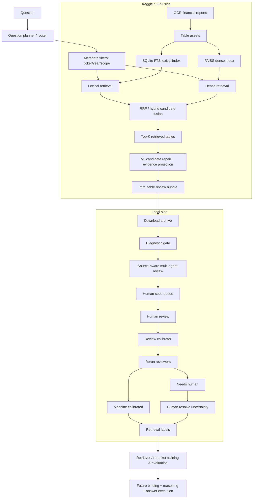

# ViFinQA Architecture

## 1. Mục tiêu kiến trúc

Hệ thống được thiết kế theo nguyên tắc:

> **Semantic retrieval để tìm ứng viên, deterministic grounding để chứng minh bằng chứng, human review để hiệu chỉnh, symbolic execution để tính toán.**

Không coi đây là một hệ RAG chỉ gồm:

```text
question → embedding → nearest table → LLM answer
```

ViFinQA có nhiều loại câu hỏi và bảng tài chính có cấu trúc phân cấp, nên kiến trúc phải tách rõ:

```text
question understanding
retrieval
source grounding
review/calibration
binding
reasoning
execution
validation
```

Current milestone tập trung vào bốn phần đầu.

---

# 2. Operational architecture hiện tại



---

# 3. Phân chia Kaggle và Local

## 3.1 Kaggle chịu workload nặng

Kaggle thực hiện:

```text
corpus parsing
build table assets
build lexical index
build dense embeddings/index
hybrid retrieval
candidate repair
review bundle export
```

Các file nặng:

```text
artifacts/table_assets.jsonl
artifacts/lexical_index.sqlite3
artifacts/dense.index
artifacts/dense_uids.jsonl
```

Các thao tác build/rebuild dense không được chạy local mặc định.

## 3.2 Local chịu review và calibration

Local thực hiện:

```text
bundle integrity check
diagnostic
multi-agent review
human seed review
calibration
rerun review
final label export
```

Local không cần:

```text
FAISS rebuild
embedding toàn corpus
GPU
raw 146k-table indexing
```

---

# 4. Data flow

## 4.1 Raw report

Input:

```text
data/ViFinQA/financial_statements/
```

Mỗi report chứa OCR text và table HTML-like structures.

## 4.2 TableAsset

Mỗi table được chuyển thành asset có identity ổn định:

```json
{
  "internal_table_uid": "...",
  "document_id": "...",
  "ticker": "SAB",
  "report_year": 2016,
  "scope": "separate",
  "page_no": 12,
  "local_ordinal": 5,
  "unit_hint": "vnd",
  "context_before": "...",
  "headers": [],
  "rows": [],
  "search_text": "..."
}
```

`internal_table_uid` là identity nội bộ. Không model nào được phép tự tạo UID mới.

---

# 5. Retrieval layer

## 5.1 Lexical retrieval

SQLite FTS được dùng cho exact/near-exact financial concepts:

```text
"tiền và các khoản tương đương tiền"
"bất động sản đầu tư"
"giá trị còn lại"
```

Lexical retrieval có lợi khi metric wording trong query gần với table wording.

## 5.2 Dense retrieval

Dense embeddings xử lý semantic variation khi wording không giống hoàn toàn.

Current baseline:

```text
intfloat/multilingual-e5-small
```

Research model có thể dùng BGE-M3 sau khi retrieval labels đủ tốt.

## 5.3 Hybrid fusion

Sparse + dense được fusion bằng Reciprocal Rank Fusion.

```text
lexical rank
+
dense rank
→ fused candidate list
```

Không coi fused rank là bằng chứng đủ để auto-label.

---

# 6. Root retrieval problem: context leakage

Corpus hiện tại đưa `context_before` vào `search_text`.

Điều này hữu ích để lấy heading/unit, nhưng tạo failure mode:

```text
TABLE N contains correct concept
        ↓
raw previous context leaks into TABLE N+1
        ↓
retriever retrieves TABLE N+1
        ↓
rank looks good but actual rows are wrong
```

Q13 là canary của lỗi này.

Root fix dài hạn là rebuild corpus với context sạch hơn:

```text
current-table heading
+
current-table rows
+
controlled section context
```

thay vì raw previous context.

Root fix này yêu cầu rebuild:

```text
table assets
→ lexical index
→ dense index
```

Vì vậy V3 hiện dùng repair layer để tiếp tục annotation trước khi rebuild toàn bộ corpus.

---

# 7. V3 candidate repair

V3 không thay đổi identity của table.

Khi một retrieved candidate có dấu hiệu:

```text
query concept mạnh trong context_before
nhưng yếu trong own rows
```

pipeline kiểm tra table đứng trước bằng:

```text
document_id
+
local_ordinal - 1
```

Recovered table được thêm với provenance:

```json
{
  "candidate_source": "adjacent_previous_due_context",
  "parent_retrieval_rank": 11,
  "original_retrieval_rank": null
}
```

Recovered candidate không được giả mạo là BM25/dense retrieval trực tiếp.

---

# 8. Effective metric

Planner đôi lúc tạo metric bị nhiễu bởi:

```text
ticker
company name
date
year
requested unit
```

Ví dụ query:

```text
Giá trị còn lại của bất động sản đầu tư của công ty mẹ IJC
đến ngày 31 tháng 12 năm 2021 là bao nhiêu tỷ đồng?
```

Effective metric cần trở thành:

```text
Giá trị còn lại của bất động sản đầu tư
```

V3 giữ cả:

```text
question_plan original
+
effective_metric
```

để vừa audit planner vừa dùng metric sạch cho evidence grounding.

---

# 9. Evidence projection

Một table candidate chỉ hữu ích nếu hệ thống có thể chỉ ra bằng chứng người review đọc nhanh được.

Không dùng:

```text
"Candidate #4 có vẻ đúng"
```

Mà dùng cấu trúc:

```text
TABLE
COLUMNS
VALUE
```

Ví dụ:

```text
TABLE: 10. Bất động sản đầu tư
||
COLUMNS: Nguyên giá | Hao mòn lũy kế | Giá trị còn lại
||
VALUE: Số cuối năm | 417.860.288.970 | 39.303.347.137 | 378.556.941.833
```

Các field:

```text
context_heading
anchor_row_index
value_row_index
best_row_index
direct_evidence
one_line_summary
period_intent
period_match
evidence_features
```

`direct_evidence` phải được ghép từ source table/context đã lưu.

Không cho LLM tự viết evidence text rồi coi nó là source.

---

# 10. Period-aware evidence selection

Một bảng tài chính thường có nhiều period:

```text
Số đầu năm
Số cuối năm
Năm trước
Năm nay
```

Question cue được map thành intent:

```text
cuối năm
31/12
31 tháng 12
→ end

đầu năm
01/01
→ start
```

Value-row selection ưu tiên period phù hợp.

Nếu metric nằm ở heading nhưng value nằm ở `TỔNG CỘNG`, hệ thống phải có khả năng nối:

```text
TABLE HEADING
+
TOTAL VALUE ROW
```

---

# 11. Review bundle

Kaggle export một bundle immutable:

```text
vifinqa_review_bundle_v3/
├── manifest.json
├── review_items.jsonl
├── tables.jsonl
├── errors.jsonl
└── SHA256SUMS
```

Archive:

```text
vifinqa_review_bundle_v3.tar.gz
```

`manifest.json` khóa:

```text
schema version
git commit
question hash
artifact health
question count
top_k
candidate counts
error count
```

Local review không query live Kaggle indexes; nó đọc bundle tĩnh.

Lợi ích:

```text
reproducible
versionable
auditable
review không đổi giữa chừng
```

---

# 12. Diagnostic gate

Trước auto-review phải chạy diagnostic.

Diagnostic không tạo label.

Nó phân biệt:

```text
ADJACENT_CONTEXT_HIT
RETRIEVAL_RISK
EVIDENCE_RISK
PLANNER_RISK
AMBIGUOUS_TOPK
COMPLEX_FAMILY_REVIEW
LOOKS_REVIEWABLE
```

Nguyên tắc:

```text
absence in Top-K != absence in corpus
```

Do đó:

```text
NO_CANDIDATE_IN_TOPK
```

không được chuyển thành:

```text
NO_GOLD_IN_CORPUS
```

---

# 13. Source-aware multi-agent review

Các "agent" hiện tại là independent reviewer modules trong code.

Không phải nhiều ChatGPT đang tự nói chuyện với nhau.

## 13.1 lexical_agent

Ưu tiên candidate có lexical rank tốt.

## 13.2 dense_agent

Ưu tiên semantic dense rank.

## 13.3 metadata_agent

Kiểm tra:

```text
ticker
year
scope
```

## 13.4 evidence_agent

Đánh giá source-grounded evidence:

```text
metric overlap
row score
numeric evidence
period match
```

## 13.5 challenger_agent

Cố tìm candidate khác mạnh hơn candidate hiện tại.

Mục tiêu là giảm rank anchoring.

## 13.6 grounding_agent

So `effective_metric` với `direct_evidence` thực sự của candidate.

## 13.7 verifier

Không chọn candidate mới. Nó chỉ trả lời candidate đã chọn có đủ support hay không.

## 13.8 calibrator_agent

Chỉ xuất hiện sau khi human review seed.

Đây là supervised reviewer học từ candidate features, không học answer string.

---

# 14. V3.1 grounding guard

Recovered adjacent candidate có rủi ro false recovery.

Do đó V3.1 bắt buộc:

```text
adjacent candidate
      ↓
effective_metric vs direct_evidence
      ↓
token coverage gate
+
bigram coverage gate
      ↓
PASS → được vote
FAIL → không được vote
```

Default conservative gate:

```text
token coverage >= 0.85
bigram ratio >= 0.45
```

Điều này bảo vệ khỏi trường hợp table kế bên có vài từ giống query nhưng không phải metric thực sự.

---

# 15. Consensus state machine

Machine review không chỉ có true/false.

```text
retrieval_failure
needs_human
machine_provisional
machine_high_confidence
machine_calibrated
human_verified
```

Ý nghĩa:

### retrieval_failure

Không có candidate đủ support.

Không có nghĩa gold không tồn tại.

### needs_human

Agent disagreement hoặc grounding/verifier fail.

### machine_provisional

Có candidate hợp lý nhưng chưa đủ calibrated confidence.

### machine_high_confidence

Rule-based confidence mạnh, chủ yếu dùng cho direct lookup.

### machine_calibrated

Candidate qua source grounding + reviewer consensus + learned calibration threshold.

### human_verified

Người review trực tiếp xác nhận.

Đây là label có provenance mạnh nhất.

---

# 16. Human-in-the-loop strategy

Không yêu cầu human review tất cả 60 câu.

Luồng:

```text
machine review 60
       ↓
stratified seed queue ~12
       ↓
human review seed
       ↓
train calibrator
       ↓
rerun 60
       ↓
review only unresolved cases
```

Seed queue cần chứa cả:

```text
machine-confident cases
uncertain cases
nhiều question families
```

Mục tiêu là calibration, không phải chỉ tìm case khó.

---

# 17. Review UI boundary

`local/review_bundle_widget.py` sử dụng `ipywidgets`.

Nó phải chạy trong:

```text
Jupyter Notebook
JupyterLab
IPython notebook kernel
```

Command:

```python
%run local/review_bundle_widget.py \
    --bundle-dir ... \
    --machine-reviews ... \
    --queue ... \
    --output ...
```

`%run` là IPython magic.

Không chạy `%run` trong Bash.

Terminal chỉ dùng để:

```text
pull
install
diagnose
baseline
calibrate
final
launch jupyter
```

---

# 18. Calibration layer

Human annotations tạo candidate-level training examples.

Features hiện tại gồm:

```text
rank reciprocal
lexical reciprocal
dense reciprocal
fused score
metadata score
row score
metric overlap
question overlap
numeric evidence
ticker match
scope match
year match
```

Baseline calibrator:

```text
StandardScaler
+
LogisticRegression(class_weight="balanced")
```

Evaluation dùng grouped split theo question ID để tránh candidate cùng question rơi vào cả train/test fold.

Calibrator không được override grounding verifier.

---

# 19. Label provenance

Final label phải giữ nguồn:

```json
{
  "annotation_status": "human_verified",
  "label_source": "human"
}
```

hoặc:

```json
{
  "annotation_status": "machine_calibrated",
  "label_source": "machine"
}
```

Không hợp nhất hai loại này thành một generic `verified=true`.

Training có thể dùng weighting khác nhau:

```text
human_verified          1.0
machine_calibrated      < 1.0
machine_provisional     không dùng mặc định
```

---

# 20. Question-family-specific evidence requirements

## Direct lookup

Cần tối thiểu:

```text
correct metadata
metric grounded
numeric value
period/unit compatibility
```

## Temporal change

Cần:

```text
operand t
operand t-1
period direction
```

Không được auto-pass chỉ vì một row có hai con số nếu chưa xác minh column meaning.

## Ratio / derived

Cần:

```text
numerator evidence
denominator evidence
formula identity
unit compatibility
```

## Cross entity

Cần evidence riêng cho:

```text
entity A
entity B
```

## Aggregation

Cần evidence set nhiều table/period/entity.

Một single-table reviewer không đủ để gọi gold.

---

# 21. Future binding layer

Sau khi retrieval labels đủ tốt, architecture tiếp tục:

```text
selected table(s)
→ row-path binding
→ column/period binding
→ exact cell binding
→ unit resolver
→ GroundedOperand
```

Target object:

```json
{
  "metric": "cash_and_cash_equivalents",
  "table_uid": "...",
  "row_index": 4,
  "column_index": 1,
  "raw_value": "1.880.612.291.229",
  "parsed_value": "1880612291229",
  "source_unit": "VND",
  "requested_unit": "billion_vnd"
}
```

---

# 22. Future reasoning/execution layer

Reasoning phải chuyển thành typed operation plan.

Ví dụ temporal change:

```text
subtract(value_t, value_t_minus_1)
```

Ratio:

```text
divide(numerator, denominator)
```

Aggregation:

```text
sum(values)
mean(values)
argmax(values)
count(filter(values))
```

LLM có thể đề xuất semantic operation, nhưng deterministic executor thực hiện arithmetic.

---

# 23. Failure taxonomy

Mọi failure phải có type.

```text
PLANNER_FAILURE
DOCUMENT_ROUTING_FAILURE
TABLE_RETRIEVAL_FAILURE
CONTEXT_LEAKAGE_FAILURE
EVIDENCE_PROJECTION_FAILURE
ROW_BINDING_FAILURE
COLUMN_BINDING_FAILURE
UNIT_FAILURE
FORMULA_FAILURE
EXECUTION_FAILURE
VALIDATION_FAILURE
```

Typed failures giúp biết phải sửa planner, retriever, projection hay reasoning thay vì retrain toàn bộ model.

---

# 24. Repository modules

```text
src/finance_query/
  corpus.py          raw report → TableAsset
  retrieval.py       lexical/dense/RRF
  questions.py       planner/router
  pipeline.py        orchestration
  binding.py         row/cell binding baseline
  execution.py       numeric/symbolic execution
  schemas.py         typed records

scripts/
  build_review_bundle_v3.py
  auto_review_bundle_v31.py
  train_review_calibrator.py
  export_review_labels.py
  train_dense_retriever.py
  train_reranker.py

kaggle/
  export_review_bundle_v3.py

local/
  diagnose_review_bundle.py
  run_local_review_stage.py
  review_bundle_widget.py
```

---

# 25. Current state machine của project

```text
KAGGLE BUILD
   ↓
REVIEW BUNDLE V3
   ↓
LOCAL DIAGNOSTIC
   ↓
SOURCE-AWARE BASELINE REVIEW
   ↓
HUMAN SEED
   ↓
CALIBRATION
   ↓
MACHINE CALIBRATED REVIEW
   ↓
HUMAN RESOLVE UNCERTAINTY
   ↓
VERIFIED RETRIEVAL LABELS
   ↓
RETRIEVER/RERANKER TRAINING
   ↓
ROW/CELL BINDING
   ↓
OPERAND REASONING
   ↓
DETERMINISTIC ANSWER EXECUTION
```

Không chuyển sang bước sau nếu bước trước chưa có evaluation gate đáng tin.

---

# 26. Priority order

Ưu tiên kỹ thuật hiện tại:

```text
P0 source correctness
P1 table retrieval recall
P2 evidence grounding
P3 review precision/calibration
P4 row/cell binding
P5 operand coverage
P6 formula execution
P7 final answer generation
```

Nguyên tắc cuối:

> **Không dùng model lớn để che lỗi retrieval hoặc provenance. Nếu bảng/evidence sai, answer đúng do may mắn vẫn được xem là failure.**