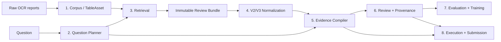

# ViFinQA — kiến trúc 8 mô-đun

> Tài liệu chuẩn để hiểu hệ thống hiện tại. Những tài liệu chuyên sâu trong
> `docs/` chỉ giải thích contract của từng artifact; nếu có khác biệt, tài liệu
> này mô tả luồng vận hành hiện hành.

## 1. Hệ thống đang giải quyết việc gì?

ViFinQA đọc câu hỏi tài chính tiếng Việt và tìm bằng chứng trong báo cáo tài
chính OCR. Khó khăn không nằm ở phép cộng/chia, mà ở việc chứng minh rằng một
con số thuộc đúng:

```text
công ty · báo cáo · scope · năm · bảng · dòng · cột · đơn vị
```

Vì vậy hệ thống không hoạt động như chatbot RAG thông thường:

```text
câu hỏi → bảng gần nhất → mô hình đoán đáp án
```

Luồng đúng là:

```text
câu hỏi
  → hiểu dạng bài toán
  → tìm bảng ứng viên
  → dựng lại cấu trúc bảng
  → bind đúng ô nguồn
  → kiểm tra bằng chứng
  → tính toán bằng rule
  → trả kết quả hoặc từ chối an toàn
```

Nguyên tắc ngắn gọn:

```text
ML tìm ứng viên.
Rule kiểm chứng.
Provenance quyết định trạng thái.
Executor thực hiện phép tính.
```

## 2. Những điều không được phá vỡ

| Quy tắc | Giải thích dễ hiểu |
| --- | --- |
| Raw report là nguồn gốc | Không sửa số OCR rồi giả rằng đó là số nguồn. |
| Retrieval không phải evidence | Bảng rank 1 chỉ là ứng viên, chưa phải bằng chứng. |
| Metadata không phải evidence | Tiêu đề/tóm tắt giúp tìm và đọc; không chứng minh giá trị số. |
| Exact-cell grounding | Giá trị phải truy ngược được về đúng row, column và source cell. |
| Không tự chọn scope | Nếu `consolidated` và `separate` còn mơ hồ thì phải dừng. |
| Không tự nâng provenance | Bốn trạng thái nhãn luôn tách biệt. |
| Fail closed | Thiếu hoặc mơ hồ thì `partial`/`blocked`, không đoán. |

Bốn trạng thái provenance:

| Trạng thái | Ý nghĩa | Được train? |
| --- | --- | ---: |
| `human_verified` | Human đã xác minh bằng chứng nguồn | Có, trọng số cao |
| `machine_calibrated` | Máy qua toàn bộ gate độc lập | Có, sau training gate |
| `machine_provisional` | Có ứng viên hợp lý nhưng chưa đủ gate | Không |
| `needs_human` | Thiếu/mơ hồ/quarantine | Không |

## 3. Bản đồ 8 mô-đun



Mỗi mô-đun có một đầu vào, một đầu ra và một quyền hạn riêng. Mô-đun sau
không được âm thầm sửa artifact của mô-đun trước.

---

## 4. Mô-đun 1 — Corpus và TableAsset

### Cách hiểu đơn giản

Mô-đun này cắt các báo cáo OCR thành những bảng có danh tính ổn định. Nó giống
việc đánh số và niêm phong từng bảng trước khi tìm kiếm.

### Input

```text
raw financial report
OCR text
HTML-like tables
```

### Output chính

```text
table_assets.jsonl
```

Mỗi `TableAsset` giữ:

```text
internal_table_uid
document_id / ticker / report_year / scope
raw rows và headers
page/ordinal/offset
source SHA và table SHA
context_before
search_text
```

`internal_table_uid` là identity. Các bước review không được tạo UID thay thế.

### Code chính

- `src/finance_query/corpus.py`
- `src/finance_query/schemas.py`
- `scripts/build_review_bundle_v3.py`

### Trạng thái

Đã hoàn thành cho snapshot hiện tại trên Kaggle. Không rebuild corpus chỉ vì
thay UI, evidence rule hay QueryProgram.

---

## 5. Mô-đun 2 — Question Planner và QueryProgram

### Cách hiểu đơn giản

Planner biến một câu tiếng Việt thành “phiếu công việc” có cấu trúc:

```text
cần chỉ tiêu gì?
của công ty nào?
năm nào?
scope nào?
phải thực hiện phép toán gì?
```

Ví dụ:

```text
"A chiếm bao nhiêu phần trăm B?"

→ divide
  numerator = A
  denominator = B
  same entity/year/scope = required
```

### Hai mức IR

**QuestionPlan** mô tả family, ticker, year, scope, unit, metric và phép toán
cấp cao.

**QueryProgram** mô tả câu nhiều bước dưới dạng stage:

```text
source operands → filter → aggregate/rank → lookup/output
```

### Trạng thái dữ liệu hiện tại

Trong 1.012 câu:

- 893 câu đã có top-level operator cụ thể;
- 119 câu còn `plan_required`;
- 647 câu vẫn cảnh báo operand decomposition chưa đầy đủ.

Các top-level operator hiện quan sát được:

| Operator | Số câu |
| --- | ---: |
| `lookup` | 339 |
| `subtract` | 127 |
| `max` | 118 |
| `mean` | 105 |
| `divide` | 102 |
| `count` | 47 |
| `min` | 30 |
| `percentage_change` | 17 |
| `sum` | 8 |
| `plan_required` | 119 |

Con số này chứng minh rằng không cần hardcode 1.012 câu. Ta cần một thư viện
operator nhỏ và một bộ phân rã operand tốt.

### QueryProgram hiện tại

Hai template đã được allow-list ở chế độ shadow:

1. Quick Ratio → lọc dưới median → xếp hạng thay đổi Gross Margin → Interest
   Coverage.
2. CFO dương qua nhiều năm → lọc entity → xếp hạng Net Margin.

Q369 compile nhưng bị chặn vì definition/binding/scope không coherent. Q551
chạy `shadow_complete` từ 15 exact cells, nhưng không được tạo final answer hay
nâng provenance.

### Code chính

- `src/finance_query/questions.py`
- `src/finance_query/financial_metrics.py`
- `src/finance_query/query_program.py`
- `src/finance_query/plan_overrides.py`

### Trạng thái

Đã có baseline và canary; chưa hoàn tất DSL tổng quát. Đây là một trong hai
bottleneck chính còn lại.

---

## 6. Mô-đun 3 — Retrieval

### Cách hiểu đơn giản

Retrieval giống người thủ thư: nó đưa ra những bảng có khả năng liên quan,
không được khẳng định bảng nào đúng.

```text
Lexical FTS: bắt cụm từ gần giống
Dense E5: bắt ý nghĩa gần giống
RRF: hợp nhất hai danh sách
→ Top-K candidates
```

Adjacent-table recovery có thể bổ sung bảng đứng cạnh khi context bị lệch,
nhưng candidate đó phải giữ provenance riêng và qua grounding guard.

### Output

Immutable review bundle V3:

```text
manifest.json
review_items.jsonl
tables.jsonl
errors.jsonl
```

### Code chính

- `src/finance_query/retrieval.py`
- `src/finance_query/pipeline.py`
- `kaggle/export_review_bundle_v3.py`

### Trạng thái

Đã hoàn thành cho snapshot hiện tại. Không cần rebuild FTS/FAISS/dense trong
giai đoạn xây DSL và validator.

---

## 7. Mô-đun 4 — Chuẩn hóa nguồn V2/V3

### Cách hiểu đơn giản

OCR có thể đọc đúng chữ nhưng làm lệch cột. Mô-đun này dựng lại “khung bảng”
trước khi đọc số.

```text
Raw table
  → V2: dựng đúng grid, ô trống, rowspan, colspan
  → V3: xác định header path, kỳ, đơn vị và quality
```

### V2 và V3 khác nhau thế nào?

| Lớp | Chức năng | Không được làm |
| --- | --- | --- |
| **V2 Structure** | Khôi phục hình học bảng và provenance từng cell | Không sửa chữ/số OCR |
| **V3 Evidence Context** | Chuẩn hóa header, period, unit, row profile | Không trở thành nguồn số mới |

Hai nhánh metadata song song:

- **OCR Quality Profile:** đánh dấu `normal`, `review_required`, `quarantine`;
- **Semantic Catalog:** mô tả bảng là statement, note, schedule hay source
  metadata.

Hai nhánh này chỉ giúp điều hướng/audit. Exact evidence vẫn phải đi từ V3 về
source cell V2.

### Snapshot hiện tại

29.509 bảng đã được profile OCR:

```text
normal           24.479
review_required   4.854
quarantine          176
```

### Code chính

- `src/finance_query/table_structure.py`
- `src/finance_query/evidence_context.py`
- `src/finance_query/ocr_quality.py`
- `src/finance_query/semantic_catalog.py`
- `src/finance_query/report_segments.py`

### Trạng thái

Đã hoàn thành cho snapshot hiện tại. Đây là lớp chuẩn hóa cấu trúc, không phải
OCR correction engine.

---

## 8. Mô-đun 5 — Evidence Compiler

### Cách hiểu đơn giản

Mô-đun này phải trả lời được câu hỏi:

> “Con số này nằm chính xác ở đâu trong báo cáo?”

### Direct EvidenceSet

Dùng cho câu tra cứu trực tiếp. Một binding hợp lệ cần:

```text
exact metric row
exact period column/header
exact value cell
matching ticker/year/scope
raw V2 provenance
```

### Formula EvidenceSet

Dùng cho câu cần nhiều số. Câu được tách thành operand slots. Mỗi operand phải
bind riêng; một bảng đúng cho một operand không làm toàn công thức complete.

Với multi-entity, mọi operand phải có một reporting scope chung nếu contract
yêu cầu. Duplicate, tie hoặc hai scope đều hợp lệ sẽ làm selection blocked.

### Snapshot hiện tại

Có 136 Formula EvidenceSet:

```text
operand coverage complete       30
full selected bindings           4
evidence completeness complete   3
```

Vì vậy executor không phải bottleneck duy nhất; thiếu operand binding chính là
vấn đề phải giải quyết để tăng coverage.

### Source completion

Source completion chỉ tìm bảng raw bị thiếu khỏi immutable bundle. Nó không
được sửa corpus/index, tạo answer hoặc tự chọn scope. Nếu bảng đã có nhưng chưa
bind được, thêm lại bảng không giải quyết vấn đề.

### Code chính

- `src/finance_query/binding.py`
- `src/finance_query/formula_evidence.py`
- `src/finance_query/source_completion.py`
- `scripts/build_direct_evidence_sets.py`
- `scripts/build_formula_evidence_sets.py`

### Trạng thái

Direct evidence đã vận hành; Formula evidence V6 đã có contract chặt nhưng
coverage còn thấp. Đây là bottleneck chính thứ hai.

---

## 9. Mô-đun 6 — Reviewer, critic và provenance

### Cách hiểu đơn giản

Nhiều reviewer không có nghĩa là nhiều AI tự thuyết phục nhau. Các reviewer
đọc những tín hiệu khác nhau:

```text
lexical match
dense match
metadata match
exact evidence
challenger candidate
grounding verifier
confidence calibrator
```

Consensus chỉ được tin khi exact-source validator đồng ý. Confidence cao không
thể vượt qua binding fail.

### Snapshot hiện tại

Trong 1.012 machine reviews:

```text
machine_calibrated     62
machine_provisional   364
needs_human           586
```

62 calibrated hiện đều thuộc direct lookup. Điều này cho thấy hướng tăng nhanh
nhất là **Direct Evidence Replay**: tái kiểm deterministic toàn bộ exact
row/header/cell thay vì yêu cầu human đọc lại từng câu.

### Code chính

- `scripts/auto_review_bundle_v4.py`
- `scripts/build_review_ledger.py`
- `scripts/train_review_calibrator.py`
- `local/review_bundle_widget.py`

### Trạng thái

Đã vận hành. Chưa nên coi mọi `machine_provisional` là silver; cần replay và
promotion policy độc lập.

---

## 10. Mô-đun 7 — Evaluation và Training

### Cách hiểu đơn giản

Mô-đun 7 quyết định dữ liệu nào đủ sạch để học. Nó không làm dữ liệu trở nên
đúng chỉ vì model cần thêm examples.

```text
human_verified      → training eligible
machine_calibrated  → eligible sau provenance/training gate
machine_provisional → audit only
needs_human         → quarantine
```

Grounding Health Dashboard tách lỗi theo family, OCR quality, semantic role,
candidate availability và Formula completeness.

Training gate hiện đặt ở 200 machine-silver grounded; snapshot mới có 62. Do
đó chưa train dense/reranker chính thức và không ghi đè baseline index.

GPU có ích ở đây cho embedding, reranking và training sau khi đủ labels. GPU
không thay thế exact-cell validation.

### Code chính

- `src/finance_query/evaluation_dashboard.py`
- `scripts/build_evaluation_dashboard.py`
- `scripts/export_review_labels.py`
- `scripts/train_dense_retriever.py`
- `scripts/train_pilot_candidate_reranker.py`

### Trạng thái

Evaluation đã hoàn thành; training production chưa mở vì chưa đạt gate.

---

## 11. Mô-đun 8 — Execution và Submission

### Cách hiểu đơn giản

Sau khi các số đầu vào đã được chứng minh, executor mới thực hiện phép tính.
Nó dùng `Decimal` và operator allow-list, không dùng LLM để viết/chạy Python tùy
ý.

Các điều kiện fail-closed gồm:

```text
operand thiếu
cell không exact
entity/year/scope không coherent
unit không tương thích
mẫu số bằng 0
tie khi cần unique winner
formula chưa defined
```

Submission compiler kiểm lại execution record và binding trước khi xuất kết
quả. Shadow result không đủ điều kiện submission.

### Code chính

- `src/finance_query/execution.py`
- `src/finance_query/query_program.py`
- `src/finance_query/submission.py`
- `scripts/build_query_program_shadow.py`
- `scripts/build_execution_ledger.py`
- `scripts/compile_vifinqa_submission.py`

### Trạng thái

Direct/percentage-change execution đã có contract hẹp. Multi-stage
QueryProgram mới ở shadow canary; chưa hoàn tất generic operator DSL.

---

## 12. Không review 1.012 câu bằng cách nào?

Ta không bỏ validation. Ta đổi đơn vị kiểm thử từ **câu hỏi** sang **contract
fingerprint**.

Một fingerprint gồm:

```text
operator DAG
operand roles
entity/year cardinality
scope policy
allowed table functions
unit/output contract
```

Những câu khác wording nhưng cùng fingerprint dùng chung executor và test
contract. Toàn bộ 1.012 câu vẫn chạy census tự động:

```text
known fingerprint + exact evidence → Green / executable
known fingerprint + ambiguous data → provisional / blocked
unknown fingerprint               → needs_human / abstain
```

### Ba lớp kiểm định

1. **Census tự động:** chạy schema/hash/grounding gate cho 1.012/1.012 câu.
2. **Fixture theo fingerprint:** positive, missing operand, wrong year/scope,
   unit mismatch, zero denominator, tie và OCR malformed.
3. **Risk-stratified audit:** lấy mẫu độc lập từ tập Green; fingerprint hiếm
   hoặc rủi ro cao được audit nhiều hơn.

Hai model đồng ý không phải là bằng chứng độc lập. Raw-source replay và
mutation tests mới là validator độc lập với planner/model.

## 13. Kế hoạch tăng tốc trong 12 giờ

Mốc 12 giờ phù hợp để hoàn thiện **MVP shadow**, không đủ để tuyên bố production
accuracy cho gần hết corpus.

| Thời gian | Việc thực hiện | Kết quả |
| --- | --- | --- |
| Giờ 0–2 | Sinh fingerprint/coverage matrix cho 1.012 câu | Biết contract nào phủ nhiều câu nhất |
| Giờ 2–5 | Direct Evidence Replay | Tái kiểm 358 câu direct, không cần human đọc từng câu |
| Giờ 5–8 | Generic operator registry | Dùng chung lookup/divide/subtract/sum/mean/min/max/count/change |
| Giờ 8–10 | Migrate hai QueryProgram canary | Bỏ evaluator riêng ở mức template |
| Giờ 10–12 | Regression, dashboard, artifact registry | Snapshot shadow reproducible |

GPU chỉ nên chạy song song để đề xuất operand/plan hoặc rerank. Quyết định cuối
vẫn do CPU validator exact-source thực hiện.

Sau 12 giờ, kết quả hợp lệ mong đợi là:

- 1.012 câu được route thành fingerprint hoặc abstain có reason code;
- direct questions được replay deterministic;
- operator chung chạy shadow;
- không tự nâng provenance hoặc train dense;
- coverage report cho biết chính xác bước nào còn thiếu.

## 14. Khi nào được coi là hoàn thành 8 mô-đun?

“Có đủ tám file/module” chưa phải hoàn thành. Definition of Done là:

1. 1.012/1.012 câu đi qua schema và routing census.
2. Mọi output là `executable` hoặc `abstain` có reason code rõ ràng.
3. Mọi value truy ngược được exact V2 row/header/cell.
4. Scope, period, entity và unit đều coherent.
5. Provenance không bị promotion ngầm.
6. Artifact registry và dependency hash validate được.
7. Green pool đạt ngưỡng precision đã định trên audit độc lập.
8. Training/submission chỉ đọc artifact đủ eligibility.

Một hệ thống có thể hoàn thành dù vẫn còn `needs_human`: từ chối đúng là hành
vi đúng. Hoàn thành không có nghĩa ép 1.012 câu phải có answer.

## 15. Artifact và version hiện hành

| Tên logic | Artifact/schema | Vai trò |
| --- | --- | --- |
| Raw table | Review Bundle V3 | snapshot candidate và raw table |
| Structured table | V2 | grid + cell provenance |
| Evidence context | V3 | canonical header/period/unit |
| Formula evidence | V6 | operand discovery và binding |
| Query program | Shadow V1 | multi-stage execution canary |
| OCR profile | V1 | diagnostic/quarantine metadata |
| Semantic catalog | V1 | navigation/evaluation metadata |
| Evaluation dashboard | V1 | trạng thái grounding toàn corpus |

ArtifactRegistry dùng logical name và dependency hash để tránh chọn nhầm file
chỉ vì tên có `v2`, `v3`, `v31` hoặc `v4`.

## 16. Tài liệu chuyên sâu còn giữ

- [`docs/ARTIFACT_REGISTRY.md`](docs/ARTIFACT_REGISTRY.md)
- [`docs/TABLE_STRUCTURE_V2.md`](docs/TABLE_STRUCTURE_V2.md)
- [`docs/FORMULA_EVIDENCE_SETS.md`](docs/FORMULA_EVIDENCE_SETS.md)
- [`docs/QUERY_PROGRAM.md`](docs/QUERY_PROGRAM.md)
- [`docs/COMPLEX_QUERY_CANARY.md`](docs/COMPLEX_QUERY_CANARY.md)
- [`docs/OCR_QUALITY_PROFILE.md`](docs/OCR_QUALITY_PROFILE.md)
- [`docs/SEMANTIC_CATALOG.md`](docs/SEMANTIC_CATALOG.md)
- [`docs/GROUNDING_HEALTH_DASHBOARD.md`](docs/GROUNDING_HEALTH_DASHBOARD.md)
- [`docs/AUTONOMOUS_RAW_REVIEW.md`](docs/AUTONOMOUS_RAW_REVIEW.md)
- [`docs/SUBMISSION_EXECUTION_PIPELINE.md`](docs/SUBMISSION_EXECUTION_PIPELINE.md)
- [`docs/KAGGLE_TO_LOCAL_REVIEW.md`](docs/KAGGLE_TO_LOCAL_REVIEW.md)

Tài liệu snapshot cũ được loại khỏi nhánh hiện hành sau khi nội dung còn đúng
đã được hợp nhất vào tài liệu này. Lịch sử vẫn có thể xem hoặc khôi phục bằng
Git.
