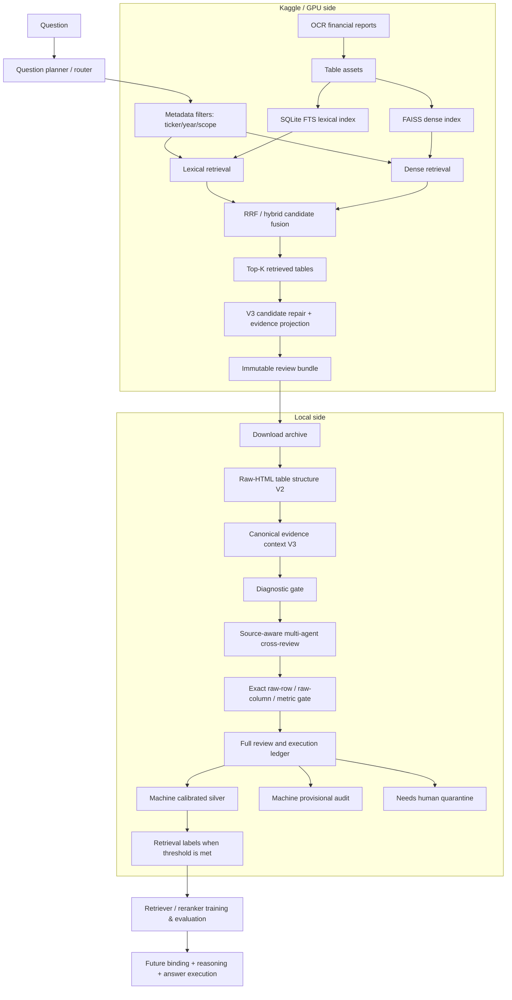

# ViFinQA Architecture

## 1. Mục tiêu kiến trúc

Hệ thống được thiết kế theo nguyên tắc:

> **Semantic retrieval để tìm ứng viên, deterministic grounding để chứng minh bằng chứng, human review để hiệu chỉnh, symbolic execution để tính toán.**

Không coi đây là một hệ RAG chỉ gồm:

```text
question → embedding → nearest table → LLM answer
```

ViFinQA có nhiều loại câu hỏi và bảng tài chính có cấu trúc phân cấp, nên kiến trúc phải tách rõ:

```text
question understanding
retrieval
source grounding
review/calibration
binding
reasoning
execution
validation
```

Current milestone tập trung vào bốn phần đầu.

---

# 2. Operational architecture hiện tại



---

# 3. Phân chia Kaggle và Local

## 3.1 Kaggle chịu workload nặng

Kaggle thực hiện:

```text
corpus parsing
build table assets
build lexical index
build dense embeddings/index
hybrid retrieval
candidate repair
review bundle export
```

Các file nặng:

```text
artifacts/table_assets.jsonl
artifacts/lexical_index.sqlite3
artifacts/dense.index
artifacts/dense_uids.jsonl
```

Các thao tác build/rebuild dense không được chạy local mặc định.

## 3.2 Local chịu review và calibration

Local thực hiện:

```text
bundle integrity check
diagnostic
multi-agent review
human seed review
calibration
rerun review
final label export
```

Local không cần:

```text
FAISS rebuild
embedding toàn corpus
GPU
raw 146k-table indexing
```

## 3.3 Local Table Structure V2

Bundle V3 là immutable snapshot retrieval. Để sửa lỗi presentation do parser
cũ bỏ ô trống hoặc không xử lý `rowspan`/`colspan`, local tạo sidecar
`tables_structured_v2.jsonl` từ raw HTML report theo `internal_table_uid`.

```text
immutable V3 bundle + raw report HTML
        ↓ UID/hash verification
rectangular grid with blank cells and expanded spans
        ↓
column labels + cell provenance + table function/purpose + context trace
        ↓
compact review UI / section gate / formula EvidenceSet
```

Sidecar không thay raw source, không thay annotation provenance và không rebuild
Kaggle/FTS/FAISS. Chi tiết contract: [`docs/TABLE_STRUCTURE_V2.md`](docs/TABLE_STRUCTURE_V2.md).

### 3.4 Canonical evidence context V3 và machine-silver boundary

V2 grid là bằng chứng lossless. Context V3 là sidecar suy dẫn từ grid đó, không
phải một lớp OCR correction: nó dựng header cha–con từ span provenance và chỉ
hồi phục header dạng `td` khi bảng không có HTML header, tối đa ba hàng đứng
trước data đều còn provenance hợp lệ, mỗi cột số có text nguồn và có cue
kỳ/đơn vị/tham chiếu. Mã/heading nhóm hoặc số trần không được dùng làm header.
Nếu không chứng minh đủ, bảng vẫn `needs_processing`.

Một label máy chỉ vào tập `machine_calibrated`/machine-silver khi selected
value row, cell và column header khớp raw V2, đồng thời significant token của
metric khớp exact với raw row. Chỉ mã dòng cấu trúc, tham chiếu thuyết minh độc
lập và viết tắt `TNDN` có audit transform hẹp; pipeline không bỏ các từ nghiệp
vụ như `tổng`, `số dư`, `nguyên giá`. `machine_provisional` và `needs_human`
vẫn là audit/quarantine và không thể vào training.

---

# 4. Data flow

## 4.1 Raw report

Input:

```text
data/ViFinQA/financial_statements/
```

Mỗi report chứa OCR text và table HTML-like structures.

## 4.2 TableAsset

Mỗi table được chuyển thành asset có identity ổn định:

```json
{
  "internal_table_uid": "...",
  "document_id": "...",
  "ticker": "SAB",
  "report_year": 2016,
  "scope": "separate",
  "page_no": 12,
  "local_ordinal": 5,
  "unit_hint": "vnd",
  "context_before": "...",
  "headers": [],
  "rows": [],
  "search_text": "..."
}
```

`internal_table_uid` là identity nội bộ. Không model nào được phép tự tạo UID mới.

---

# 5. Retrieval layer

## 5.1 Lexical retrieval

SQLite FTS được dùng cho exact/near-exact financial concepts:

```text
"tiền và các khoản tương đương tiền"
"bất động sản đầu tư"
"giá trị còn lại"
```

Lexical retrieval có lợi khi metric wording trong query gần với table wording.

## 5.2 Dense retrieval

Dense embeddings xử lý semantic variation khi wording không giống hoàn toàn.

Current baseline:

```text
intfloat/multilingual-e5-small
```

Research model có thể dùng BGE-M3 sau khi retrieval labels đủ tốt.

## 5.3 Hybrid fusion

Sparse + dense được fusion bằng Reciprocal Rank Fusion.

```text
lexical rank
+
dense rank
→ fused candidate list
```

Không coi fused rank là bằng chứng đủ để auto-label.

---

# 6. Root retrieval problem: context leakage

Corpus hiện tại đưa `context_before` vào `search_text`.

Điều này hữu ích để lấy heading/unit, nhưng tạo failure mode:

```text
TABLE N contains correct concept
        ↓
raw previous context leaks into TABLE N+1
        ↓
retriever retrieves TABLE N+1
        ↓
rank looks good but actual rows are wrong
```

Q13 là canary của lỗi này.

Root fix dài hạn là rebuild corpus với context sạch hơn:

```text
current-table heading
+
current-table rows
+
controlled section context
```

thay vì raw previous context.

Root fix này yêu cầu rebuild:

```text
table assets
→ lexical index
→ dense index
```

Vì vậy V3 hiện dùng repair layer để tiếp tục annotation trước khi rebuild toàn bộ corpus.

---

# 7. V3 candidate repair

V3 không thay đổi identity của table.

Khi một retrieved candidate có dấu hiệu:

```text
query concept mạnh trong context_before
nhưng yếu trong own rows
```

pipeline kiểm tra table đứng trước bằng:

```text
document_id
+
local_ordinal - 1
```

Recovered table được thêm với provenance:

```json
{
  "candidate_source": "adjacent_previous_due_context",
  "parent_retrieval_rank": 11,
  "original_retrieval_rank": null
}
```

Recovered candidate không được giả mạo là BM25/dense retrieval trực tiếp.

---

# 8. Effective metric

Planner đôi lúc tạo metric bị nhiễu bởi:

```text
ticker
company name
date
year
requested unit
```

Ví dụ query:

```text
Giá trị còn lại của bất động sản đầu tư của công ty mẹ IJC
đến ngày 31 tháng 12 năm 2021 là bao nhiêu tỷ đồng?
```

Effective metric cần trở thành:

```text
Giá trị còn lại của bất động sản đầu tư
```

V3 giữ cả:

```text
question_plan original
+
effective_metric
```

để vừa audit planner vừa dùng metric sạch cho evidence grounding.

---

# 9. Evidence projection

Một table candidate chỉ hữu ích nếu hệ thống có thể chỉ ra bằng chứng người review đọc nhanh được.

Không dùng:

```text
"Candidate #4 có vẻ đúng"
```

Mà dùng cấu trúc:

```text
TABLE
COLUMNS
VALUE
```

Ví dụ:

```text
TABLE: 10. Bất động sản đầu tư
||
COLUMNS: Nguyên giá | Hao mòn lũy kế | Giá trị còn lại
||
VALUE: Số cuối năm | 417.860.288.970 | 39.303.347.137 | 378.556.941.833
```

Các field:

```text
context_heading
anchor_row_index
value_row_index
best_row_index
direct_evidence
one_line_summary
period_intent
period_match
evidence_features
```

`direct_evidence` phải được ghép từ source table/context đã lưu.

Không cho LLM tự viết evidence text rồi coi nó là source.

Table Structure V2 bổ sung lớp context có kiểm soát:

```text
exact source title (audit)
+ nearest numbered topic/note (quick view)
+ observed period labels
+ observed unit labels
+ deterministic table function/purpose
```

Phân loại từ tiêu đề vùng thuyết minh mang `specificity=broad`; fallback tổng
quát mang `specificity=generic`. Chúng không được trình bày như hiểu biết
nghiệp vụ chắc chắn. UI ưu tiên topic ngắn, còn source title dài và rule
evidence nằm trong trace thu gọn.

Ngoài heading, primary statement được nhận diện bằng tập dòng chuẩn. Ví dụ một
bảng có đồng thời `doanh thu thuần`, `lợi nhuận gộp` và `kế toán trước thuế`
được đánh dấu `income_statement` với `specificity=structural`. Đây là metadata
điều hướng; exact rows và cells vẫn là bằng chứng duy nhất cho số liệu.

---

# 10. Period-aware evidence selection

Một bảng tài chính thường có nhiều period:

```text
Số đầu năm
Số cuối năm
Năm trước
Năm nay
```

Question cue được map thành intent:

```text
cuối năm
31/12
31 tháng 12
→ end

đầu năm
01/01
→ start
```

Value-row selection ưu tiên period phù hợp.

Nếu metric nằm ở heading nhưng value nằm ở `TỔNG CỘNG`, hệ thống phải có khả năng nối:

```text
TABLE HEADING
+
TOTAL VALUE ROW
```

---

# 11. Review bundle

Kaggle export một bundle immutable:

```text
vifinqa_review_bundle_v3/
├── manifest.json
├── review_items.jsonl
├── tables.jsonl
├── errors.jsonl
└── SHA256SUMS
```

Archive:

```text
vifinqa_review_bundle_v3.tar.gz
```

`manifest.json` khóa:

```text
schema version
git commit
question hash
artifact health
question count
top_k
candidate counts
error count
```

Local review không query live Kaggle indexes; nó đọc bundle tĩnh.

Lợi ích:

```text
reproducible
versionable
auditable
review không đổi giữa chừng
```

---

# 12. Diagnostic gate

Trước auto-review phải chạy diagnostic.

Diagnostic không tạo label.

Nó phân biệt:

```text
ADJACENT_CONTEXT_HIT
RETRIEVAL_RISK
EVIDENCE_RISK
PLANNER_RISK
AMBIGUOUS_TOPK
COMPLEX_FAMILY_REVIEW
LOOKS_REVIEWABLE
```

Nguyên tắc:

```text
absence in Top-K != absence in corpus
```

Do đó:

```text
NO_CANDIDATE_IN_TOPK
```

không được chuyển thành:

```text
NO_GOLD_IN_CORPUS
```

---

# 13. Source-aware multi-agent review

Các "agent" hiện tại là independent reviewer modules trong code.

Không phải nhiều ChatGPT đang tự nói chuyện với nhau.

## 13.1 lexical_agent

Ưu tiên candidate có lexical rank tốt.

## 13.2 dense_agent

Ưu tiên semantic dense rank.

## 13.3 metadata_agent

Kiểm tra:

```text
ticker
year
scope
```

## 13.4 evidence_agent

Đánh giá source-grounded evidence:

```text
metric overlap
row score
numeric evidence
period match
```

## 13.5 challenger_agent

Cố tìm candidate khác mạnh hơn candidate hiện tại.

Mục tiêu là giảm rank anchoring.

## 13.6 grounding_agent

So `effective_metric` với `direct_evidence` thực sự của candidate.

## 13.7 verifier

Không chọn candidate mới. Nó chỉ trả lời candidate đã chọn có đủ support hay không.

## 13.8 calibrator_agent

Chỉ xuất hiện sau khi human review seed.

Đây là supervised reviewer học từ candidate features, không học answer string.

---

# 14. V3.1 grounding guard

Recovered adjacent candidate có rủi ro false recovery.

Do đó V3.1 bắt buộc:

```text
adjacent candidate
      ↓
effective_metric vs direct_evidence
      ↓
token coverage gate
+
bigram coverage gate
      ↓
PASS → được vote
FAIL → không được vote
```

Default conservative gate:

```text
token coverage >= 0.85
bigram ratio >= 0.45
```

Điều này bảo vệ khỏi trường hợp table kế bên có vài từ giống query nhưng không phải metric thực sự.

---

# 15. Consensus state machine

Machine review không chỉ có true/false.

```text
retrieval_failure
needs_human
machine_provisional
machine_high_confidence
machine_calibrated
human_verified
```

Ý nghĩa:

### retrieval_failure

Không có candidate đủ support.

Không có nghĩa gold không tồn tại.

### needs_human

Agent disagreement hoặc grounding/verifier fail.

### machine_provisional

Có candidate hợp lý nhưng chưa đủ calibrated confidence.

### machine_high_confidence

Rule-based confidence mạnh, chủ yếu dùng cho direct lookup.

### machine_calibrated

Candidate qua source grounding + reviewer consensus + learned calibration threshold.

### human_verified

Người review trực tiếp xác nhận.

Đây là label có provenance mạnh nhất.

---

# 16. Collaborative Codex + human review strategy

Không yêu cầu human review tất cả 60 câu.

Luồng:

```text
machine review 60
       ↓
Codex review một batch với exact UID/rows
       ↓
human spot-check ~6 câu, ưu tiên disagreement + đủ family
       ↓
Codex đọc correction và review lại phần còn lại
       ↓
lặp đến khi có >=8 human cases dùng được cho calibration
       ↓
train calibrator + rerun 60
       ↓
giữ đủ mọi trạng thái trong review ledger
```

Seed queue cần chứa cả:

```text
machine-confident cases
uncertain cases
nhiều question families
```

Mục tiêu là vừa calibration vừa đo disagreement. Codex review luôn có `reviewer_type=codex_assisted`, `human_verified=false` và không được tự nâng thành human gold.

## 16.1 Review unit cho câu phức tạp

Direct lookup có thể review một table. Temporal/ratio/comparison/aggregation phải review một `EvidenceSet`:

```text
question
→ operand slots (entity, metric, year, scope)
→ one or more exact table rows per slot
→ completeness: complete | partial | missing
```

Một candidate đúng cho một operand vẫn có thể là positive retrieval table, nhưng toàn câu không được gọi complete khi operand khác còn thiếu.

Formula planner hiện là tập rule có kiểm soát, chỉ tạo review template chứ
không tính answer. Mỗi formula gồm `formula_id`, expression, definition status,
required operands, period và role. Operand coverage giữ:

```text
operand_id
→ candidate UID + rank
→ exact row_index + exact row cells
→ exact column labels/period context
```

Một EvidenceSet có thể ghép nhiều bảng. `definition_status=ambiguous` luôn
fail closed; `review_required` cần human xác nhận công thức. Multi-operand
formula không được accept trực tiếp từ machine recommendation.

Câu lọc/xếp hạng nhiều giai đoạn được route thành
`multi_stage_selection_unresolved`, thay vì lấy công thức từ keyword xuất hiện
đầu tiên. Q369 là controlled canary đầu tiên có stage planner theo entity; mọi
stage vẫn partial nếu thiếu exact-row EvidenceSet. Các pattern khác tiếp tục
unresolved cho đến khi có rule riêng.

Human có thể xác nhận phần evidence này bằng `human_verified_partial`. Nó được giữ trong ledger để Codex dùng ở vòng sau, nhưng không đi vào training subset cho đến khi evidence set complete.

---

# 17. Review UI boundary

`local/review_bundle_widget.py` sử dụng `ipywidgets`.

Trước review số liệu, chạy `repair-tables --repair-force` để widget tự đọc
`tables_structured_v2.jsonl`. UI chính chỉ hiển thị chức năng bảng, context
ngắn, tối đa bốn exact rows liên quan, mức phù hợp và tóm tắt grounded; raw grid
là phần mở rộng. Nếu phần kế
toán của bảng mâu thuẫn rõ ràng với câu hỏi (ví dụ `asset` thay vì `liability`),
machine acceptance bị chặn nhưng human vẫn có thể override có chủ đích.

Với ratio/derived, UI hiện formula ở đầu câu, chỉ rõ operand đã có/đang thiếu
và candidate nào hỗ trợ. Candidate không map được vào operand bị bỏ khỏi quick
numeric view để giảm nhiễu nhưng full source grid vẫn mở được để kiểm tra.
Legacy grid chưa được UID/hash-verified cũng không được dùng để tạo complete
label. Khi build ledger, exact operand rows và column labels được đối chiếu lại
với sidecar V2; mismatch làm tiến trình dừng.

Positive human label từ UI cũ được bảo toàn trong audit ledger với
`needs_review_refresh=true`, nhưng `training_eligible=false`. Sau khi human lưu
lại trên V2, provenance human được giữ và structure gate mới được mở.

Machine reviewer dùng cùng sidecar để bind projected `VALUE/ANCHOR` trở lại
`best_row_index`. Candidate row mismatch bị loại trước consensus; machine label
không có `structure_validation.validated=true` không qua final export gate.

Nó phải chạy trong:

```text
Jupyter Notebook
JupyterLab
IPython notebook kernel
```

Command:

```python
%run local/review_bundle_widget.py \
    --bundle-dir ... \
    --machine-reviews ... \
    --assistant-reviews ... \
    --queue ... \
    --output ...
```

`%run` là IPython magic.

Không chạy `%run` trong Bash.

Terminal chỉ dùng để:

```text
pull
install
diagnose
baseline
collaborate
calibrate
final
launch jupyter
```

---

# 18. Calibration layer

Human annotations tạo candidate-level training examples.

Features hiện tại gồm:

```text
rank reciprocal
lexical reciprocal
dense reciprocal
fused score
metadata score
row score
metric overlap
question overlap
numeric evidence
ticker match
scope match
year match
```

Baseline calibrator:

```text
StandardScaler
+
LogisticRegression(class_weight="balanced")
```

Evaluation dùng grouped split theo question ID để tránh candidate cùng question rơi vào cả train/test fold.

Calibrator không được override grounding verifier.

---

# 19. Label provenance và output boundary

Final label phải giữ nguồn:

```json
{
  "annotation_status": "human_verified",
  "label_source": "human"
}
```

hoặc:

```json
{
  "annotation_status": "machine_calibrated",
  "label_source": "machine"
}
```

Không hợp nhất hai loại này thành một generic `verified=true`.

Output được tách thành:

```text
review_ledger_60.jsonl     đủ mọi question/status/reviewer, dùng audit
retriever_labels_v2.jsonl  chỉ training-eligible labels
```

`machine_provisional`, `needs_human` và `retrieval_failure` không bị xóa khỏi ledger chỉ vì chúng không được dùng để train.

Training có thể dùng weighting khác nhau:

```text
human_verified          1.0
machine_calibrated      < 1.0
machine_provisional     không dùng mặc định
```

---

# 19.1 Pilot candidate reranker (shadow-only)

Sau khi final label export, local có thể học một reranker nhỏ trên feature của
**candidate đã tồn tại trong immutable bundle Top-K**. Đây không phải retriever
training và không được rebuild dense/FAISS hoặc lexical index.

```text
review_items Top-K + final labels + provenance ledger
→ candidate feature model
→ GroupKFold theo question ID
→ shadow ranking để audit
```

Negative supervision chỉ đến từ `human_verified` có V2 complete. Với
`machine_calibrated`/`machine_high_confidence`, exact selected table là
positive pseudo-label có weight; các candidate không được chọn là `unknown`,
không được giả định là negative. Metric phải tách `human_verified_only` khỏi
metric có pseudo-label, và chỉ nói về re-rank trong Top-K, không phải full
corpus recall.

Artifact luôn ở trạng thái shadow/hold cho đến khi đủ ít nhất 30 question
`human_verified`, OOF human-only không giảm, và có holdout audit. Chi tiết
contract và lệnh chạy ở [`docs/PILOT_CANDIDATE_RERANKER.md`](docs/PILOT_CANDIDATE_RERANKER.md).

---

# 19.2 Autonomous source-processing and machine-silver loop

Khi không có human reviewer, hệ thống không thay machine provenance bằng human
gold. Luồng V4 trước hết tạo sidecar semantic riêng từ V2 raw-HTML grid:

```text
V2 cell provenance
→ V2 canonical header parent/child path
→ per-column period/unit context
→ row role + source-quality gate
→ review_ready | needs_processing | blocked
```

Header cha được khôi phục chỉ khi `cell_provenance` xác nhận đó là ô bị cover
bởi span; OCR text/số và V2 grid gốc vẫn bất biến. Candidate muốn thành
`machine_calibrated` silver phải có exact V2 row, canonical table
`review_ready`, data-row binding, unique raw-header period/year-cell binding
nếu câu hỏi yêu cầu đầu/cuối kỳ hoặc nêu rõ năm, consensus của retrieval/semantic/evidence/metadata/source,
và critic không tìm thấy alternative gần ngang điểm.

Năm trong metadata của report **không** tự bind giá trị vào một cột so sánh.
V4 chỉ chọn cột có raw canonical header nêu đúng năm; fallback `Năm nay/Kỳ
này` chỉ hợp lệ khi report year của candidate đúng bằng năm hỏi. Nếu không có
một cột duy nhất thì giữ `row_bound`/`ambiguous_period_column`, không đoán.

Trước V4 có thêm sidecar `direct_evidence_sets_context_v2_discovered.jsonl`
để bù recall theo raw V2 cho `direct_lookup`, không rebuild lexical/dense
index. Nó giới hạn bảng theo ticker/năm/scope của effective plan và chỉ thêm
một row khi label có exact significant-token sequence, endpoint `đầu/cuối`
không mâu thuẫn, table `review_ready` và cột số bind duy nhất qua canonical
header. Hai raw row cùng table cùng match được ghi ambiguity và không chọn theo
thứ tự. Sidecar hash-bind với bundle/V2/context/plan override; V4 và execution
ledger vẫn lặp lại toàn bộ gate nên đây là source recall có provenance, không
phải label hay answer tự suy diễn.

Khi sidecar thay evidence của một UID đã có trong Top-K, nó cũng thay
`one_line_summary` bằng `ticker | year | scope` và chính raw V2 value row.
Không được kế thừa preview Top-K cũ: cùng UID có thể chứa một projected row
khác với row raw vừa được bind. Summary này chỉ để audit/UI, không phải input
để chọn candidate hay suy diễn answer.

Một số metric là row label đã disclosed dù có từ giống phép tính, ví dụ `Tổng
cộng tài sản`, `Tỷ lệ sở hữu`, `Lỗ chênh lệch tỷ giá`. Rule planner chỉ
reclassify các form đơn chủ thể/đơn kỳ có pattern hẹp. Với bundle đã tạo, việc
replan không sửa `review_items.jsonl`: `question_plan_overrides_v1.jsonl`
bind hash câu hỏi và original plan, reason code, effective `lookup` plan.
V4 copy effective plan và provenance vào review output; ledger dùng đúng plan
đã review nhưng compiler vẫn yêu cầu raw V2 cell. Group/range/comparison hoặc
formula nhiều operand không được đưa vào override.

Canonical header cũng phải là prefix trước data row quan sát được đầu tiên.
Nếu V2 heuristic đánh dấu một row số liệu nằm sau data là header, V2 loại row
đó khỏi header path và ghi `nonleading_header_rows_excluded_from_canonical_path`;
không ghép số liệu vào period label. Raw cells và marker V2 không bị sửa. Khi
prefix còn lại không đủ label cột số, table bị `needs_processing`.

`row_profiles.numeric_columns` chỉ chứa cell parse được đúng một số theo
contract execution. Cell OCR có hình thức số nhưng ghép nhiều nhóm số được
ghi riêng ở `unreliable_numeric_columns`; row chỉ có các cell đó mang role
`data_with_unreliable_numeric` và không thể bind. Điều này là quarantine của
derived context, không sửa/tách raw V2 grid.

`tables_evidence_context_v1.jsonl` được giữ read-only để audit các sidecar lịch
sử. Mọi review/evidence/execution mới dùng `tables_evidence_context_v2.jsonl`
và manifest mang `numeric_binding_policy =
one_reliable_raw_v2_number_per_cell`; consumer từ chối V2 sidecar thiếu
contract này.

```text
machine_calibrated  source-gated autonomous silver; có thể train sau min size
machine_provisional audit only; không train
needs_human         quarantine only khi không có reviewer; không train
human_verified      không được tự tạo trong autonomous flow
```

Dense fine-tuning chỉ bắt đầu từ tối thiểu 200 V4 silver pairs. Training tạo
model mới và không rebuild/rewrite existing dense index. Nếu chưa đủ pairs,
pipeline trả `deferred` thay vì tự nới evidence threshold. Xem
[`docs/AUTONOMOUS_RAW_REVIEW.md`](docs/AUTONOMOUS_RAW_REVIEW.md).

Semantic cross-encoder được chạy ở lớp audit sidecar V2, không nằm trong
contract promotion. Một score chỉ tồn tại khi `value_row_index`,
`best_row_index` hoặc `anchor_row_index` của candidate có mặt trong
`evidence_window` và row đó khớp nguyên văn raw V2. Input đã chấm được lưu
cùng SHA-256, rồi audit render lại từ V2/canonical context trước khi báo cáo
margin. Vì vậy score semantic không thể thay thế exact row/cell, period/unit
binding hay critic; nó chỉ có thể trở thành signal hạ mức sau một audit độc
lập.

Formula EvidenceSet V2 dùng cùng parser fail-closed với execution ledger: một
cell có nhiều nhóm số OCR ghép không phải numeric operand. `complete` đòi hỏi
mỗi operand là đúng một raw V2 number có thể parse, ngoài các gate entity,
scope, period và definition hiện có.

---

# 20. Question-family-specific evidence requirements

## Direct lookup

Cần tối thiểu:

```text
correct metadata
metric grounded
numeric value
period/unit compatibility
```

## Temporal change

Cần:

```text
operand t
operand t-1
period direction
```

Không được auto-pass chỉ vì một row có hai con số nếu chưa xác minh column meaning.

## Ratio / derived

Cần:

```text
numerator evidence
denominator evidence
formula identity
unit compatibility
```

## Cross entity

Cần evidence riêng cho:

```text
entity A
entity B
```

## Aggregation

Cần evidence set nhiều table/period/entity.

Một single-table reviewer không đủ để gọi gold.

---

# 21. Future binding layer

Sau khi retrieval labels đủ tốt, architecture tiếp tục:

```text
selected table(s)
→ row-path binding
→ column/period binding
→ exact cell binding
→ unit resolver
→ GroundedOperand
```

Target object:

```json
{
  "metric": "cash_and_cash_equivalents",
  "table_uid": "...",
  "row_index": 4,
  "column_index": 1,
  "raw_value": "1.880.612.291.229",
  "parsed_value": "1880612291229",
  "source_unit": "VND",
  "requested_unit": "billion_vnd"
}
```

---

# 22. Future reasoning/execution layer

Reasoning phải chuyển thành typed operation plan.

Ví dụ temporal change:

```text
subtract(value_t, value_t_minus_1)
```

Ratio:

```text
divide(numerator, denominator)
```

Aggregation:

```text
sum(values)
mean(values)
argmax(values)
count(filter(values))
```

LLM có thể đề xuất semantic operation, nhưng deterministic executor thực hiện arithmetic.

---

# 23. Failure taxonomy

Mọi failure phải có type.

```text
PLANNER_FAILURE
DOCUMENT_ROUTING_FAILURE
TABLE_RETRIEVAL_FAILURE
CONTEXT_LEAKAGE_FAILURE
EVIDENCE_PROJECTION_FAILURE
ROW_BINDING_FAILURE
COLUMN_BINDING_FAILURE
UNIT_FAILURE
FORMULA_FAILURE
EXECUTION_FAILURE
VALIDATION_FAILURE
```

Typed failures giúp biết phải sửa planner, retriever, projection hay reasoning thay vì retrain toàn bộ model.

---

# 24. Repository modules

```text
src/finance_query/
  corpus.py          raw report → TableAsset
  table_structure.py raw HTML → rectangular grid + cell provenance
  retrieval.py       lexical/dense/RRF
  questions.py       planner/router
  pipeline.py        orchestration
  binding.py         row/cell binding baseline
  execution.py       numeric/symbolic execution
  schemas.py         typed records

scripts/
  build_review_bundle_v3.py
  repair_review_bundle_tables.py  immutable bundle → local V2 sidecar
  auto_review_bundle_v31.py
  train_review_calibrator.py
  export_review_labels.py
  train_dense_retriever.py
  train_reranker.py

kaggle/
  export_review_bundle_v3.py

local/
  diagnose_review_bundle.py
  run_local_review_stage.py
  review_bundle_widget.py
```

---

# 25. Current state machine của project

```text
KAGGLE BUILD
   ↓
REVIEW BUNDLE V3
   ↓
LOCAL DIAGNOSTIC
   ↓
SOURCE-AWARE BASELINE REVIEW
   ↓
HUMAN SEED
   ↓
CALIBRATION
   ↓
MACHINE CALIBRATED REVIEW
   ↓
HUMAN RESOLVE UNCERTAINTY
   ↓
VERIFIED RETRIEVAL LABELS
   ↓
RETRIEVER/RERANKER TRAINING
   ↓
ROW/CELL BINDING
   ↓
OPERAND REASONING
   ↓
DETERMINISTIC ANSWER EXECUTION
```

Không chuyển sang bước sau nếu bước trước chưa có evaluation gate đáng tin.

---

# 26. Priority order

Ưu tiên kỹ thuật hiện tại:

```text
P0 source correctness
P1 table retrieval recall
P2 evidence grounding
P3 review precision/calibration
P4 row/cell binding
P5 operand coverage
P6 formula execution
P7 final answer generation
```

Nguyên tắc cuối:

> **Không dùng model lớn để che lỗi retrieval hoặc provenance. Nếu bảng/evidence sai, answer đúng do may mắn vẫn được xem là failure.**

---

# 27. Kiến trúc cần cải thiện tiếp

Thứ tự đề xuất sau collaborative review:

```text
P0 operand planner
   tách entity × metric × year × scope trước retrieval;
   không dùng toàn bộ complex question làm effective_metric.

P0 evidence schema
   tách context_hint khỏi exact_row_evidence;
   lưu header/value row indices và period-column binding rõ ràng.

P0 evidence-set verifier
   đánh giá completeness của toàn bộ operand set;
   không dùng verdict của một candidate để đại diện câu multi-step.

P1 two-stage calibration
   candidate relevance probability
   + evidence-set completeness probability.

P1 evaluation gates
   table recall@K, operand coverage, exact-row precision,
   human/Codex disagreement và calibration error theo family.

P2 corpus context rebuild
   chỉ thực hiện sau khi retrieval labels đủ ổn định;
   không rebuild dense trong vòng local review hiện tại.
```
