# ViFinQA Adaptive Hierarchical RAG

This repository develops an auditable Vietnamese financial question-answering system for the public ViFinQA corpus.

The target is not a generic “embed chunks and ask an LLM” pipeline. ViFinQA combines OCR reports, hierarchical financial tables, multiple report scopes, multi-period questions, cross-company comparisons, filtering, aggregation, ratios, and executable numerical reasoning.

The selected design is therefore:

> **Adaptive hierarchical retrieval + structure-aware evidence binding + constrained symbolic execution.**

The model resolves semantic ambiguity. Deterministic code preserves source identity, binds evidence, parses numbers, performs arithmetic, and compiles the final Pandas program.

## Verified dataset facts

The public release currently provides:

- `1,012` Vietnamese questions;
- OCR financial reports under `financial_statements/`;
- company/ticker metadata in `code_stock.csv`;
- question rows containing only `id` and `question`.

The public question file does **not** provide:

```text
answer
relevant_docs
relevant_tables
evidence
pandas_query
difficulty
```

Consequences:

- retrieval cannot be honestly scored against public gold labels alone;
- the external table-reference mapping cannot be proved corpus-wide from the public question file;
- a manually verified development set or a richer organizer release is required;
- table identifiers must be stored as metadata, not learned as semantic classes.

## Question audit

Sequential inspection of all `1,012` public questions reveals six clear template blocks. These ranges are an observed organization of the public file, **not official difficulty labels**.

| IDs | Count | Observable question family | Typical reasoning |
|---:|---:|---|---|
| `1–361` | `361` | Single-value lookup | one entity, one period, one metric, unit conversion |
| `362–577` | `216` | Conditional analytical / scenario | multiple entities or years, filtering, median/ranking, financial formulas, stress scenarios |
| `578–655` | `78` | Temporal change | two periods, difference or growth rate for one entity |
| `656–732` | `77` | Ratio / derived metric | two or more operands, margin, leverage, coverage, turnover, net values |
| `733–812` | `80` | Cross-entity comparison | retrieve the same or related metric for multiple companies and subtract/compare |
| `813–1012` | `200` | Multi-period / multi-entity aggregation | average, sum, maximum, minimum, count, threshold filtering |

This distribution rejects two simplistic architectures:

1. A lookup-only system cannot solve the analytical and aggregation blocks.
2. A full agentic workflow for every question wastes latency and increases error risk on direct lookups.

The system must route questions adaptively.

## Target architecture

```mermaid
flowchart LR
    Q[Question] --> R[Question-family router]

    R -->|direct| P1[Deterministic slot parser]
    R -->|composed| P2[Operand decomposer and typed planner]

    P1 --> PLAN[QuestionPlan]
    P2 --> PLAN

    PLAN --> DR[Confidence-aware document retrieval]
    DR --> TR[Multi-view table and row retrieval]

    TR --> BM25[BM25 / sparse]
    TR --> DENSE[Multilingual dense retrieval]
    TR --> LATE[Optional late interaction]

    BM25 --> FUSE[RRF / candidate fusion]
    DENSE --> FUSE
    LATE --> FUSE

    FUSE --> RR[Cross-encoder reranker]
    RR --> EG[Evidence graph and operand coverage]
    EG --> BIND[Row, column, period and unit binding]
    BIND --> AST[Typed operation AST]
    AST --> EXEC[Deterministic Decimal executor]
    EXEC --> OUT[Pandas/evidence compiler and validator]
```



The complete graph, schemas, routing logic, recovery edges, metrics, and implementation phases are documented in [`ARCHITECTURE.md`](ARCHITECTURE.md).

## Why hierarchical RAG

A report is not an unordered collection of text chunks. Evidence has structure:

```text
company
└── report year and scope
    └── document section / page
        └── table
            ├── hierarchical row path
            ├── hierarchical column path
            ├── unit scope
            ├── note reference
            └── cell value
```

Flattening every table into arbitrary token chunks can destroy row-column relations, duplicate labels, unit scope, and header hierarchy. The primary representation is therefore a table/cell graph. CSV or DataFrame form is a derived execution view.

## Retrieval design

The first-stage retriever is evaluated as an ablation ladder:

```text
R0: metadata routing + normalized exact matching
R1: BM25 over document/table/row views
R2: BM25 + multilingual dense retrieval
R3: Reciprocal Rank Fusion
R4: cross-encoder reranking
R5: optional token-level late interaction
R6: evidence-set graph selection for multi-hop questions
```

Candidate models include:

- embeddings: `BAAI/bge-m3` or a suitable `Qwen3-Embedding` checkpoint;
- reranking: `BAAI/bge-reranker-v2-m3` or a suitable `Qwen3-Reranker` checkpoint;
- late interaction: a multilingual ColBERT-style retriever, added only after simpler baselines are measured.

Model size is not assumed to imply better performance on Vietnamese OCR tables. Every layer must justify itself through retrieval and end-to-end ablations.

## MRR, RRF, and RAG

These terms are different:

- **RAG** is the retrieval-and-reasoning architecture.
- **MRR** is an evaluation metric measuring the rank of the first relevant item.
- **RRF** is a rank-fusion method used to merge lexical, dense, or multi-view rankings.

MRR alone is insufficient for questions needing multiple evidence items. The evaluation must also measure set recall, F2, and operand coverage.

## Table identity

Three identities are kept separate:

```text
external_table_ref
    Organizer/upstream reference, for example document|table_350 or document|350.

internal_table_uid
    Stable system identity derived from document identity and table content/provenance.

source_span
    Raw byte and decoded-character positions in the OCR source file.
```

The earlier hypothesis that `350` was the raw opening `<table>` character offset is refuted for the exact VJC 2018 separate report: the first raw table begins at character offset `205` and UTF-8 byte offset `235`.

Companion ViFinQA code consumes assets named `table_N.csv` and references shaped as `document|table_N`, which strongly supports interpreting `N` as an upstream normalized-table identifier. The original algorithm that assigned `N` is not present in the public raw release.

The model must never regress or classify the numeric suffix. It retrieves a table asset and emits the stored external reference when that mapping is available.

## Meaning of `df1`

`df1` is an execution-time alias for the first selected evidence DataFrame in one question.

```json
{
  "variable": "df1",
  "csv_path": "data/generated/question_1_table_1.csv"
}
```

It is not:

- an external table ID;
- an internal table UID;
- the first table in the corpus;
- a financial concept.

With several evidence tables, aliases are assigned deterministically as `df1`, `df2`, and so on.

## Current implementation status

Implemented:

- explicit download of `questions/questions.jsonl`;
- explicit download of `code_stock.csv`;
- download of OCR financial reports;
- centralized path configuration;
- question-file validation;
- report, page, raw-table, character-offset, byte-offset, and line statistics;
- table-ID hypothesis auditing when labeled `relevant_tables` are supplied.

Not implemented yet:

- immutable source manifest and strict byte-preserving corpus builder;
- hierarchy-aware table/cell graph;
- question-family router;
- operand planner and typed operation AST;
- document, table, row, and cell retrievers;
- hybrid fusion and reranker;
- evidence graph and operand coverage selector;
- deterministic numerical executor;
- Pandas compiler, restricted sandbox, and final submission builder.

## Local paths

All processing paths are centralized in:

```text
data/process/project_paths.py
```

Canonical layout:

```text
<repository>/
└── data/
    ├── ViFinQA/
    │   ├── code_stock.csv
    │   ├── questions/
    │   │   └── questions.jsonl
    │   └── financial_statements/
    └── process/
        └── audit_output/
```

The resolver temporarily supports the earlier `data/data/ViFinQA` layout, but new downloads use `data/ViFinQA`.

## Installation

Python 3.11 or 3.12 is recommended.

```bash
python -m venv .venv
source .venv/bin/activate
python -m pip install --upgrade pip
pip install -r requirements.txt
```

## Download and validate the public release

```bash
python data/process/extract_data.py
```

The downloader validates that the question file contains usable `id` and `question` records and confirms that OCR report files exist.

## Audit the corpus

```bash
python data/process/audit_dataset.py
```

Generated files:

```text
data/process/audit_output/
├── statistics_report.md
├── dataset_summary.csv
├── document_statistics.csv
├── table_inventory.csv
├── question_records.csv
├── question_statistics.csv
├── reference_audit.csv
├── table_id_hypothesis_summary.csv
└── anomalies.csv
```

With the public question file, the correct table-ID conclusion is “not testable from gold references” because `relevant_tables` is absent.

## Development order

1. Freeze a source manifest and reproduce corpus counts.
2. Build a stratified labeled development set covering all six observed question families.
3. Resolve or explicitly isolate the external table-reference mapping.
4. Build the hierarchy-aware table/cell asset layer.
5. Establish metadata + BM25 baselines.
6. Add dense retrieval, RRF, and reranking only through measured ablations.
7. Implement question routing, operand decomposition, and evidence coverage.
8. Implement typed symbolic execution with `Decimal`.
9. Compile selected evidence and operation AST into Pandas-compatible output.
10. Add confidence calibration, recovery, and abstention.
