# ViFinQA Adaptive Hierarchical RAG

This repository implements an auditable Vietnamese financial question-answering pipeline for the public ViFinQA corpus.

The target is not generic flat-vector RAG. ViFinQA contains OCR reports, hierarchical financial tables, separate/consolidated scopes, direct lookups, temporal changes, ratios, cross-company comparisons, filtering, ranking, aggregation, and scenario calculations.

The selected design is:

> **Adaptive hierarchical retrieval + structure-aware evidence binding + constrained symbolic execution.**

Learned models resolve semantic ambiguity. Deterministic code preserves provenance, parses finance numbers, converts units, executes operations, and validates output.

## Verified public-data contract

The public release provides:

- `1,012` Vietnamese questions;
- OCR reports under `data/ViFinQA/financial_statements/`;
- company/ticker metadata in `code_stock.csv`;
- question records containing only `id` and `question`.

It does not publicly provide:

```text
answer
relevant_docs
relevant_tables
evidence
pandas_query
difficulty
```

Consequences:

- the repository can build a zero-shot retrieval baseline immediately;
- supervised retriever/reranker training requires manually verified labels;
- weak question-family labels must not be presented as organizer gold labels;
- external numeric table IDs are metadata, never model targets.

## Question-family audit

Sequential inspection of the complete public question file reveals six observable template blocks. These are research labels inferred from file organization, not official difficulty labels.

| IDs | Count | Observable family | Typical reasoning |
|---:|---:|---|---|
| `1–361` | `361` | Direct lookup | one entity, period, metric, unit conversion |
| `362–577` | `216` | Conditional analytical / scenario | filtering, median/ranking, financial formulas, hypothetical adjustments |
| `578–655` | `78` | Temporal change | two periods, difference or growth |
| `656–732` | `77` | Ratio / derived metric | numerator/denominator and finance formulas |
| `733–812` | `80` | Cross-entity comparison | comparable evidence from several companies |
| `813–1012` | `200` | Multi-period / multi-entity aggregation | sum, average, max/min, count, thresholds |

The architecture therefore has a fast route for direct lookups and a decomposition/evidence-set route for composed questions.

## Implemented baseline

The current code implements the first runnable model stack:

```text
Question
→ rule-based metadata extraction and family routing
→ confidence-aware document filters
→ byte-preserving table-asset builder
→ SQLite FTS lexical retrieval
→ sentence-transformer dense retrieval
→ Reciprocal Rank Fusion
→ optional cross-encoder reranking
→ retrieved table candidates with provenance
```

It also implements:

- strict UTF-8 reading and raw character/byte spans;
- stable internal table UIDs;
- hierarchical row-path retrieval text;
- locale-aware `Decimal` parsing;
- typed deterministic operations;
- weakly supervised question-router training;
- supervised dense-retriever and reranker training scripts that require verified labels.

The system intentionally stops before final answers when row/cell evidence has not been grounded. It does not fabricate bindings.

## Architecture graph

```mermaid
flowchart LR
    Q[Question] --> ROUTER[Question router and metadata parser]
    ROUTER --> PLAN[QuestionPlan]
    PLAN --> DOC[Document routing]
    DOC --> RET[Multi-view retrieval]

    RET --> LEX[SQLite FTS / sparse]
    RET --> DEN[Dense embeddings]
    LEX --> RRF[Reciprocal Rank Fusion]
    DEN --> RRF
    RRF --> RR[Optional cross-encoder reranker]
    RR --> CAND[Table candidates with provenance]

    CAND --> BIND[Future row/column/unit binding]
    BIND --> AST[Typed operation AST]
    AST --> EXEC[Decimal executor]
    EXEC --> OUT[Evidence and Pandas compiler]
```



The full offline/online graph, recovery edges, schemas, metrics, and phases are in [`ARCHITECTURE.md`](ARCHITECTURE.md).

## Table identity

The system separates:

```text
external_table_ref
    Organizer/upstream compatibility ID, such as document|table_350.

internal_table_uid
    Stable SHA-256-derived identity used by this repository.

source_span
    Raw byte and decoded-character provenance.

df1
    Local execution alias for the first selected evidence DataFrame.
```

For the exact VJC 2018 separate report, the first raw table begins at character offset `205` and UTF-8 byte offset `235`, so external suffix `350` is not that raw offset. Companion code consumes `table_N.csv` assets, supporting the interpretation of `N` as an upstream normalized-table identifier. The model never predicts it.

## Repository structure

```text
src/finance_query/
├── config.py          # paths and model configuration
├── corpus.py          # byte-preserving table assets
├── questions.py       # family routing and deterministic slots
├── retrieval.py       # SQLite FTS, FAISS, RRF, reranking
├── execution.py       # Decimal parser and typed operations
├── pipeline.py        # retrieval orchestration
├── schemas.py         # typed records
└── cli.py             # command-line interface

scripts/
├── train_question_router.py
├── train_dense_retriever.py
└── train_reranker.py

configs/
├── baseline.yaml
└── research_bge_m3.yaml
```

## Installation

Python 3.11 or 3.12 is recommended.

```bash
python -m venv .venv
source .venv/bin/activate
python -m pip install --upgrade pip
pip install -e .
```

## Download data

```bash
python data/process/extract_data.py
```

The downloader explicitly retrieves and validates:

```text
data/ViFinQA/questions/questions.jsonl
data/ViFinQA/code_stock.csv
data/ViFinQA/financial_statements/
```

## Build the retrieval assets

### 1. Extract table assets

```bash
finance-query build-assets
```

Output:

```text
artifacts/table_assets.jsonl
```

Each asset stores document metadata, raw source spans, page, local ordinal, internal UID, headers, row paths, context, unit hint, and retrieval text.

### 2. Build lexical index

```bash
finance-query build-lexical
```

Output:

```text
artifacts/lexical_index.sqlite3
```

### 3. Build fast dense index

```bash
finance-query build-dense --config configs/baseline.yaml
```

The laptop baseline uses:

```text
intfloat/multilingual-e5-small
```

### 4. Build research dense index

```bash
finance-query build-dense --config configs/research_bge_m3.yaml
```

The research configuration uses:

```text
BAAI/bge-m3
BAAI/bge-reranker-v2-m3
```

BGE-M3 indexing is substantially slower and is best run on an NVIDIA GPU.

## Retrieve candidates

Lexical-only test:

```bash
finance-query retrieve \
  --no-dense \
  --question-id 1 \
  --question "Lãi tiền gửi năm 2018 của công ty mẹ VJC là bao nhiêu triệu đồng?"
```

Hybrid retrieval:

```bash
finance-query retrieve \
  --config configs/baseline.yaml \
  --question-id 1 \
  --question "Lãi tiền gửi năm 2018 của công ty mẹ VJC là bao nhiêu triệu đồng?"
```

Output contains:

```json
{
  "question_plan": {},
  "retrieved_tables": [],
  "status": "retrieval_only",
  "next_required_stage": "row_column_unit_binding"
}
```

## Analyze question routing

```bash
finance-query analyze-questions \
  --output artifacts/question_routing.jsonl
```

This compares the observed ID-range family with the immediate rule router. It is an audit, not official task evaluation.

## Training

### Weak router baseline

```bash
python scripts/train_question_router.py \
  --questions data/ViFinQA/questions/questions.jsonl \
  --model intfloat/multilingual-e5-small \
  --output-dir artifacts/question_router
```

### Dense retriever

Requires verified rows such as:

```json
{"question":"...","positive_table_uids":["internal_uid"]}
```

```bash
python scripts/train_dense_retriever.py \
  --train-jsonl data/labels/retriever_train.jsonl \
  --asset-db artifacts/lexical_index.sqlite3 \
  --model BAAI/bge-m3 \
  --epochs 3 \
  --batch-size 8
```

### Reranker

Requires labeled positive and hard-negative pairs:

```json
{"question":"...","table_uid":"internal_uid","label":1.0}
```

```bash
python scripts/train_reranker.py \
  --train-jsonl data/labels/reranker_train.jsonl \
  --asset-db artifacts/lexical_index.sqlite3 \
  --model BAAI/bge-reranker-v2-m3 \
  --epochs 3 \
  --batch-size 8
```

Detailed runtime assumptions and hardware estimates are in [`TRAINING.md`](TRAINING.md).

## Tests

```bash
python -m unittest discover -s tests -v
```

## Current boundary

Implemented now:

- corpus table assets;
- lexical and dense indexes;
- RRF hybrid retrieval;
- optional pretrained reranking;
- question routing and deterministic metadata;
- numerical parser and operation executor;
- training entry points.

Still required for full answers:

- semantic operand decomposition for analytical questions;
- evidence graph and operand coverage;
- hierarchical row/column/cell binding;
- unit provenance resolver;
- evidence CSV materializer;
- Pandas compiler and sandbox;
- final submission builder;
- stratified manually verified development labels.
