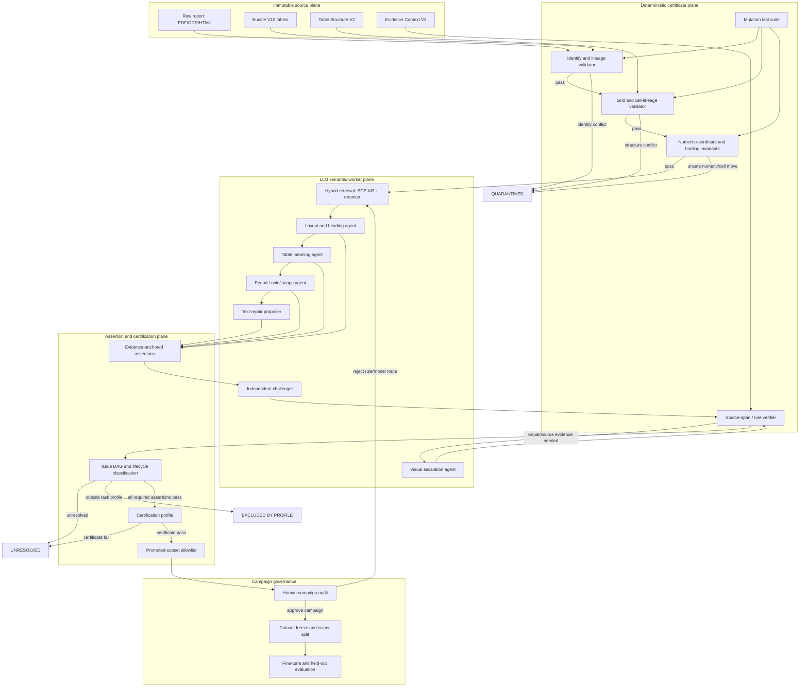
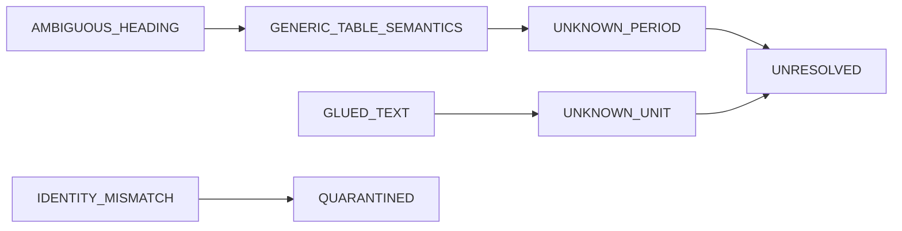

# Certified Canonical Layer

## Purpose and decision

This document defines the next data architecture for retrieval fine-tuning:
the **Certified Canonical Layer (CCL)**. Its purpose is to let language models
learn report/table semantics at scale while preserving a deterministic path back
to immutable financial-report evidence.

It is deliberately not a bulk "data cleaning" pipeline. It creates derived
representations, assertions and certificates beside raw source. A record is
eligible for training only through an explicit promoted allowlist.

The current V10 bundle, Table Structure V2, Evidence Context V3 and
`preprocessing_v2_run_003` are frozen inputs. CCL does not overwrite or rename
them. In particular, CCL is not called "V3", because Evidence Context V3 is
already an active, hash-bound source sidecar.

## Design goals

1. Classify every table into a lifecycle state without requiring a person to
   repair every row.
2. Let LLMs propose semantic interpretations, but never let an LLM output by
   itself certify a source fact or a training record.
3. Auto-certify only facts supported by source evidence and deterministic
   preconditions; unresolved facts abstain.
4. Use human review only at **campaign level**: people audit rule behaviour,
   samples and failure clusters, then approve or reject a release as a whole.
5. Keep model inference below 14.7B parameters per model and record the exact
   model revision, prompt and decoding configuration for every proposal.

## System graph



## Non-negotiable boundaries

### Raw and derived worlds stay separate

```text
raw report/table/cell             derived canonical representation
─────────────────────             ───────────────────────────────
cell.raw_text                 ->  cell.normalized_text
source coordinates             ->  header and row paths
raw header/context             ->  semantic assertions
raw numeric lexeme             ->  parsed numeric candidate
```

No CCL task overwrites raw source, raw grid, raw value or source coordinates.
An OCR repair, inferred period or canonical column path is derived metadata and
must carry both a proof receipt and a versioned rule/model receipt.

### Promotion is a positive allowlist

```text
training_eligible != not unresolved

training_eligible == table_uid is present in promoted_subset_manifest
```

Every allowlist entry must bind the current source, canonical record,
certificate profile and dataset version by SHA-256. Missing evidence is an
abstention, never an implicit approval.

## Identity and cell lineage contract

`internal_table_uid` remains the compatibility ID. It is an extraction
identity, not proof that two parser versions refer to the same physical table.
CCL records a multi-dimensional source identity:

```json
{
  "internal_table_uid": "...",
  "source_identity": {
    "document_sha256": "...",
    "table_html_sha256": "...",
    "raw_grid_sha256": "...",
    "raw_context_sha256": "..."
  },
  "extraction_identity": {
    "document_id": "...",
    "page_no": 21,
    "local_ordinal": 12,
    "char_start": 48112,
    "parser_version": "..."
  }
}
```

For every promoted numeric cell, the certificate retains the complete chain:

```text
document -> table -> source cell -> raw text -> header path
         -> period -> unit -> scope -> canonical value
```

The validator enforces four independent invariants:

1. **Value identity**: the raw numeric lexeme remains unchanged.
2. **Coordinate identity**: the value remains attached to its original source
   cell.
3. **Structural identity**: rowspan/colspan, row and column relations remain
   explainable from source provenance.
4. **Semantic binding**: header path, period, unit and scope are certified for
   the task profile that uses the cell.

`parsed_numeric` is derived, never evidence. A parse must declare locale,
separator/sign rule and source evidence.

## Assertions and evidence classes

CCL certifies fields individually instead of assigning a single table
confidence score.

```json
{
  "assertion_id": "...",
  "table_uid": "...",
  "field": "period",
  "value": "2022-12-31",
  "status": "CERTIFIED",
  "evidence_class": "E2",
  "evidence_anchors": [
    {"kind": "report_period_end", "source_span": [100, 124]},
    {"kind": "relative_header", "text": "Năm nay", "column": 2}
  ],
  "derivation_rule": "relative_period_binding_v1",
  "rule_version": "1.0.0"
}
```

| Class | Meaning | Promotion policy |
| --- | --- | --- |
| E0 | Direct raw-source fact | Auto-certifiable |
| E1 | Exact source derivation, such as expanded span/header path | Auto-certifiable |
| E2 | Deterministic derivation with all declared preconditions | Auto-certifiable only when verifier passes every precondition |
| E3 | Heuristic inference | Unresolved or excluded; never promotes alone |
| E4 | LLM proposal | Proposal only; must be converted into E0–E2 evidence |

An assertion may be `PASS`, `FAIL`, `UNRESOLVED` or
`NOT_APPLICABLE_WITH_EVIDENCE`. Null without a state and reason is invalid.

## LLM worker contract

LLMs are semantic workers, not authorities. Each worker returns strict JSON
containing a proposed value, source anchors, alternative candidates and
unresolved conditions. It cannot emit `CERTIFIED` or alter raw fields.

| Worker | Primary responsibility | Allowed output | Required downstream check |
| --- | --- | --- | --- |
| Layout/heading | Build report hierarchy and candidate heading links | Heading candidates with source spans | Source-span and hierarchy validation |
| Table meaning | Propose statement/note/table topic | Table semantic assertions | Heading, rows and headers must support it |
| Period/unit/scope | Bind relative headers and units | Field assertions plus preconditions | Deterministic period/unit rules |
| Text repair | Suggest source-backed OCR/spacing repair | Before/after proposal | Exact source occurrence or deterministic rule |
| Challenger | Seek alternative interpretation and conflicts | Counterevidence / alternative candidates | Candidate-order-blind comparison |
| Visual escalation | Read source page when extraction loses layout | Image anchors and proposal | Page/image coordinate receipt |

### Finite evidence-selection graph

Each Phase-3 packet now carries `vifinqa_packet_evidence_graph_v1`. Its
selectable nodes are only raw context/cell anchors with a source coordinate and
raw-text hash. Its deterministic E1 edges are limited to:

```text
heading -> table
header  -> canonical column
period  -> canonical column
unit    -> canonical column
row label -> visible value cell
```

The LLM returns `evidence_anchor_ids` and `evidence_relation_ids`; it cannot
generate a free-text citation, raw SHA-256, coordinate or relation. A selected
relation must touch a selected raw anchor. The validator additionally requires
the relation class needed by the proposed field: e.g. `period_context` needs
`period_applies_to_column`, and `unit_context` needs
`unit_applies_to_column`.

The graph is deliberately bounded to the packet's visible anchors. A successful
selection proves only packet-local source anchoring, not that no competing
evidence exists in the entire corpus. The Answer Certificate gate therefore
requires separate counterfactual rejection receipts for period, scope and unit.

### Typed temporal and answer contracts

Every operand plan now carries a temporal contract. The question may declare a
year/scope/output unit, but it must not infer `period_grain`, `flow_or_stock`,
`as_of_date`, `comparative_basis`, restatement state or fiscal calendar. Exact
binding must supply these fields from source-backed context. A requested output
unit may differ from the source unit only with an explicit verified conversion.

`vifinqa_answer_certificate_v1` accepts only: all planned exact source
operands, a matching deterministic-operation hash and `Decimal` output, plus
rejected alternatives for period/scope/unit. It emits either
`ANSWER_CERTIFICATE_COMPLETE_CAMPAIGN_ONLY` or `ABSTAIN`; both are
non-promotable until the campaign/release policy separately approves them.

### Dynamic candidate-set diagnostics

`vifinqa_dynamic_candidate_set_v1` replaces a fixed Top-10 assumption with
separate lexical, dense and metadata budgets, deterministic fusion, and an
explicit coverage check for declared ticker/year/scope dimensions. Missing
coverage requests expansion before binding or abstention. The evaluation ladder
records document, page, table and complete-operand-set reachability; finding a
right table alone is not retrieval success.

### Model routing policy

The default production-oriented route is deliberately small:

| Route role | Candidate model | Parameter cap and purpose |
| --- | --- | --- |
| Primary semantic worker | Qwen3-8B | 8.2B, multilingual structured assertions |
| Visual escalation | Qwen2.5-VL-7B-Instruct | under cap, page/layout/OCR ambiguity only |
| Independent challenger | Gemma 3 12B IT | 12B, different model family and multimodal alternative |
| Retrieval/reranking | BGE-M3 + BGE-reranker-v2-m3 | multilingual retrieval, not semantic certification |
| Research-only Vietnamese challenger | Aya Expanse 8B | Vietnamese support; non-commercial license means not a production default |

The strict `<14.7B` policy excludes Qwen2.5-14B because its published total is
14.7B. Models run sequentially; a second model is routed only for high-risk or
disagreement cases. Model name/revision, prompt SHA-256, decoding settings,
input hashes and output hash are part of every proposal receipt.

No majority vote can promote an assertion. Multiple models can only increase
the search for evidence or expose a disagreement. The deterministic verifier
remains the sole certification authority.

## Issue DAG and lifecycle

Issue counts must not be treated as disjoint table counts. Each table gets an
issue graph; its primary blocker is the earliest blocking dependency, not the
most frequent symptom.



Lifecycle states are mutually exclusive:

| State | Meaning | May train? |
| --- | --- | --- |
| `CERTIFIED` | Every assertion required by the profile has a valid certificate | Only after promoted allowlist entry |
| `UNRESOLVED` | Source evidence cannot prove a required assertion | No; retain for future model/rule routing |
| `QUARANTINED` | Identity, structure, numeric or provenance safety invariant failed | No; requires targeted remediation/re-extraction |
| `EXCLUDED_BY_PROFILE` | Structurally sound but not useful for current training profile | No; may be included in a later task profile |

## Certification profiles

Profiles prevent a governance roster from being rejected merely because it has
no currency unit, while keeping period/unit binding mandatory for financial
numeric tasks.

| Profile | Required assertions | Explicitly allowed N/A |
| --- | --- | --- |
| Financial statement / schedule | table type, heading, period, scope, unit, value-column binding, cell lineage | none for numeric value columns |
| Governance roster | table type, heading, entity/role columns | period, unit, numeric binding |
| Textual disclosure | heading, semantic context, source lineage | numeric binding when no numeric task is present |
| Multi-period financial schedule | all financial requirements plus distinct header path per value column | none for values used in a calculation |

## Human role: final campaign review

Human reviewers are not a row-by-row repair workforce. They review a campaign
packet after the machine pipeline has completed:

1. stratified samples by issuer, year, table profile, model route and rule;
2. every high-severity false certification or model disagreement cluster;
3. mutation-suite results and the coverage of known failure modes;
4. changes to rule bundles, prompts, model revisions and certification profiles;
5. the exact promoted-subset manifest diff.

The reviewer approves or rejects the campaign/rule bundle. A rejection reruns
the relevant route on the corpus; it does not ask the reviewer to hand-fix every
affected table.

## Label certification boundary

Certified preprocessing does not automatically make a machine-generated QA
label correct. A train label has a second certificate:

```text
question intent -> issuer/scope/period -> exact operand cells
                -> formula/program -> Decimal recomputation
                -> alternative-table and counterfactual rejection
```

The recomputation must prove both arithmetic and operand selection. Synthetic
examples, historical human labels and machine-calibrated labels are all input
sources to this gate; none bypasses it. Human provenance remains preserved but
does not create automatic eligibility.

## Mutation suite

Mutation testing is the executable specification for the certificate layer.
The suite must inject and detect at least:

| Mutation | Expected result |
| --- | --- |
| Source SHA or duplicate UID | `QUARANTINED` |
| Swap rows/columns or move a value to another period | Structural/numeric-binding failure |
| Remove/alter rowspan, colspan or cell provenance | Structural failure |
| `1.000 -> 10.000`, sign change, or unit-scale change | `QUARANTINED` |
| Attach heading from neighbouring note | Semantic certificate failure |
| Remove report date, period or explicit unit | `UNRESOLVED` or profile failure |

Passing this suite proves detection of modeled failures, not universal semantic
truth. The campaign report must state that boundary explicitly.

## Phased implementation plan

### Phase 0 — Freeze and baseline

**Inputs:** Bundle V10, Structure V2, Evidence Context V3 and preprocessing
V2 run 003.

**Deliverables:** input inventory, hashes, source/model/rule version policy,
and a fixed benchmark packet set.

**Exit gate:** no implicit input path; every source sidecar hash validates.

**Status:** implemented and replayed as part of
`certified_canonical_v1_run_002`.

### Phase 1 — Identity, structure and mutation foundation

**Build:** source identity certificates, raw-grid/cell-lineage certificates and
the mutation framework.

**Exit gate:** every generated corruption is classified into the expected
failure class; no raw mutation is silently accepted.

**Status:** implemented and replayed. All 29,509 identity and cell-lineage
certificates passed, and the in-memory mutation suite passed.

### Phase 2 — Assertion and issue graph contracts

**Build:** assertion schema, proof receipt schema, lifecycle classifier and
issue DAG with primary/secondary blockers.

**Exit gate:** all 29,509 tables have exactly one lifecycle state; every missing
field is explicit `UNRESOLVED` or `NOT_APPLICABLE_WITH_EVIDENCE`.

**Status:** implemented and replayed. Every table is deliberately
`UNRESOLVED` until semantic certification begins; none is training eligible.

### Phase 3 — LLM bake-off and routing freeze

**Build:** a stratified 250–300 packet evaluation set covering exact cases,
heading ambiguity, relative period/unit, OCR glue, wrong-scope alternatives and
injected mutations. Compare primary-only, primary-plus-challenger and visual
escalation routes.

**Exit gate:** select route by evidence-anchor exactness, mutation detection,
abstention behaviour, disagreement rate, VRAM/runtime and license fit—not by
plausible prose or generic benchmarks.

**Status:** the immutable job is prepared at
`ccl_phase3_bakeoff_v1_job_001`: 270 Qwen3-8B primary requests plus 225 Gemma
3 12B challenger requests. The private Kaggle Qwen route is dispatched with a
P100-compatible, hash-receipted runtime. The base-image attempt lacked P100
`sm_60` kernels; a subsequent installer attempt inadvertently overwrote the
pinned CUDA-11.8 wheel and its preflight stopped before model loading. Version
4 then exposed the incompatible preinstalled `torchvision` wheel, also before
response generation. Version 5 locks the matching PyTorch/torchvision CUDA-11.8
pair, logs every ten packets and disables Qwen3 thinking for the exact-one-JSON
contract. No failed attempt produced an accepted output. No model proposal or
route decision exists until version 5 has been downloaded, source-anchor
validated and audited. Qwen2.5-VL-7B remains disabled until source page images
have a hash-bound packet contract.

The finite-ID evidence graph was added after that dispatched packet schema.
Therefore any response from the existing v5 job can be used only as a runtime
receipt/legacy diagnostic. It cannot satisfy the current validator's proposal
contract (`legacy_lexical_anchor_only`) and cannot feed certification or
fine-tuning. A fresh hash-bound Phase-3 job is required after the new packet
and source bundle are built.

### Phase 4 — Report layout and context binding

**Build:** report hierarchy, heading candidates, cross-report retrieval hints
and deterministic heading-binding validators.

**Exit gate:** only source-supported headings become E0–E2 assertions;
ambiguous tables remain unresolved.

### Phase 5 — Semantic, period/unit and text assertions

**Build:** table-type/topic, period/unit/scope/value-column assertions plus
source-backed OCR repair proposals.

**Exit gate:** all profile-required assertions are either certified or
unresolved; LLM probability/consensus alone creates no certification.

**Current implementation:** `run_ccl_phase45_semantic_verifier.py` verifies an
audit-passed Phase 3 chain from source bundle through the Kaggle receipt and
validator manifest. The first V3.3 full run produced 30 source-bound
period/unit proposals and 237 unresolved assertions from 267 proposals.
`materialize_ccl_phase4_heading_spans.py` then materialized 178 literal source
heading spans. The source-first rerun of
`build_ccl_phase5_table_topic_profiles.py` derives 178 narrow layout profiles:
12 financial-statement titles and 166 decimal or enumerated note sections.
`materialize_ccl_phase5_numbered_note_context.py` separates all 166 literal
note locators/topics; `materialize_ccl_phase4_row_label_context.py` supplies
an exact source-cell/relation context for the other 33 claims. The resulting
source-first router covers all 211 claims. Finally,
`materialize_ccl_phase5_table_structure_context.py` joins every route to its
hash-bound raw grid, source header cells, data-row labels and document identity.
It preserves cross-table header provenance and records any raw/canonical OCR
difference rather than overwriting raw text. These are source-backed context,
not a validation of an LLM topic claim;
`verify_ccl_phase5_header_components.py` separately derived 14 period/unit
components from 18 merged header proposals and left four endpoint mismatches
unresolved. `verify_ccl_phase5_source_profile_compatibility.py` joined all 211
table-semantic claims to the original spans/profiles and found zero controlled
statement-label matches. The original diagnostic had 33 claims without a
heading span, 15 without a narrow profile, 151 note-only contexts and 12 model
values that disagreed with a statement profile. The later source-first context
rerun removes the 15 heading-regex gaps and supplies context for all 211; it
does not change that fail-closed semantic diagnosis. All output remains
non-promotable and non-certified.

The focused V3.4 five-packet smoke then constrained the model to only the
three statement labels and a `heading_scopes_table` relation. It passed the
GPU and closed-world response contract 5/5, but matched the independently
derived literal profile only 2/5 times (40%): the cash-flow table was called
income and both income statements were called balance sheets. Therefore a
literal statement heading is routed as deterministic source-profile context,
not as an LLM classification task. V3.4 remains an evaluation artifact only;
it cannot become training, repair, certification or promotion data.

### Phase 6 — Certification and campaign review

**Build:** profile evaluator, full validation report, campaign packet and
promoted-subset manifest builder.

**Exit gate:** every promoted record has complete source, cell, assertion and
profile certificates; human approves the campaign, not individual repairs.

### Phase 7 — Dataset freeze and fine-tune

**Build:** label certification, issuer-held-out split, leakage audit, serving
passage renderer and balanced hard-negative construction.

**Exit gate:** a frozen dataset manifest exists; each label is source-bound and
certified; no synthetic or historical label bypasses the gate.

### Phase 8 — Model evaluation and promotion

**Build:** checkpoint health checks, retrieval/grounding evaluation using the
same serving path, and candidate promotion manifest.

**Exit gate:** candidate improves issuer-held-out retrieval without grounding
regression; human final audit approves the model campaign.

## Artifact layout

```text
artifacts/research/certified_canonical_v1_run_XXX/
├── source_certificates.jsonl
├── cell_lineage_certificates.jsonl
├── semantic_assertions.jsonl
├── llm_proposals.jsonl
├── proof_receipts.jsonl
├── issue_registry.jsonl
├── certification_results.jsonl
├── mutation_report.json
├── human_campaign_packet.json
├── promoted_subset_manifest.jsonl
├── validation_report.json
└── release_manifest.json
```

`normalized_tables` remains a derived product. The audit trail is carried by
the certificates, issue registry and proof receipts.

## Current position

`preprocessing_v2_run_003` remains a useful candidate seed, not a
CCL-certified dataset. Phase 0–2 has now re-evaluated all 29,509 tables in
`certified_canonical_v1_run_002`: all source and cell-lineage certificates
pass, all records remain `UNRESOLVED`, and the mutation suite passes. The run
creates 270 deterministic Phase 3 packets across review-ready, heading,
semantic, text-repair, column-path, and period/unit-gap strata. No record has
been promoted; the remaining corpus is input to evidence-anchored LLM routing
and abstention, not a manual row-by-row queue.

## Research references

- [Snorkel / data programming](https://pmc.ncbi.nlm.nih.gov/articles/PMC7075849/):
  programmatic label sources should be allowed to abstain rather than forced to
  cover every record.
- [STaR](https://openreview.net/pdf?id=_3ELRdg2sgI): iterative self-training
  needs a reliable filter for retained reasoning; CCL uses proof receipts as
  that filter.
- [LLM judge position bias](https://arxiv.org/abs/2406.07791) and
  [self-preference bias](https://arxiv.org/abs/2410.21819): support the policy
  that model agreement never certifies a fact by itself.
- Model cards: [Qwen3-8B](https://huggingface.co/Qwen/Qwen3-8B),
  [Qwen2.5-VL-7B-Instruct](https://huggingface.co/Qwen/Qwen2.5-VL-7B-Instruct),
  [Gemma 3 12B IT](https://huggingface.co/google/gemma-3-12b-it),
  [BGE-M3](https://huggingface.co/BAAI/bge-m3),
  [BGE reranker v2 m3](https://huggingface.co/BAAI/bge-reranker-v2-m3), and
  research-only [Aya Expanse 8B](https://huggingface.co/CohereLabs/aya-expanse-8b).
