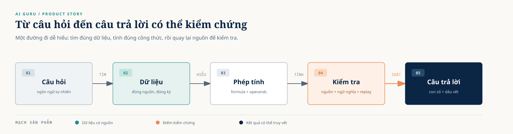
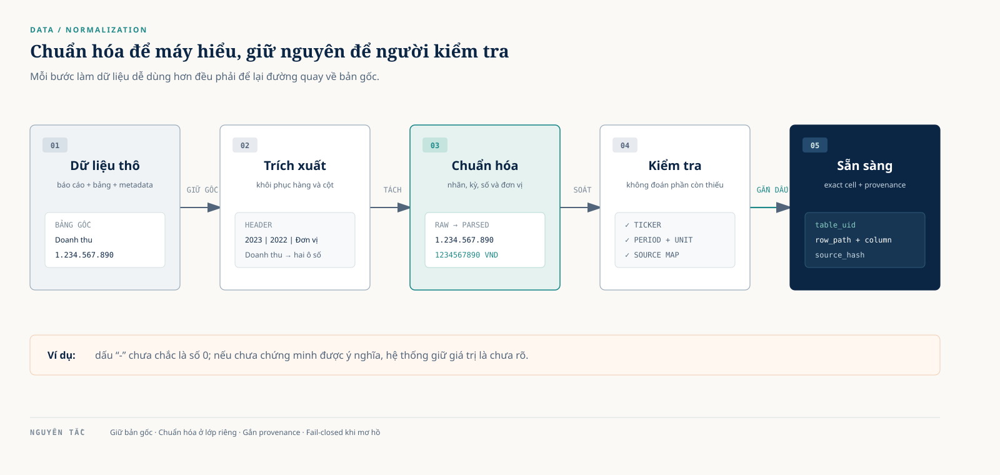
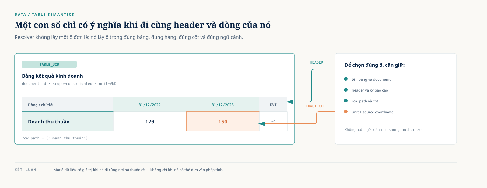
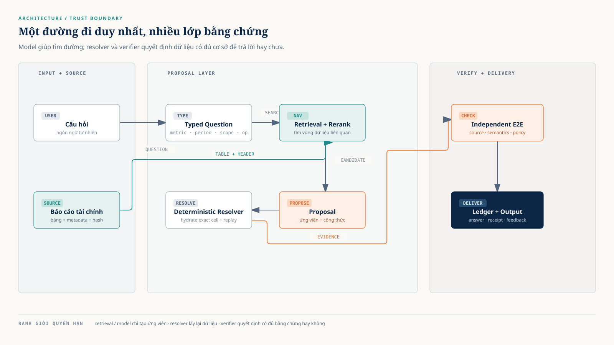
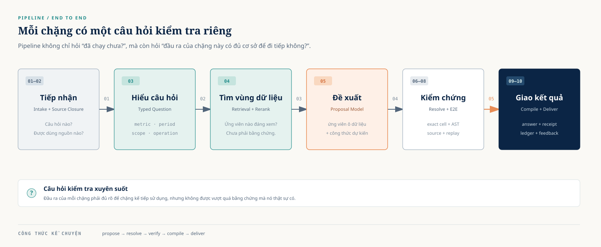
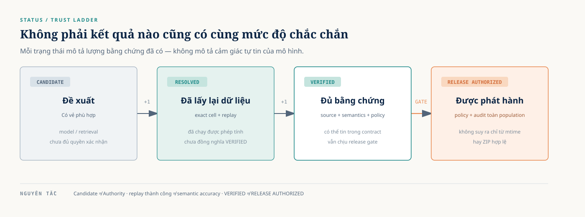
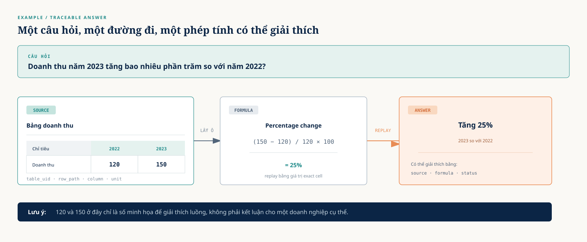
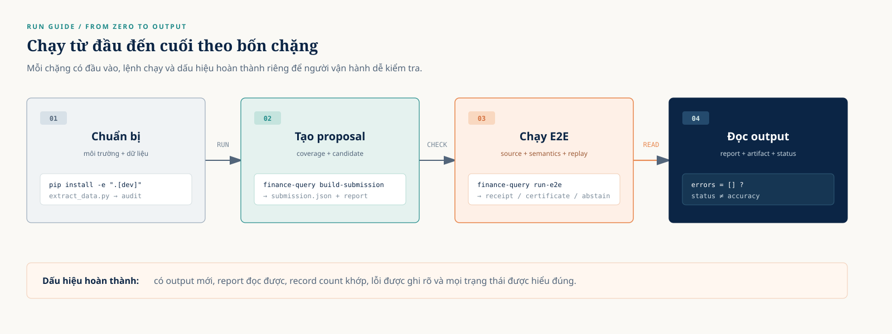

# AI GURU

## Từ câu hỏi tài chính đến câu trả lời có thể kiểm chứng

### Thuyết minh sản phẩm, dữ liệu, kiến trúc, pipeline và hướng dẫn vận hành

**Phiên bản:** 2.0 — bản trực quan, bám yêu cầu nghiệm thu  
**Ngày cập nhật:** 31/08/2026  
**Bài toán dữ liệu:** ViFinQA  
**Đơn vị:** AI GURU

---

## Tóm tắt

AI GURU là hệ thống hỏi đáp tài chính được thiết kế để biến một câu hỏi tự nhiên thành một câu trả lời có thể truy vết và kiểm tra. Người dùng có thể hỏi những câu như:

> Doanh thu của một doanh nghiệp năm 2023 tăng bao nhiêu phần trăm so với năm 2022?

Để trả lời, hệ thống không chỉ tìm một con số có vẻ phù hợp. Hệ thống cần xác định đúng doanh nghiệp, đúng chỉ tiêu, đúng kỳ báo cáo, đúng phạm vi báo cáo và đúng đơn vị. Sau đó, hệ thống tìm đến các ô dữ liệu tương ứng, thực hiện phép tính và kiểm tra lại câu trả lời bằng nguồn dữ liệu gốc.

Giá trị của AI GURU nằm ở cả hai khía cạnh:

- **Khả năng trả lời:** tìm kiếm, tổng hợp và tính toán trên dữ liệu tài chính.
- **Khả năng giải thích và kiểm chứng:** cho biết câu trả lời dựa trên nguồn nào, vị trí nào, công thức nào và đang ở trạng thái tin cậy ra sao.

Thông điệp ngắn gọn của sản phẩm là:

> **AI GURU không chỉ đưa ra một con số; AI GURU đưa ra một con số có đường dẫn quay về nguồn dữ liệu.**

---

## Mục lục

1. Bối cảnh và bài toán
2. Dữ liệu của sản phẩm
3. Vấn đề trong dữ liệu
4. Chuẩn hóa dữ liệu
5. Kiến trúc tổng quan
6. Pipeline từ đầu đến cuối
7. Ví dụ minh họa xuyên suốt
8. Hướng dẫn chạy hệ thống
9. Đọc kết quả và các trạng thái
10. Đánh giá, giới hạn và hướng phát triển
11. Kết luận
12. Phụ lục

> **Cách đọc tài liệu:** Các hình lớn giúp người đọc nắm câu chuyện sản phẩm; các khung lệnh và bảng chi tiết là phần để đội kỹ thuật tái hiện. Các đường dẫn bàn giao trong Mục 8.2 đã được đối chiếu với remote GitHub, dataset Hugging Face và metadata Kaggle của dự án.

---

# 1. Bối cảnh và bài toán

## 1.1. Nhu cầu thực tế

Báo cáo tài chính chứa nhiều thông tin có giá trị, nhưng việc tìm một câu trả lời trong báo cáo thường mất thời gian. Một câu hỏi ngắn có thể yêu cầu người đọc thực hiện nhiều thao tác:

- Xác định đúng doanh nghiệp.
- Tìm đúng báo cáo của đúng năm.
- Phân biệt báo cáo hợp nhất và báo cáo riêng lẻ.
- Tìm đúng chỉ tiêu trong một bảng dài.
- Xác định giá trị thuộc đúng cột và đúng kỳ.
- Hiểu đơn vị đang sử dụng.
- Thực hiện phép tính theo đúng ý nghĩa câu hỏi.

Ví dụ, câu hỏi “Lợi nhuận sau thuế năm 2023 tăng bao nhiêu so với năm 2022?” không chỉ là một bài toán trừ. Để có câu trả lời đáng tin cậy, hệ thống phải biết hai giá trị đang được so sánh có cùng chỉ tiêu, cùng doanh nghiệp, cùng phạm vi báo cáo và cùng đơn vị hay không.

## 1.2. Bài toán AI GURU giải quyết

AI GURU xử lý câu hỏi tài chính theo một quy trình có nhiều lớp. Có thể hình dung sản phẩm như một “đường ray” đi từ câu hỏi đến câu trả lời: ở giữa đường ray là dữ liệu và phép tính, còn trạm cuối luôn có bước quay lại nguồn để kiểm tra.



## 1.3. Giá trị sản phẩm

### Với người sử dụng

Người dùng nhận được câu trả lời ngắn gọn hơn so với việc tự đọc nhiều báo cáo, đồng thời có thể xem câu trả lời dựa trên dữ liệu nào.

### Với người vận hành

Người vận hành có thể biết một câu hỏi bị vướng ở bước nào: tìm kiếm, hiểu kỳ báo cáo, chọn dòng, chọn cột, đọc đơn vị hay kiểm tra công thức.

### Với quá trình cải tiến

Các trường hợp chưa giải quyết được được phân loại thành những nhóm lỗi có thể hành động. Nhờ vậy, việc cải tiến tập trung vào nguyên nhân chung của một nhóm câu hỏi, thay vì sửa thủ công từng mã câu hỏi.

## 1.4. Phạm vi và nguyên tắc

AI GURU tập trung vào hỏi đáp trên dữ liệu tài chính có cấu trúc và các báo cáo tài chính được trích xuất. Hệ thống hướng tới các câu hỏi về:

- Giá trị của một chỉ tiêu.
- So sánh giữa hai năm hoặc hai kỳ.
- Chênh lệch và tỷ lệ thay đổi.
- Tổng hợp một số dòng dữ liệu.
- Chọn giá trị lớn nhất hoặc nhỏ nhất trong một nhóm được xác định rõ.

Hệ thống giữ nguyên sự không chắc chắn khi dữ liệu chưa đủ cơ sở. Một câu trả lời được sinh ra bởi mô hình hoặc tìm thấy trong kết quả tìm kiếm vẫn chỉ là **đề xuất** cho đến khi vượt qua bước đối chiếu và kiểm chứng.

---

# 2. Dữ liệu của sản phẩm

## 2.1. Nguồn dữ liệu chính

Dữ liệu chính của AI GURU là corpus ViFinQA. Dữ liệu được tải về từ dataset repository `AIGuruTinix/ViFinQA` và lưu cục bộ trong thư mục `data/ViFinQA/`. Dữ liệu gốc không được xem như một file duy nhất, mà gồm nhiều nhóm có vai trò khác nhau.

### Tập câu hỏi

File chính:

```text
data/ViFinQA/questions/questions.jsonl
```

Mỗi dòng mô tả một câu hỏi, thường có mã câu hỏi và nội dung câu hỏi bằng ngôn ngữ tự nhiên. Đây là điểm bắt đầu của pipeline.

### Thông tin doanh nghiệp

File chính:

```text
data/ViFinQA/code_stock.csv
```

File này giúp liên kết mã cổ phiếu, tên hoặc thông tin nhận diện doanh nghiệp với các báo cáo tài chính tương ứng.

### Báo cáo tài chính

Báo cáo được tổ chức theo doanh nghiệp, năm và loại báo cáo:

```text
data/ViFinQA/financial_statements/
├── ticker/
│   ├── year/
│   │   ├── document_id_extracted.txt
```

Trong cây minh họa, `ticker`, `year` và `document_id` là các thành phần nhận diện; tên thư mục thực tế được thay theo từng doanh nghiệp, năm và báo cáo.

Một báo cáo có thể thuộc loại **hợp nhất** hoặc **riêng lẻ**. Nội dung được trích xuất thành văn bản, trong đó có thể chứa các bảng HTML và dấu mốc trang.

## 2.2. Quy mô dữ liệu trong snapshot hiện tại

Kết quả audit cục bộ hiện tại ghi nhận:

| Thành phần | Số lượng |
|---|---:|
| Câu hỏi | 1.012 |
| Mã doanh nghiệp / ticker | 100 |
| Báo cáo tài chính | 1.973 |
| Năm dữ liệu | 11 |
| Trang báo cáo | 121.756 |
| Bảng HTML được nhận diện | 146.246 |
| Báo cáo có table asset | 1.965 |
| Báo cáo không có table asset | 8 |

Các con số trên là một **data snapshot**, không phải một hằng số của sản phẩm. Khi dữ liệu được tải lại hoặc source closure thay đổi, tài liệu vận hành cần ghi rõ ngày, manifest hoặc fingerprint tương ứng.

## 2.3. Bốn lớp dữ liệu

### Lớp 1 — Dữ liệu gốc

Đây là dữ liệu cần được giữ nguyên để có thể quay lại kiểm tra:

- Câu hỏi ban đầu.
- Văn bản báo cáo tài chính.
- Bảng được trích xuất từ báo cáo.
- Thông tin doanh nghiệp và mã cổ phiếu.

### Lớp 2 — Dữ liệu đã trích xuất

Ở lớp này, hệ thống nhận diện các thành phần trong báo cáo:

- Document ID.
- Năm và doanh nghiệp.
- Phạm vi báo cáo.
- Các bảng.
- Header, nhãn dòng và nhãn cột.
- Vị trí trang, dòng hoặc offset trong văn bản.

### Lớp 3 — Dữ liệu đã chuẩn hóa

Lớp này tổ chức dữ liệu thành dạng có thể truy vấn và tính toán:

- Bảng có cấu trúc.
- Nhãn gốc và nhãn chuẩn hóa.
- Kỳ báo cáo được phân loại.
- Đơn vị được gắn rõ.
- Giá trị gốc và giá trị số đã parse.
- Tọa độ và hash để truy vết.

Trong pipeline hiện tại, `tables_structured_v2` là lớp dữ liệu quan trọng để hệ thống hydrate lại exact cell và thực hiện replay. Lớp này hỗ trợ xử lý, nhưng không xóa vai trò của nguồn gốc.

### Lớp 4 — Dữ liệu dẫn xuất cho pipeline

Các dữ liệu sau được tạo từ lớp chuẩn hóa:

- Lexical search index.
- Dense retrieval index.
- Reranker output.
- Candidate table.
- Context packet.
- Evidence binding.
- E2E receipt.
- Submission ledger.

Các index, ranking và model output giúp hệ thống tìm đường đến dữ liệu. Chúng không tự trở thành nguồn sự thật của câu trả lời.

## 2.4. Dữ liệu chính và dữ liệu phụ trợ

Nên phân biệt rõ hai nhóm trong tài liệu:

| Nhóm | Vai trò | Có được tự cấp quyền cho câu trả lời không? |
|---|---|---|
| Báo cáo và bảng nguồn | Nguồn dữ liệu để đối chiếu | Là nền tảng của việc kiểm chứng |
| Bảng đã cấu trúc | Lấy exact cell và replay | Có thể dùng trong resolver theo contract |
| Search index | Tìm ứng viên nhanh | Không |
| Dense embedding | Mở rộng khả năng tìm kiếm | Không |
| Reranker | Xếp hạng ứng viên | Không |
| Model proposal | Đề xuất route, ô dữ liệu, công thức | Không |
| E2E receipt | Ghi nhận kết quả kiểm tra | Có vai trò bằng chứng khi đầy đủ contract |
| FinQA/TAT-QA hoặc benchmark phụ trợ | Nghiên cứu, đánh giá thành phần | Không phải nguồn numeric truth của run ViFinQA |

Điểm cần nhớ:

> Dữ liệu dẫn xuất giúp hệ thống làm việc nhanh và thông minh hơn; dữ liệu nguồn giúp hệ thống kiểm tra xem câu trả lời có đứng vững hay không.

---

# 3. Vấn đề trong dữ liệu

## 3.1. Vì sao dữ liệu tài chính khó xử lý?

Dữ liệu tài chính có đặc điểm khác với một bảng dữ liệu sạch trong cơ sở dữ liệu. Một báo cáo được tạo ra để con người đọc, không phải để máy tính luôn hiểu ngay lập tức.

Có thể nhìn các vấn đề thành ba nhóm:

```text
Vấn đề về hình thức
        ↓
Vấn đề về ý nghĩa
        ↓
Vấn đề về truy vết
```

## 3.2. Vấn đề về hình thức

### OCR không hoàn hảo

Văn bản trích xuất từ báo cáo có thể bị sai ký tự, sai dấu hoặc sai khoảng cách. Ví dụ minh họa:

```text
BÁO CÁO TÀI CHÍNH
        ↓
BẢO CẢO TÀI CHÍNH
```

Nếu chỉ so khớp chuỗi tuyệt đối, hệ thống có thể bỏ qua một đoạn dữ liệu vốn có liên quan.

### Bảng bị chuyển thành chuỗi văn bản

Một bảng vốn có hàng và cột rõ ràng có thể trở thành một chuỗi dài:

```text
31/12/2023 VND 31/12/2022 VND Doanh thu thuần 1.234.567 987.654
```

Khi đó, hệ thống phải khôi phục quan hệ giữa header, nhãn dòng, cột và giá trị.

### Ô gộp và header nhiều tầng

Một header có thể áp dụng cho nhiều cột. Một nhãn dòng có thể là dòng cha của nhiều dòng con. Nếu cấu trúc này bị mất, số liệu vẫn còn nhưng ý nghĩa của số liệu bị thiếu.

## 3.3. Vấn đề về số và định dạng

Các biểu diễn sau có thể xuất hiện trong báo cáo:

| Dữ liệu gốc | Vấn đề cần xử lý |
|---|---|
| `1.234.567` | Dấu chấm có thể là phân cách hàng nghìn |
| `30,5` | Dấu phẩy có thể là dấu thập phân |
| `(120)` | Có thể biểu thị số âm |
| `-` | Có thể là thiếu dữ liệu, không áp dụng hoặc số 0 |
| `1.234 567` | Có thể là hai ô bị dính sau OCR |
| `1.234` | Cần biết ngữ cảnh đơn vị và định dạng trước khi parse |

Nguyên tắc an toàn là không tự động biến mọi dấu `-` thành số 0. Nếu ý nghĩa chưa được chứng minh, giá trị phải được đánh dấu là chưa rõ.

## 3.4. Vấn đề về ý nghĩa tài chính

### Chỉ tiêu có nhiều cách gọi

Một chỉ tiêu có thể được viết theo nhiều cách gần nhau. Ví dụ:

```text
Doanh thu thuần
Tổng doanh thu bán hàng và cung cấp dịch vụ
Doanh thu bán hàng và cung cấp dịch vụ
```

Các cụm từ này có thể liên quan, nhưng không được mặc định coi là hoàn toàn giống nhau nếu chưa có quy tắc hoặc ngữ cảnh phù hợp.

### Hợp nhất và riêng lẻ

Cùng một doanh nghiệp có thể có:

- Báo cáo tài chính hợp nhất.
- Báo cáo tài chính riêng lẻ.
- Báo cáo có phạm vi chưa xác định rõ.

Lấy đúng chỉ tiêu từ sai phạm vi vẫn tạo ra một con số hợp lệ về mặt toán học, nhưng câu trả lời có thể sai về mặt nghiệp vụ.

### Kỳ báo cáo khác nhau

Các biểu diễn sau không nên bị gộp thành một khái niệm duy nhất:

```text
Năm 2023
31/12/2023
Trong năm 2023
Tại ngày 31/12/2023
01/01/2023 - 31/12/2023
```

Một số giá trị thể hiện tình trạng tại một thời điểm; một số giá trị thể hiện tổng phát sinh trong cả kỳ.

### Dòng cha và dòng con

Ví dụ:

```text
Phải thu
  ├── Phải thu khách hàng
  ├── Trả trước cho người bán
  └── Phải thu khác
```

Nếu câu hỏi hỏi “Phải thu khách hàng” nhưng hệ thống lấy dòng “Phải thu”, kết quả có thể vẫn là một số có thật trong báo cáo nhưng không trả lời đúng câu hỏi.

## 3.5. Vấn đề về truy vết

Một bảng có thể có nhiều loại vị trí:

- Thứ tự nội bộ trong file bảng đã cấu trúc.
- Vị trí dòng bắt đầu của bảng trong báo cáo OCR.
- Trang hoặc offset trong văn bản.

Các tọa độ này không được dùng lẫn cho nhau. Hệ thống cần lưu bản đồ ánh xạ rõ ràng để biết một candidate nội bộ tương ứng với vị trí nào trong nguồn báo cáo.

## 3.6. Vấn đề dữ liệu và tác động đến câu trả lời

| Vấn đề | Nếu bỏ qua | Cách hệ thống phản ứng |
|---|---|---|
| OCR sai nhãn | Không tìm thấy đúng dòng | Tạo nhãn tìm kiếm chuẩn hóa nhưng giữ nhãn gốc |
| Mất header | Nhầm năm hoặc đơn vị | Giữ quan hệ header và đánh dấu thiếu ngữ cảnh |
| Sai định dạng số | Tính sai giá trị | Lưu raw value, parsed value và warning |
| Nhầm hợp nhất/riêng lẻ | Lấy nhầm nguồn | Gắn `scope` rõ ràng |
| Nhầm kỳ báo cáo | So sánh sai thời gian | Chuẩn hóa period và loại period |
| Tọa độ stale | Không truy lại được nguồn | Kiểm tra source map và hash |
| Câu hỏi mơ hồ | Đoán một cách nguy hiểm | Giữ `UNRESOLVED` hoặc `ABSTAIN` |

---

# 4. Chuẩn hóa dữ liệu

## 4.1. Nguyên tắc chuẩn hóa

Chuẩn hóa dữ liệu của AI GURU dựa trên bốn nguyên tắc:

1. **Giữ nguyên bản gốc:** không sửa hoặc xóa nội dung nguồn.
2. **Tạo lớp chuẩn hóa riêng:** các giá trị phục vụ tìm kiếm và tính toán nằm ở lớp dẫn xuất.
3. **Gắn provenance:** mọi dữ liệu quan trọng phải có đường dẫn quay về nguồn.
4. **Fail-closed khi mơ hồ:** không biến suy đoán thành dữ liệu đã xác nhận.

Nói đơn giản:

> Chuẩn hóa làm cho dữ liệu dễ sử dụng hơn, nhưng không được làm mất khả năng kiểm tra dữ liệu ban đầu.

## 4.2. Sơ đồ chuẩn hóa



## 4.3. Chuẩn hóa metadata báo cáo

Mỗi báo cáo cần có một nhóm thông tin nhận diện:

| Trường | Ví dụ minh họa |
|---|---|
| `ticker` | `AAA` |
| `year` | `2023` |
| `document_id` | `AAA_financial_statements_2023_consolidated` |
| `scope` | `consolidated` |
| `source_path` | đường dẫn báo cáo gốc |
| `source_hash` | SHA-256 của nguồn |

Nhờ đó, hệ thống không chỉ biết “đây là một bảng doanh thu”, mà còn biết bảng đó thuộc báo cáo nào.

## 4.4. Chuẩn hóa bảng

Một bảng chuẩn hóa cần giữ được các thành phần sau:

```text
table_uid
document_id
table_title
table_section
header hierarchy
row path
column labels
cell values
unit
page / line / coordinate
source hash
```



## 4.5. Chuẩn hóa nhãn văn bản

Hệ thống giữ hai phiên bản của nhãn:

| Phiên bản | Mục đích |
|---|---|
| Nhãn gốc | Hiển thị, kiểm tra và truy vết |
| Nhãn chuẩn hóa | Tìm kiếm và so sánh linh hoạt hơn |

Ví dụ:

| Nhãn gốc | Nhãn chuẩn hóa dùng cho tìm kiếm |
|---|---|
| `BÁO CÁO TÀI CHÍNH` | `bao cao tai chinh` |
| `Doanh thu thuần` | `doanh thu thuan` |
| `Phải trả người bán` | `phai tra nguoi ban` |

Chuẩn hóa nhãn có thể gồm:

- Chuẩn hóa Unicode.
- Chuẩn hóa khoảng trắng.
- Chuyển về dạng so sánh không phân biệt hoa thường.
- Tạo alias phù hợp.
- Ghi nhận các biến thể OCR có thể xử lý.

Không nên thay thế nhãn gốc bằng nhãn đã bỏ dấu hoặc đã rút gọn.

## 4.6. Chuẩn hóa kỳ báo cáo

Các thông tin thời gian được tách thành những trường có ý nghĩa rõ ràng:

| Dữ liệu gốc | Dạng chuẩn hóa minh họa |
|---|---|
| `31/12/2023` | `date=2023-12-31` |
| `Năm 2023` | `period=2023` |
| `Trong năm 2023` | `period=2023`, `period_type=flow` |
| `Tại ngày 31/12/2023` | `period=2023-12-31`, `period_type=point_in_time` |

Mục tiêu không phải là ép mọi cách viết thành một chuỗi duy nhất, mà là lưu được cả giá trị thời gian và ý nghĩa của kỳ.

## 4.7. Chuẩn hóa phạm vi báo cáo

Phạm vi báo cáo được ghi thành một trường riêng:

```text
Hợp nhất  → consolidated
Riêng lẻ  → separate
Chưa rõ   → unknown
```

Nếu câu hỏi yêu cầu một phạm vi cụ thể nhưng dữ liệu chỉ có phạm vi khác, hệ thống không được âm thầm thay thế.

## 4.8. Chuẩn hóa giá trị số

Mỗi giá trị số quan trọng nên có các trường:

| Trường | Ý nghĩa |
|---|---|
| `raw_value` | Nội dung đúng như nguồn |
| `normalized_value` | Giá trị đã chuyển sang dạng tính toán |
| `unit` | Đơn vị của giá trị |
| `normalization_note` | Cách parse hoặc cảnh báo |
| `source_coordinate` | Vị trí trong bảng hoặc báo cáo |

Ví dụ minh họa:

```text
raw_value:          "1.234.567.890"
normalized_value:   1234567890
unit:               VND
normalization_note: parsed_thousands_separator
```

### Trường hợp chưa đủ cơ sở

```text
raw_value:          "-"
normalized_value:   null
status:             unresolved
reason:             value_not_proven_zero
```

Giá trị tính toán được nên được xử lý bằng dạng số chính xác, chẳng hạn `Decimal`, thay vì phụ thuộc vào phép tính dấu phẩy động không kiểm soát.

## 4.9. Chuẩn hóa câu hỏi

Câu hỏi ban đầu được giữ nguyên, đồng thời tạo một biểu diễn có cấu trúc:

```text
question:        Doanh thu năm 2023 tăng bao nhiêu so với 2022?
entity:          Công ty A
metric:          Doanh thu
periods:         2022, 2023
scope:           consolidated
unit:            VND
operation:       percentage_change
operands:        revenue_2022, revenue_2023
```

Biểu diễn này giúp pipeline biết cần tìm gì, nhưng bản thân typed question vẫn chưa phải là bằng chứng. Nó là kế hoạch để tìm và kiểm tra dữ liệu.

## 4.10. Kiểm tra chất lượng sau chuẩn hóa

Trước khi dữ liệu được đưa vào pipeline, cần kiểm tra:

- Có đủ file nguồn hay không.
- Có document ID trùng hay không.
- Có table UID trùng hay không.
- Báo cáo có ticker, năm và scope hợp lệ hay không.
- Header và nhãn dòng có được bảo toàn hay không.
- Giá trị số có parse được hay đã được đánh dấu rõ.
- Đơn vị có được nhận diện hay không.
- Tọa độ nguồn có truy ngược được hay không.
- Source map có phủ đủ các bảng cần dùng hay không.
- Hash của dữ liệu có khớp manifest hay không.

---

# 5. Kiến trúc tổng quan

## 5.1. Kiến trúc dễ hiểu

Ở mức sản phẩm, AI GURU có thể được hiểu qua ba vùng: nơi nhận câu hỏi và nguồn; nơi tạo ứng viên; và nơi resolver/verifier kiểm tra trước khi giao kết quả.



## 5.2. Vai trò của từng khối

### Câu hỏi và nguồn

Tiếp nhận câu hỏi, xác định tập dữ liệu và khóa phạm vi nguồn được phép sử dụng.

### Hiểu câu hỏi và tìm dữ liệu

Nhận diện doanh nghiệp, chỉ tiêu, thời gian, phạm vi, đơn vị và phép tính; sau đó tìm các bảng có khả năng liên quan.

### Đề xuất câu trả lời

Mô hình hoặc các bộ quy tắc đề xuất vị trí dữ liệu, operands, công thức và câu trả lời dự kiến.

### Lấy lại dữ liệu và tính toán

Resolver quay lại bảng chuẩn hóa để lấy đúng ô dữ liệu, kiểm tra quan hệ giữa operands và thực hiện phép tính theo AST được cho phép.

### Kiểm chứng độc lập

E2E verifier đối chiếu câu trả lời với nguồn, semantics, formula, operand và replay. Bước này có quyền giữ câu trả lời ở trạng thái chưa xác nhận khi thiếu bằng chứng.

### Xuất kết quả và feedback

Submission compiler tạo gói kết quả theo policy. Các hàng bị chặn hoặc chưa giải quyết được có thể trở thành dữ liệu cho vòng cải tiến tiếp theo.

## 5.3. Một đường đi duy nhất

Sản phẩm được mô tả theo một đường đi duy nhất:



Hai lệnh công khai có vai trò nối tiếp:

| Lệnh | Vai trò dễ hiểu |
|---|---|
| `build-submission` | Tạo câu trả lời đề xuất và đo coverage |
| `run-e2e` | Kiểm tra độc lập câu trả lời đã đề xuất |
| `run-submission-flow` | Điều phối chuỗi đề xuất → kiểm tra → đóng gói |

`build-submission` không thay thế `run-e2e`, và `run-e2e` không tự sinh một câu trả lời mới để che lấp lỗi của proposal.

## 5.4. Ranh giới tin cậy



Mỗi mũi tên cần một lớp bằng chứng tương ứng. Retrieval rank, model confidence hoặc phép tính chạy thành công không thể tự nhảy qua các lớp này.

---

# 6. Pipeline từ đầu đến cuối

## 6.1. Toàn cảnh pipeline


## 6.2. Bước 1 — Intake: tiếp nhận câu hỏi

Hệ thống đọc câu hỏi, mã câu hỏi và input manifest. Đây là bước xác định pipeline đang xử lý yêu cầu nào và sử dụng tập dữ liệu nào.

Đầu ra thường gồm:

- Question ID.
- Nội dung câu hỏi.
- Input manifest.
- Thông tin phiên bản chạy.

Điều cần nhớ:

> Mã câu hỏi chỉ giúp theo dõi bản ghi. Mã câu hỏi không được quyết định câu trả lời hoặc tạo ra một ngoại lệ riêng cho một câu hỏi.

## 6.3. Bước 2 — Source Closure: khóa phạm vi nguồn

Hệ thống xác định các báo cáo, bảng và asset được phép sử dụng trong lần chạy.

Việc khóa source closure giúp tránh các tình huống:

- Lấy nhầm báo cáo khác năm.
- Lấy nhầm báo cáo riêng lẻ thay vì hợp nhất.
- Sử dụng một file cũ hoặc file ngoài phạm vi.
- Dùng một artifact mới hơn chỉ vì tên file hoặc thời gian sửa đổi.

Đầu ra:

```text
document_id
table_uid
source_path
source_hash
manifest
```

## 6.4. Bước 3 — Typed Question: hiểu câu hỏi

Câu hỏi được phân rã thành những thành phần có thể kiểm tra:

```text
Entity       Doanh nghiệp nào?
Metric       Chỉ tiêu nào?
Period       Kỳ nào?
Scope        Hợp nhất hay riêng lẻ?
Unit         Đơn vị nào?
Operation    Cần lấy, trừ, chia hay tính phần trăm?
Operands     Cần những giá trị đầu vào nào?
```

Typed question giúp giảm khoảng cách giữa ngôn ngữ tự nhiên và thao tác trên bảng.

## 6.5. Bước 4 — Retrieval và rerank: tìm vùng dữ liệu liên quan

Hệ thống dùng tìm kiếm từ khóa, tìm kiếm dense hoặc reranker để tạo một nhóm ứng viên.

Ở bước này, hệ thống có thể biết:

- Bảng nào có nhãn gần với câu hỏi.
- Báo cáo nào có đúng ticker và năm.
- Dòng nào có khả năng liên quan.
- Ứng viên nào nên được xem xét trước.

Nhưng kết quả tìm kiếm vẫn chỉ là **navigation**. Nó chưa chứng minh rằng ô dữ liệu đã được chọn đúng.

## 6.6. Bước 5 — Context Compiler: tạo ngữ cảnh cho model

Context compiler chọn các nhãn, cấu trúc và thông tin cần thiết để model hiểu câu hỏi. Ngữ cảnh có thể giữ:

- Câu hỏi tiếng Việt.
- Nhãn dòng và cột gốc.
- Alias chuẩn hóa.
- Phạm vi nguồn.
- Kỳ báo cáo.
- Thông tin lỗi từ các vòng trước.

Ngữ cảnh này nhằm giúp model định hướng. Giá trị số cuối cùng vẫn phải được lấy lại từ bảng chuẩn hóa trong bước resolver.

## 6.7. Bước 6 — Proposal Model: đề xuất cách trả lời

Model hoặc rule engine tạo ra một proposal, có thể gồm:

- Các operand.
- Coordinate hint.
- Operation.
- Formula.
- Claim.
- Câu trả lời dự kiến.

Ví dụ:

```text
operand_1: doanh thu năm 2022
operand_2: doanh thu năm 2023
operation: percentage_change
formula: (operand_2 - operand_1) / operand_1 × 100
```

Proposal có thể tốt hoặc chưa tốt. Nó chưa được gọi là `VERIFIED` ở bước này.

## 6.8. Bước 7 — Deterministic Resolver: lấy lại dữ liệu và tính

Resolver quay lại bảng dữ liệu chuẩn hóa và thực hiện các thao tác có thể tái lập:

1. Xác định đúng document.
2. Xác định đúng table.
3. Xác định đúng row.
4. Xác định đúng column.
5. Kiểm tra period, entity, scope và unit.
6. Lấy giá trị gốc.
7. Chuẩn hóa giá trị số.
8. Thực hiện AST và replay.

Nếu proposal chỉ trỏ đến một vị trí nhưng vị trí đó không khớp semantics, resolver không được tự sửa bằng một con số khác mà không ghi nhận lý do.

## 6.9. Bước 8 — Independent E2E Verification: kiểm chứng độc lập

E2E verifier kiểm tra lại proposal/resolved prediction theo một đường độc lập:

```text
source closure
      ↓
exact cell binding
      ↓
semantic checks
      ↓
formula and operand compatibility
      ↓
Decimal replay
      ↓
Answer Certificate hoặc ABSTAIN
```

E2E verifier không tìm một đáp án mới để thay thế proposal. Nếu chưa đủ bằng chứng, nó giữ trạng thái `ABSTAIN`, `PARTIAL` hoặc `UNRESOLVED` tùy contract.

## 6.10. Bước 9 — Submission Compiler: đóng gói kết quả

Submission compiler kết hợp:

- Prediction.
- Resolver receipt.
- E2E receipt.
- Policy.
- Coverage accounting.

Đầu ra có thể gồm:

- `submission.json`.
- Evidence CSV.
- Candidate ledger.
- Audit ledger.
- `build_report.json`.
- `submission.zip`.

Compiler không nên re-resolve hoặc re-execute một cách không kiểm soát sau khi đã có receipt.

## 6.11. Bước 10 — Delivery và feedback

Kết quả được bàn giao theo policy. Các trường hợp chưa đạt được giữ lại cùng lý do.

Feedback có thể được dùng để tạo:

- Prompt improvement.
- Hard negative.
- Dataset curation.
- Retrieval/index experiment.
- Formula hoặc AST improvement.

Feedback không tự biến thành gold label và không tự cấp quyền promotion cho phiên bản mới.

---

# 7. Ví dụ minh họa xuyên suốt

## 7.1. Câu hỏi minh họa

Giả sử người dùng hỏi:

> Doanh thu năm 2023 tăng bao nhiêu phần trăm so với năm 2022?

Giả sử dữ liệu minh họa trong báo cáo là:

| Năm | Doanh thu |
|---|---:|
| 2022 | 120 |
| 2023 | 150 |

Các số liệu trong ví dụ này được dùng để minh họa luồng xử lý, không phải số liệu kết luận cho một doanh nghiệp cụ thể.



## 7.2. Hệ thống hiểu câu hỏi

```text
Metric:       Doanh thu
Periods:      2022 và 2023
Comparison:   2023 so với 2022
Operation:    Percentage change
Base value:   Doanh thu 2022
New value:    Doanh thu 2023
```

## 7.3. Hệ thống tìm dữ liệu

Hệ thống tìm các báo cáo phù hợp rồi chọn bảng có nhãn liên quan đến doanh thu.

```text
Báo cáo đúng doanh nghiệp
        ↓
Báo cáo đúng năm
        ↓
Đúng phạm vi: consolidated
        ↓
Bảng doanh thu
        ↓
Dòng doanh thu
        ↓
Cột 2022 và 2023
```

## 7.4. Hệ thống tạo proposal

```text
value_2022 = 120
value_2023 = 150
operation  = percentage_change
```

Proposal formula:

```text
(value_2023 - value_2022) / value_2022 × 100
```

## 7.5. Resolver lấy lại exact cell

Resolver không chỉ tin vào hai con số trong proposal. Nó quay về bảng chuẩn hóa để xác nhận:

```text
Đúng doanh nghiệp?   Có
Đúng báo cáo?        Có
Đúng phạm vi?        Có
Đúng chỉ tiêu?       Có
Đúng năm?            Có
Đúng đơn vị?         Có
Đúng hai ô dữ liệu?  Có
```

## 7.6. Hệ thống tính toán

```text
(150 - 120) / 120 × 100
= 30 / 120 × 100
= 25%
```

## 7.7. Câu trả lời cuối cùng

Một kết quả được trình bày dễ hiểu có thể là:

> Doanh thu năm 2023 tăng **25%** so với năm 2022. Kết quả được tính từ doanh thu năm 2022 là 120 và năm 2023 là 150 theo công thức `(150 - 120) / 120 × 100`.

Thông tin máy đọc đi kèm:

```text
answer:       25%
status:       VERIFIED hoặc trạng thái tương ứng
formula:      (150 - 120) / 120 × 100
source:       document_id + table_uid + row/column coordinate
```

Nếu hệ thống không xác định được đơn vị hoặc không biết hai cột thuộc đúng năm nào, câu trả lời không được gọi là `VERIFIED`, dù phép tính 25% vẫn có thể chạy được.

---

# 8. Hướng dẫn chạy hệ thống

## 8.1. Tổng quan cách chạy

Quy trình vận hành gồm bốn chặng:



## 8.2. Hồ sơ bàn giao theo yêu cầu nghiệm thu

Phần này được viết như một checklist để người khác có thể tải đủ tài nguyên, chạy lại sản phẩm và kiểm tra được mỗi câu trả lời dựa trên dữ liệu nào. Hạn nộp theo yêu cầu của Ban tổ chức là **trước 17h30 ngày 31/08/2026**.

### 8.2.1. Bảng đối chiếu nhanh

| Hạng mục bắt buộc | Thành phần AI GURU bàn giao | Nơi đặt trong bộ hồ sơ | Link và trạng thái truy cập |
|---|---|---|---|
| Tài liệu mô tả dữ liệu | Nguồn, cấu trúc, định dạng, cách tải, cách audit | Mục 2–4 của tài liệu + `data/README.md` | [Mở dataset ViFinQA](https://huggingface.co/datasets/AIGuruTinix/ViFinQA) — công khai |
| Mô hình sử dụng | Retriever, reranker, generator/feedback model và revision | Mục 5–6 + cấu hình trong `configs/` | [Mở checkpoint reranker FP16 V2](https://www.kaggle.com/datasets/dungle2810/vifinqa-reranker-fp16-v2-20260830) — Kaggle private |
| Mã nguồn | `src/`, `scripts/`, `configs/`, `tests/` | Repository hoặc gói mã nguồn | [Mở GitHub repository](https://github.com/Dle28/nlp-finance-query-) — công khai |
| Bài nộp | `submission.json`, bảng CSV nguồn con, query/replay và ledger | Thư mục output của một run mới | [Mở Kaggle kernel bài nộp](https://www.kaggle.com/code/dungle2810/vifinqa-full-ocr-corpus-submission-v1-20260829) — COMPLETE/private |
| Tài liệu hướng dẫn | README, môi trường, lệnh tải và lệnh chạy từ đầu | `README.md` + tài liệu này | [Mở README trên GitHub](https://github.com/Dle28/nlp-finance-query-/blob/main/README.md) |

> **Lưu ý về quyền truy cập:** Dataset Hugging Face và repository GitHub là link công khai. Checkpoint Kaggle và kernel bài nộp đã tồn tại, lần lượt có trạng thái `ready` và `COMPLETE` khi kiểm tra bằng Kaggle CLI, nhưng metadata của cả hai đều ghi `private`; đội cần cấp quyền cho tài khoản người chấm hoặc chuyển sang chế độ chia sẻ phù hợp. Khi chưa đăng nhập hoặc chưa được cấp quyền, Kaggle có thể trả về trang 404 cho người ngoài.

> **Lưu ý về đồng bộ mã nguồn:** Link GitHub là remote công khai của dự án. Trước khi gửi BTC, cần commit/push phần thay đổi cuối cùng của workspace hoặc upload source package tương ứng, để link thực sự chứa đúng phiên bản mã nguồn được mô tả trong tài liệu này.

### 8.2.2. Tài liệu mô tả dữ liệu

### Nguồn dữ liệu

Nguồn dữ liệu chính là corpus ViFinQA được Ban tổ chức cung cấp hoặc được đồng bộ qua dataset repository `AIGuruTinix/ViFinQA`. Mã tải dữ liệu chính thức của dự án nằm tại `data/process/extract_data.py`; script tải hai file metadata bắt buộc và toàn bộ thư mục báo cáo tài chính về `data/ViFinQA/`.

Link tham chiếu nguồn gốc:

- Dataset repository: [AIGuruTinix/ViFinQA trên Hugging Face](https://huggingface.co/datasets/AIGuruTinix/ViFinQA)
- Link chia sẻ dữ liệu dùng để nộp: [Dataset ViFinQA trên Hugging Face](https://huggingface.co/datasets/AIGuruTinix/ViFinQA)

### Cấu trúc và định dạng

```text
data/ViFinQA/
├── questions/questions.jsonl       # mỗi dòng là một câu hỏi JSON
├── code_stock.csv                  # mã/tên doanh nghiệp và metadata ticker
└── financial_statements/           # báo cáo tài chính trích xuất
    └── <TICKER>/<YEAR>/*.txt       # văn bản OCR, có thể chứa bảng HTML
```

Các lớp dữ liệu được giữ trong tài liệu bàn giao:

| Lớp | Định dạng | Vai trò |
|---|---|---|
| Câu hỏi | JSONL | `id`, nội dung câu hỏi và các trường của bài toán |
| Mã doanh nghiệp | CSV | nối ticker với tên/doanh nghiệp |
| Báo cáo nguồn | TXT/HTML trích xuất | nguồn để đối chiếu nội dung và cấu trúc |
| Bảng chuẩn hóa | JSONL/CSV tùy artifact | phục vụ hydrate exact cell và replay |
| Bảng CSV nộp | CSV | tập con cần thiết cho từng câu hỏi, có thể truy nguồn |

### Hướng dẫn tải và kiểm tra dữ liệu

```bash
# Từ thư mục gốc repository
.venv/bin/python -m pip install -e ".[dev]"
.venv/bin/python -m pip install huggingface_hub
.venv/bin/python data/process/extract_data.py
.venv/bin/python data/process/audit_dataset.py
```

Sau khi tải, người kiểm tra cần xác nhận: `questions.jsonl` đọc được; số câu hỏi khớp manifest; các báo cáo có thể tìm thấy; ticker/năm/scope được nhận diện; và audit được ghi vào `data/process/audit_output/`. Các con số thống kê trong Mục 2.2 là snapshot của bộ dữ liệu tại thời điểm cập nhật, không được dùng thay cho việc kiểm tra manifest của gói nộp thực tế.

### 8.2.3. Mô hình sử dụng và checkpoint

AI GURU có nhiều thành phần mô hình, nhưng chúng không có cùng quyền hạn. Retriever và reranker chỉ giúp tìm vùng dữ liệu; model sinh proposal/feedback chỉ đưa ra ứng viên hoặc phân loại lỗi; giá trị số cuối cùng phải được hydrate từ bảng CSV/bảng chuẩn hóa và kiểm tra bằng resolver/E2E.

| Thành phần | Model và revision đã ghim trong cấu hình | Vai trò | Link tải tham chiếu |
|---|---|---|---|
| Retriever | `intfloat/multilingual-e5-small` — `614241f622f53c4eeff9890bdc4f31cfecc418b3` | Tìm kiếm dense, navigation-only | [Hugging Face](https://huggingface.co/intfloat/multilingual-e5-small) |
| Reranker | `BAAI/bge-reranker-v2-m3` — `953dc6f6f85a1b2dbfca4c34a2796e7dde08d41e` | Xếp hạng ứng viên, navigation-only | [Hugging Face](https://huggingface.co/BAAI/bge-reranker-v2-m3) |
| Generator/feedback | `Qwen/Qwen2.5-Coder-1.5B-Instruct` — `2e1fd397ee46e1388853d2af2c993145b0f1098a` | Tạo proposal hoặc feedback không cấp authority | [Hugging Face](https://huggingface.co/Qwen/Qwen2.5-Coder-1.5B-Instruct) |
| Checkpoint fine-tune của đội | ViFinQA Reranker FP16 V2, fine-tune từ `BAAI/bge-reranker-v2-m3` | Reranker navigation-only; không cấp authority cho giá trị số | [Mở checkpoint Kaggle](https://www.kaggle.com/datasets/dungle2810/vifinqa-reranker-fp16-v2-20260830) — private |

Checkpoint reranker trên đã được đối chiếu từ `artifacts/kaggle_upload/dungle2810_vifinqa_reranker_fp16_v2_20260830/dataset-metadata.json` và `metrics.json`. Dataset Kaggle chứa archive `reranker_finetuned.tar` với `model.safetensors`, tokenizer, config và model card; model card ghi base model là `BAAI/bge-reranker-v2-m3` tại revision `953dc6f6f85a1b2dbfca4c34a2796e7dde08d41e`. Đây là đường dẫn checkpoint thật của đội, nhưng vẫn cần cấp quyền vì dataset đang ở chế độ private.

> **Phân biệt theo run:** Manifest của run cục bộ mới nhất `vifinqa_answer_level_selector_optin_20260831_r4` ghi `reranker_policy=baseline_no_reranker`, đồng thời `fine_tuned_reranker` và `generator` ở trạng thái `NOT_REQUESTED`. Vì vậy checkpoint Kaggle ở trên là model đã đóng gói cho nhánh reranker/model-enhanced và có thể tái sử dụng; nó không được mô tả như bằng chứng rằng run baseline mới nhất đã nạp model đó.

Các config tham chiếu:

- `configs/retrieval/full_corpus_v1.json` — retriever và quy tắc dense navigation.
- `configs/training/vifinqa_rag_finetune_v2_strong.json` — cấu hình RAG/đề xuất phiên bản 2.
- `scripts/research/run_blocked_feedback_kaggle_v1.py` — model feedback với revision Qwen được ghim.
- `configs/research/proof_policy/open_source_model_policy_v1.json` — chính sách model open-weight và revision pinning.

Nếu có checkpoint fine-tune hoặc LoRA riêng, gói nộp phải kèm đủ:

1. Tên model nền và revision nền.
2. Tên checkpoint/LoRA, phiên bản và ngày tạo.
3. SHA-256 của các file weight/tokenizer/config.
4. Link tải có quyền truy cập cho người chấm.
5. Câu lệnh tải và thư mục đặt checkpoint.
6. Câu lệnh chạy thử một input nhỏ và expected schema của output.

Ví dụ tải đúng revision của model feedback:

```bash
.venv/bin/python -m pip install -e ".[llm,retrieval]"
.venv/bin/python - <<'PY'
from huggingface_hub import snapshot_download

snapshot_download(
    repo_id="Qwen/Qwen2.5-Coder-1.5B-Instruct",
    revision="2e1fd397ee46e1388853d2af2c993145b0f1098a",
    local_dir="checkpoints/qwen2.5-coder-1.5b-instruct",
)
PY
```

Khi chạy model feedback trong môi trường có GPU, dùng script portable của repository và giữ nguyên revision trong manifest. Nếu không chạy model, pipeline vẫn có thể tạo `MODEL_NOT_RUN` feedback rõ ràng; trạng thái đó phải được ghi trong hồ sơ thay vì mô tả như một checkpoint đã được sử dụng.

### 8.2.4. Mã nguồn, thư viện và cấu hình

Bộ mã nguồn cần chia sẻ gồm:

```text
src/finance_query/       # package chính, pipeline và E2E primitives
scripts/                 # công cụ E2E, research và training
configs/                 # config dữ liệu, retrieval, training, E2E
tests/                   # test contract và test research
README.md                # điểm bắt đầu tái hiện
pyproject.toml           # dependency và entrypoint
uv.lock                 # lock phiên bản nếu dùng uv
```

Dependency lõi được khai báo trong `pyproject.toml`: `beautifulsoup4`, `lxml`, `numpy`, `pandas`, `pyyaml` và `tqdm`. Nhóm `dev` thêm `pytest`/`ipywidgets`; nhóm `retrieval` thêm `sentence-transformers`; nhóm `llm` thêm `torch`, `transformers`, `huggingface_hub`, `accelerate` và `bitsandbytes`. Người chấm nên cài từ `pyproject.toml`/`uv.lock`, không tự cài một bộ phiên bản khác rồi kết luận sản phẩm không tái hiện được.

Các file cấu hình cần ghi rõ trong gói nộp:

- `configs/e2e/deterministic_replay_v1_locked.yaml` cho source closure, bảng chuẩn hóa và replay.
- `configs/retrieval/full_corpus_v1.json` nếu bật dense retrieval.
- `configs/training/vifinqa_rag_finetune_v2_strong.json` nếu cần mô tả model/training.
- Prompt profile, model revision và input manifest của run thực tế nếu có dùng model ngoài core resolver.

Link mã nguồn để nộp: [GitHub repository Dle28/nlp-finance-query-](https://github.com/Dle28/nlp-finance-query-).

Repository này là public remote đã được xác nhận từ cấu hình Git của workspace. Nếu bản gửi BTC bao gồm các file hoặc thay đổi chưa có trên remote, cần push commit cuối hoặc tạo source package mới; không dùng đường dẫn `/home/dungle/...` làm link cho người chấm.

### 8.2.5. Bài nộp: bảng CSV và nguyên tắc query

Các bảng CSV nộp kèm phải là **tập con được trích xuất từ dữ liệu BTC cung cấp**. Bảng có thể chỉ giữ hàng, cột hoặc ô cần thiết, nhưng phải kèm metadata đủ để truy vết về báo cáo và bảng nguồn.

Một cấu trúc minh họa:

```text
submission_data/Q001_revenue.csv
├── source_document_id
├── source_table_uid
├── source_hash
├── row_label
├── column_label
├── unit
├── 2022
└── 2023
```

Ví dụ với bảng nguồn:

| Chỉ tiêu | 2021 | 2022 | 2023 | 2024 |
|---|---:|---:|---:|---:|
| Doanh thu thuần | 800 | 1.000 | 1.200 | 1.400 |
| Lợi nhuận sau thuế | 60 | 90 | 120 | 140 |
| Tổng tài sản | 2.000 | 2.200 | 2.500 | 2.800 |
| Nợ phải trả | 900 | 1.000 | 1.100 | 1.200 |

Một CSV con hợp lệ có thể chỉ giữ phần cần dùng:

| Chỉ tiêu | 2022 | 2023 | 2024 |
|---|---:|---:|---:|
| Doanh thu thuần | 1.000 | 1.200 | 1.400 |
| Lợi nhuận sau thuế | 90 | 120 | 140 |

Tại thời điểm thực thi, mỗi pandas query phải đọc và tính trực tiếp từ CSV. Ví dụ hợp lệ cho câu hỏi “doanh thu 2023 tăng bao nhiêu so với 2022?”:

```python
import pandas as pd

df = pd.read_csv("submission_data/Q001_revenue.csv")
row = df.loc[df["Chỉ tiêu"].eq("Doanh thu thuần")].iloc[0]
base = pd.to_numeric(row["2022"])
current = pd.to_numeric(row["2023"])
result = (current - base) / base * 100
```

Các cách sau là **không hợp lệ** vì kết quả bị gán cứng hoặc đọc từ một cột đã lưu sẵn đáp án:

```python
result = 2.06
result = 1.03 * 2
result = df["answer"].iloc[0]
```

Checklist cho từng bảng CSV:

- Có thể nối về `source_document_id` và `source_table_uid`.
- Có `source_hash` hoặc manifest tương ứng.
- Chỉ giữ dữ liệu cần thiết nhưng không làm mất header, đơn vị và nhãn dòng.
- Query tính từ các cột số trong CSV tại thời điểm chạy.
- Không có `answer` column được tạo ra để che đáp án.
- Không có literal answer hoặc công thức đã rút gọn được mã hóa trong code.
- Có thể chạy lại query trên một thư mục output mới.

Link gói bài nộp và môi trường chạy tham chiếu: [Kaggle kernel ViFinQA Full OCR Corpus Submission V1 20260829](https://www.kaggle.com/code/dungle2810/vifinqa-full-ocr-corpus-submission-v1-20260829). Kaggle API xác nhận kernel có trạng thái `COMPLETE`; kernel metadata cho biết kernel sử dụng runtime full-corpus, coordinate map và checkpoint reranker FP16 V2. Kernel đang private nên cần cấp quyền cho người chấm.

Bản artifact đối chiếu mới nhất trong workspace là `submission_ready/vifinqa_full_integrated_best_effort_v1_20260831.zip`; build report ghi `records=1012`, `queries_replayed=1012`, `errors=[]`. SHA-256 của file local là `b4a05bb9352ea36d3373911e5029a7847e5686ee1f85d2660af83ccd1b6561ca`. File local này chỉ dùng để đối chiếu; link bên ngoài để người chấm truy cập là Kaggle kernel ở trên.

### 8.2.6. README tái hiện từ đầu

README bắt buộc phải đủ để một người mới có thể đi từ mã nguồn trống đến output. Trình tự đề xuất:

```bash
# 1. Lấy mã nguồn và vào thư mục dự án
git clone https://github.com/Dle28/nlp-finance-query-.git
cd AI_guru

# 2. Tạo môi trường và cài dependency
python3.11 -m venv .venv
.venv/bin/python -m pip install -e ".[dev]"

# 3. Tải dữ liệu BTC/ViFinQA và audit
.venv/bin/python -m pip install huggingface_hub
.venv/bin/python data/process/extract_data.py
.venv/bin/python data/process/audit_dataset.py

# 4. Nếu workflow cần model/retrieval
.venv/bin/python -m pip install -e ".[llm,retrieval]"

# 5. Tạo candidate cho toàn bộ population
PYTHONPATH=.:src .venv/bin/python -m finance_query.cli build-submission \
  --output submissions/vifinqa_submission_YYYYMMDD_rN

# 6. Chạy kiểm chứng E2E
PYTHONPATH=.:src .venv/bin/python -m finance_query.cli run-e2e \
  --config configs/e2e/deterministic_replay_v1_locked.yaml \
  --output-dir artifacts/runs/e2e_YYYYMMDD

# 7. Hoặc chạy flow đầy đủ
PYTHONPATH=.:src .venv/bin/python -m finance_query.cli run-submission-flow \
  --output artifacts/runs/submission_flow_YYYYMMDD_rN \
  --verification-config configs/e2e/deterministic_replay_v1_locked.yaml \
  --expected-question-count 1012 \
  --require-full-population \
  --flow-release-policy best_effort
```

Khi người chấm chạy xong, cần kiểm tra: lệnh kết thúc thành công; output là thư mục mới; số record khớp population/manifest; `errors` được ghi rõ; CSV có thể mở; query/replay được thực thi từ dữ liệu; ZIP đọc được; và status của từng câu hỏi không bị hiểu nhầm là accuracy hoặc release authorization.

### 8.2.7. Kiểm tra quyền truy cập trước khi gửi Ban tổ chức

| Việc cần kiểm tra | Link đã điền | Trạng thái xác nhận | Việc cuối cùng |
|---|---|---|---|
| Data package | [Hugging Face ViFinQA](https://huggingface.co/datasets/AIGuruTinix/ViFinQA) | Công khai, truy cập được | Kiểm tra đúng phiên bản dữ liệu BTC cần nộp |
| Checkpoint reranker | [Kaggle Reranker FP16 V2](https://www.kaggle.com/datasets/dungle2810/vifinqa-reranker-fp16-v2-20260830) | `ready`, private | Cấp quyền người chấm hoặc chuyển sang link chia sẻ |
| Source package/repository | [GitHub Dle28/nlp-finance-query-](https://github.com/Dle28/nlp-finance-query-) | Public remote | Push commit cuối chứa đúng source được mô tả |
| Submission package | [Kaggle Full OCR Submission](https://www.kaggle.com/code/dungle2810/vifinqa-full-ocr-corpus-submission-v1-20260829) | `COMPLETE`, private | Cấp quyền người chấm; đối chiếu với ZIP local và hash |
| README tái hiện | [README GitHub](https://github.com/Dle28/nlp-finance-query-/blob/main/README.md) | Công khai theo repository | Giữ README và revision/config khớp gói gửi |

Các link đã được điền và kiểm tra theo metadata của dự án. Phần còn lại là kiểm tra quyền: đăng nhập bằng tài khoản độc lập hoặc nhờ một thành viên khác mở từng link; đặc biệt không gửi cho BTC khi hai tài nguyên Kaggle vẫn chỉ mở được trong tài khoản chủ sở hữu.

## 8.3. Bước 0 — Chuẩn bị môi trường

Hệ thống được chạy trong virtual environment Python 3.11 trở lên.

```bash
.venv/bin/python -m pip install -e ".[dev]"
```

Nếu cần dense retrieval hoặc reranker fine-tuned:

```bash
.venv/bin/python -m pip install -e ".[retrieval]"
```

Trước khi chạy cần kiểm tra:

- Virtual environment tồn tại.
- Dữ liệu ViFinQA đã được tải.
- File câu hỏi có thể đọc được.
- Source closure và config trỏ đến đúng dữ liệu.
- Thư mục output dự kiến chưa tồn tại.

## 8.4. Tải dữ liệu đầu vào

Từ thư mục gốc của repository:

```bash
.venv/bin/python data/process/extract_data.py
```

Sau khi tải xong, dữ liệu mặc định nằm ở:

```text
data/ViFinQA/
├── code_stock.csv
├── questions/questions.jsonl
└── financial_statements/
```

Có thể chạy audit để kiểm tra cấu trúc dữ liệu:

```bash
.venv/bin/python data/process/audit_dataset.py
```

Các báo cáo audit được ghi vào:

```text
data/process/audit_output/
```

## 8.5. Bước 1 — Tạo prediction đề xuất

```bash
PYTHONPATH=.:src .venv/bin/python -m finance_query.cli build-submission \
  --output submissions/vifinqa_primary_integrated_20260831_r1
```

Mục đích của bước này là tạo một kết quả dự đoán ban đầu cho toàn bộ câu hỏi. Kết quả có thể bao gồm cả các candidate chưa được kiểm chứng đầy đủ.

Output thường có thể gồm:

```text
submissions/vifinqa_primary_integrated_20260831_r1/
├── submission.json
├── data/*.csv
├── diagnostics.jsonl
├── best_surviving_candidates_v1.jsonl
├── prediction_audit_ledger_v1.jsonl
├── build_report.json
└── submission.zip
```

Điều cần nhớ:

> Đây là bước tạo proposal và coverage. Có file `submission.json` không đồng nghĩa mọi dòng trong đó đã được kiểm chứng.

## 8.6. Bước 2 — Chạy kiểm chứng E2E

```bash
PYTHONPATH=.:src .venv/bin/python -m finance_query.cli run-e2e \
  --config configs/e2e/deterministic_replay_v1_locked.yaml \
  --output-dir artifacts/runs/e2e_20260831
```

Bước này kiểm tra độc lập:

- Source closure.
- Exact cell binding.
- Period, entity, scope và unit.
- Formula và operand compatibility.
- Decimal replay.
- Evidence binding.
- Answer Certificate hoặc trạng thái ABSTAIN.

## 8.7. Bước 3 — Chạy product flow nối tiếp

Khi muốn điều phối toàn bộ chuỗi trong một lần chạy:

```bash
PYTHONPATH=.:src .venv/bin/python -m finance_query.cli run-submission-flow \
  --output artifacts/runs/submission_flow_20260831_r1 \
  --verification-config configs/e2e/deterministic_replay_v1_locked.yaml \
  --flow-release-policy best_effort
```

Flow này giữ một đường đi thống nhất:

```text
ProposalAST
    ↓
ResolvedPrediction
    ↓
E2EReceipt
    ↓
SubmissionLedger
    ↓
submission.json / submission.zip
```

## 8.8. Bước 4 — Kiểm tra output

Sau mỗi lần chạy, nên kiểm tra:

```text
□ Lệnh kết thúc không có lỗi nghiêm trọng
□ Đủ số lượng câu hỏi cần xử lý
□ Không có lỗi ngoài dự kiến
□ Có report và manifest
□ Có evidence hoặc replay tương ứng
□ ZIP có thể đọc được
□ Trạng thái từng bản ghi được ghi rõ
□ Output directory là thư mục mới
```

Không nên dùng mtime hoặc tên file để kết luận một output là tốt hơn output khác.

## 8.9. Khi cần source-line map

Một số workflow cần map từ bảng trong `tables_structured_v2` về vị trí bảng trong báo cáo OCR:

```bash
PYTHONPATH=src .venv/bin/python scripts/e2e/build_source_line_map_v1.py \
  --tables artifacts/runs/runtime_demo_20260831/tables_structured_v2.jsonl \
  --output artifacts/runs/runtime_demo_20260831/source_line_map.json
```

Tọa độ nội bộ của bảng và tọa độ dòng trong báo cáo OCR là hai khái niệm khác nhau. Không được dùng `local_ordinal + 1` như một tọa độ OCR nếu chưa có map hợp lệ.

## 8.10. Dense retrieval và Kaggle

Dense retrieval và reranker là các thành phần hỗ trợ tìm kiếm hoặc xếp hạng. Khi sử dụng, cần tách rõ:

- Máy hoặc notebook dùng để tính embedding là compute worker.
- Index là artifact dẫn đường.
- Kết quả dense hit vẫn phải hydrate lại từ bảng chuẩn hóa.
- Model và ranking không tự cấp quyền cho answer hoặc submission.

Việc build index hoàn tất chỉ chứng minh index đã được tạo theo contract. Cần chạy validator và kiểm tra lại lineage trước khi dùng cho pipeline.

---

# 9. Đọc kết quả và các trạng thái

## 9.1. Các trạng thái chính

| Trạng thái | Ý nghĩa dễ hiểu | Có thể coi là câu trả lời đã xác nhận không? |
|---|---|---|
| `VERIFIED` | Có đủ bằng chứng và kiểm tra hợp lệ | Có, trong phạm vi contract |
| `PARTIAL` | Có một phần dữ liệu hoặc replay, nhưng proof chưa đầy đủ | Không |
| `UNRESOLVED` | Thiếu hoặc mâu thuẫn thông tin | Không |
| `REJECTED` | Proposal không phù hợp hoặc vi phạm contract | Không |
| `ABSTAIN` | Hệ thống chủ động không xác nhận khi chưa đủ cơ sở | Không |

## 9.2. Cách hiểu bằng màu

```text
Xanh lá   VERIFIED       Đã đủ bằng chứng
Vàng      PARTIAL        Đang thiếu một phần proof
Cam       UNRESOLVED     Chưa giải quyết được
Đỏ        REJECTED       Bị loại
Xám       ABSTAIN        Không xác nhận khi chưa đủ cơ sở
```

## 9.3. ABSTAIN có nghĩa gì?

`ABSTAIN` không nhất thiết có nghĩa là hệ thống không tìm được bất kỳ thông tin nào. Hệ thống có thể đã tìm được một candidate, nhưng candidate đó chưa có đủ bằng chứng để trở thành câu trả lời được authorize.

Ví dụ:

```text
candidate tồn tại:       Có
đã tìm thấy bảng:        Có
đã xác nhận đúng scope:  Chưa
đã xác nhận đúng unit:   Chưa
answer_authorized:       false
```

Trong trường hợp này, giữ `ABSTAIN` giúp hệ thống không biến một suy đoán có vẻ hợp lý thành kết luận chính thức.

## 9.4. Một kết quả nên được đọc theo ba tầng

```text
Tầng 1 — Hệ thống có chạy được không?
Tầng 2 — Câu trả lời có truy được về nguồn không?
Tầng 3 — Câu trả lời có đúng theo gold/scorer độc lập không?
```

Ví dụ, việc tạo được ZIP hoặc chạy được phép tính chỉ trả lời câu hỏi ở tầng 1. Nó chưa đủ để kết luận tầng 3.

---

# 10. Đánh giá, giới hạn và hướng phát triển

## 10.1. Đánh giá hệ thống

Nên tách các chỉ số thành những nhóm khác nhau.

### Chỉ số vận hành

- Số câu hỏi đã xử lý.
- Số bản ghi bị thiếu.
- Số lỗi.
- Thời gian chạy.
- Tính toàn vẹn của artifact.

### Chỉ số tìm kiếm

- Tỷ lệ tìm thấy bảng ứng viên.
- Recall ở Top-K.
- MRR hoặc thứ hạng của bảng mục tiêu.

Đây là chỉ số hỗ trợ navigation, không phải answer accuracy.

### Chỉ số kiểm chứng

- Tỷ lệ exact binding thành công.
- Tỷ lệ semantic check đạt.
- Tỷ lệ replay thành công.
- Tỷ lệ certificate đầy đủ.

Đây là bằng chứng về khả năng kiểm tra và tái lập, nhưng vẫn cần phân biệt với độ đúng theo đáp án độc lập.

### Chỉ số độ chính xác

`ANSWER_ACCURACY` và `EXECUTION_ACCURACY` chỉ được báo cáo khi có gold set độc lập hoặc official scorer. Nếu không có evaluator phù hợp, cần ghi rõ:

```text
Semantic accuracy: NOT_MEASURED
```

Không suy ra accuracy từ:

- Retrieval recall.
- Một phép tính Decimal chạy thành công.
- Số lượng record trong ZIP.
- Mtime của artifact.
- Tên file.
- Số lượng candidate.

## 10.2. Giới hạn hiện tại

AI GURU vẫn có thể gặp khó khăn trong các tình huống:

- OCR làm mất hoặc làm sai quan hệ giữa hàng và cột.
- Một chỉ tiêu có nhiều alias gần nhau.
- Câu hỏi không nói rõ phạm vi hợp nhất hay riêng lẻ.
- Một báo cáo có nhiều mốc thời gian trong cùng một bảng.
- Đơn vị bị tách khỏi giá trị.
- Câu hỏi yêu cầu nhiều operands hoặc nhiều bước tính.
- Source map không phủ đủ bảng cần kiểm tra.
- Candidate có vẻ phù hợp nhưng không có đủ semantic proof.

Khi gặp các tình huống này, hệ thống có thể trả về trạng thái chưa hoàn chỉnh thay vì đoán.

## 10.3. Trạng thái triển khai cần mô tả trung thực

Về cách kể sản phẩm, pipeline là một đường đi duy nhất. Về mặt triển khai, một số thành phần builder cũ có thể vẫn tồn tại ở compatibility layer trong giai đoạn migration. Vì vậy, tài liệu cần phân biệt:

- Logic sản phẩm được thiết kế: `propose → resolve → verify → compile → deliver`.
- Producer tương thích: tạo proposal hoặc coverage.
- Verifier canonical: kiểm chứng độc lập.
- Release gate: quyết định phát hành ở cấp policy và audit.

Không nên nói một candidate là đã release chỉ vì artifact đã được tạo hoặc replay đã chạy xong.

## 10.4. Hướng phát triển

### Cải thiện dữ liệu

- Tăng chất lượng OCR và khôi phục cấu trúc bảng.
- Bổ sung quy tắc kiểm tra header nhiều tầng.
- Hoàn thiện nguồn map giữa table UID và tọa độ OCR.
- Chuẩn hóa alias chỉ tiêu theo family thay vì theo từng Question ID.

### Cải thiện hiểu câu hỏi

- Xác định rõ loại kỳ: flow hay point-in-time.
- Xác định rõ reporting scope.
- Tạo operation AST và operand graph đầy đủ cho câu hỏi nhiều bước.
- Xử lý tốt hơn các câu hỏi tiếng Việt có nhiều cách diễn đạt.

### Cải thiện tìm kiếm

- Kết hợp lexical và dense navigation.
- Rerank theo cả metric, period, entity và scope.
- Tách ứng viên navigation khỏi evidence cuối cùng.

### Cải thiện kiểm chứng

- Tăng độ bao phủ của semantic contract.
- Kiểm tra tương thích formula và operand chặt hơn.
- Ghi nhận first failure rõ ràng.
- Hỗ trợ candidate retry có kiểm soát.

### Cải thiện đánh giá

- Giữ control và candidate cùng population.
- Bảo toàn held-out set.
- Đánh giá theo family/failure class.
- Chỉ gọi là accuracy improvement khi có scorer hoặc gold độc lập.

---

# 11. Kết luận

AI GURU được xây dựng để giải quyết một vấn đề tưởng như đơn giản nhưng có nhiều lớp phía sau: trả lời câu hỏi tài chính dựa trên các bảng số liệu trong báo cáo.

Điểm khác biệt của sản phẩm không chỉ là khả năng tìm kiếm hay khả năng tính toán. Điểm quan trọng hơn là hệ thống cố gắng giữ được toàn bộ đường đi của câu trả lời:

```text
Câu hỏi
  ↓
Nguồn dữ liệu
  ↓
Bảng và ô dữ liệu
  ↓
Công thức
  ↓
Kết quả tính toán
  ↓
Kiểm chứng
  ↓
Câu trả lời có trạng thái
```

Nhờ cách tiếp cận này, người dùng không chỉ nhận được một con số, mà còn có thể hiểu con số đó đến từ đâu và hệ thống đang chắc chắn đến mức nào.

Thông điệp cuối cùng của sản phẩm là:

> **Một câu trả lời tốt không chỉ cần đúng về mặt số học. Nó cần đúng nguồn, đúng ngữ nghĩa, đúng phép tính và có thể truy vết.**

---

# 12. Phụ lục

## Phụ lục A — Từ điển thuật ngữ

| Thuật ngữ | Giải thích |
|---|---|
| Candidate | Kết quả hoặc dữ liệu được đề xuất để xem xét |
| Proposal | Kế hoạch trả lời do model hoặc rule engine tạo ra |
| Typed Question | Câu hỏi đã được tách thành entity, metric, period, scope, unit và operation |
| Source Closure | Phạm vi nguồn được phép sử dụng trong một lần chạy |
| Exact Cell | Ô dữ liệu cụ thể trong bảng, có thể truy ngược về nguồn |
| Resolver | Thành phần lấy lại exact cell và thực hiện phép tính theo contract |
| Replay | Thực hiện lại phép tính một cách tái lập |
| E2E | Kiểm tra quy trình từ đầu đến cuối |
| E2E Receipt | Bản ghi kết quả kiểm tra, provenance, failure và certificate |
| Answer Certificate | Bằng chứng hoàn chỉnh cho một câu trả lời đã vượt qua contract |
| Submission Compiler | Thành phần ghép prediction, receipt và policy thành output |
| Submission Ledger | Sổ ghi nhận trạng thái và lineage của từng bản ghi |
| ABSTAIN | Không xác nhận câu trả lời khi chưa đủ cơ sở |
| PARTIAL | Có một phần bằng chứng nhưng chưa đầy đủ |
| UNRESOLVED | Chưa giải quyết được do thiếu hoặc mâu thuẫn thông tin |
| Provenance | Thông tin cho biết dữ liệu đến từ đâu |
| Source Map | Bản đồ nối vị trí nội bộ với vị trí trong nguồn báo cáo |

## Phụ lục B — Cây thư mục quan trọng

```text
AI_guru/
├── data/
│   ├── ViFinQA/
│   │   ├── questions/questions.jsonl
│   │   ├── code_stock.csv
│   │   └── financial_statements/
│   └── process/audit_output/
├── configs/
│   ├── e2e/
│   ├── retrieval/
│   ├── research/
│   └── training/
├── src/finance_query/
│   ├── e2e/
│   ├── pipeline/
│   ├── research/
│   └── training/
├── scripts/
│   ├── e2e/
│   ├── research/
│   └── training/
├── docs/
│   ├── e2e/
│   ├── research/
│   └── diagrams/
└── tests/
```

## Phụ lục C — Các lệnh vận hành nhanh

### Cài đặt

```bash
.venv/bin/python -m pip install -e ".[dev]"
```

### Tải dữ liệu

```bash
.venv/bin/python data/process/extract_data.py
```

### Audit dữ liệu

```bash
.venv/bin/python data/process/audit_dataset.py
```

### Tạo prediction

```bash
PYTHONPATH=.:src .venv/bin/python -m finance_query.cli build-submission \
  --output submissions/vifinqa_demo_20260831
```

### Chạy E2E

```bash
PYTHONPATH=.:src .venv/bin/python -m finance_query.cli run-e2e \
  --config configs/e2e/deterministic_replay_v1_locked.yaml \
  --output-dir artifacts/runs/e2e_demo_20260831
```

### Chạy flow đầy đủ

```bash
PYTHONPATH=.:src .venv/bin/python -m finance_query.cli run-submission-flow \
  --output artifacts/runs/submission_flow_demo_20260831 \
  --verification-config configs/e2e/deterministic_replay_v1_locked.yaml \
  --flow-release-policy best_effort
```

## Phụ lục D — Cách trả lời một số câu hỏi thường gặp

### Vì sao hệ thống không trả lời dù đã tìm thấy một con số?

Vì tìm thấy một con số mới chỉ là bước navigation. Hệ thống còn phải xác nhận số đó thuộc đúng doanh nghiệp, đúng chỉ tiêu, đúng kỳ, đúng phạm vi và đúng đơn vị.

### Vì sao một phép tính chạy được nhưng vẫn không được xác nhận?

Vì phép tính chỉ chứng minh các giá trị hiện tại có thể đưa vào công thức. Nó chưa chứng minh các giá trị đó được lấy từ đúng ô và có đúng ngữ nghĩa.

### Vì sao không dùng luôn điểm ranking cao nhất?

Ranking giúp ưu tiên ứng viên, nhưng điểm cao không phải bằng chứng. Ứng viên đứng đầu vẫn phải được hydrate và kiểm tra với nguồn chuẩn hóa.

### Vì sao cần giữ dữ liệu gốc nếu đã có bảng chuẩn hóa?

Vì bảng chuẩn hóa là lớp xử lý. Dữ liệu gốc giúp kiểm tra xem quá trình trích xuất và chuẩn hóa có làm mất ngữ cảnh hay không.

### Vì sao cần ghi trạng thái `ABSTAIN`?

Để hệ thống thể hiện rõ rằng nó chưa đủ cơ sở thay vì đưa ra một câu trả lời có vẻ chắc chắn nhưng không thể chứng minh.

## Phụ lục E — Tài liệu tham chiếu nội bộ

Bộ hồ sơ tham chiếu gồm [README của repository](/home/dungle/Documents/AI_guru/README.md), [Architecture overview](/home/dungle/Documents/AI_guru/ARCHITECTURE.md), [Pipeline contract](/home/dungle/Documents/AI_guru/docs/PIPELINE.md), [Data README](/home/dungle/Documents/AI_guru/data/README.md), [Data downloader](/home/dungle/Documents/AI_guru/data/process/extract_data.py), [Retrieval README](/home/dungle/Documents/AI_guru/docs/retrieval/README_VI.md), [E2E runbook](/home/dungle/Documents/AI_guru/docs/e2e/README_VI.md) và [E2E script guide](/home/dungle/Documents/AI_guru/scripts/e2e/README_VI.md).
